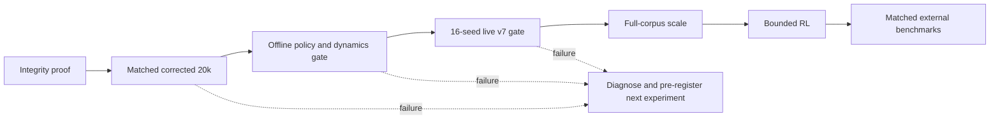

# AGENTS.md

Repository instructions for coding and research agents working in
`/Users/ericfode/Documents/learn-nethack`.

User messages and nearer nested `AGENTS.md` files override this file.

## Operating Principle

Complete work in the user's intended sense, not the easiest literal sense. If
one interpretation merely exercises plumbing and another tests the actual
research claim, assume the latter is intended.

Be autonomous. Recover state, close uncertainty with evidence, execute the
smallest meaningful increment, run the strongest relevant gate, and record the
result durably. Ask only when the unresolved choice risks destructive data
changes, credential exposure, substantial cloud spend, or an expensive design
fork.

Do not confuse activity with evidence. A wired pipeline, falling training loss,
or a watchable rollout is not proof that NetHack play improved.

## Current Objective

Produce a Gemma 4 checkpoint that improves live NetHack play relative to both
frozen base Gemma and the existing 20k checkpoint.

The active execution plan is:

`docs/superpowers/plans/2026-07-09-full-data-training-proof-next-steps.md`

The required order is:

1. Prove assistant-only loss, game-disjoint splits, true-label integrity, and
   online W&B plus local-ledger reporting.
2. Run matched corrected-20k experiments for single-frame and growing-context
   policy training, then dynamics and phased variants.
3. Promote a recipe only if offline metrics and at least 16 paired live NLE
   seeds pass the current proof gate.
4. Scale to the full corpus only after the corrected-20k gate passes.
5. Compare the promoted checkpoint under matched external benchmark protocols
   and continue until the learned-agent competitive gate passes.



Dynamics improvement alone does not complete the objective. Infrastructure
proof alone does not justify scaling.

## Authority And Legacy Evidence

Use this authority order:

1. The latest user instruction and active goal.
2. Checked-in source, tests, benchmark registry, and the active execution plan.
3. A completed local or Modal report that satisfies the admissibility contract
   below.
4. W&B and dashboards as mirrors of those reports.
5. Older generated artifacts as historical diagnostics only.

`artifacts/` contains output from many earlier agents and experimental
contracts. Directory names such as `trained`, `full`, `comparison`, `proof`, or
`watch` are not evidence. Never infer current state from a filename or from the
existence of a checkpoint.

An experimental result is admissible only when its report records:

- schema version and run ID;
- git commit or explicit dirty-tree state;
- model and exact checkpoint identity;
- dataset manifest and file fingerprints;
- environment ID and action-manifest identity;
- split seed, rollout seeds, step budget, and role/character settings;
- metric and fitness-objective versions;
- W&B mode, run ID, URL, and artifact names;
- required local events, reports, ttyrecs, and replay media;
- completion status and failure counters.

Comparisons additionally require matched environment, action space, model,
dataset split, seeds, step budget, generation/scoring procedure, and metric
version. If any differ, label the comparison exploratory and do not use it for
promotion.

Known historical artifacts using pseudo movement labels, obsolete
`live_rollout_utility_v2` or `v3`, fewer than 16 seeds, base-vs-base runs,
Gemma E2b, or a `NetHack-v0`/121-action mismatch are not current baselines.
Preserve them for diagnosis, but rerun the relevant baseline under the current
contract.

Do not create a second module or report format merely because an older one is
awkward. Patch the current owner unless a clean ownership split is necessary.

## Fixed Experiment Contract

The corrected proof lane uses:

- training/action authority: `NetHackChallenge-v0` and its exact 121-action
  manifest;
- paired live evaluator: the explicitly named
  `NetHackPairedChallenge-v0`, which preserves NLE Challenge actions, reward,
  termination, prompts, and no-progress behavior while restoring NLE seed
  control so baseline and checkpoint start from identical states;
- primary model: `google/gemma-4-E4b-it`;
- policy output: exactly `{"action_id": <int>}`;
- live objective: `live_rollout_utility_v7`;
- proof seeds: at least the 16 fixed seeds in `modal_config.py`;
- external targets: `benchmarks/nethack_benchmarks.json`.

Do not report `NetHackPairedChallenge-v0` as the official unseeded Challenge
environment. Changing its behavior, action space, model size, fitness version,
or seed set starts a new comparison family. It requires new matched base and
current-20k baselines. Do not silently migrate an existing run.

Treat NLE as the environment authority. Before a rollout, require the manifest
environment ID and exact action IDs to match `env.unwrapped.actions`. Candidate
scoring may consider only those action IDs. Never pass an ID valid only in the
manifest to a smaller live action space.

## Data Contract

Source data is read-only and lives outside git, primarily under:

- `/Users/ericfode/data/nld/nld-aa-taster`
- `/Users/ericfode/data/nld/history`
- `/Users/ericfode/data/nld-jepa`

Generated local output belongs under ignored `artifacts/`. Modal datasets,
checkpoints, caches, run reports, ttyrecs, and replay media belong in named
Modal volumes. Never commit raw NLD data, ttyrecs, checkpoints, generated
media, W&B state, or credentials.

Dataset requirements:

- split by `gameid` or `episode_id`, never row index;
- no game or episode may occur in more than one split;
- corrected-20k means 20,000 train, 2,000 validation, and 2,000 test rows per
  requested task unless a newer plan explicitly changes the quota;
- zero-byte validation or test files invalidate the dataset;
- a capped build must record and satisfy per-split quotas;
- every policy and dynamics row must retain the raw keypress and map it through
  the active action manifest without coercion;
- malformed, unmapped, ambiguous, or out-of-space labels are rejected with
  reason codes;
- sampling and splits are deterministic from a recorded seed.

Before GPU training, require a passing `integrity_report.json` that proves row
counts, game/episode disjointness, strict policy JSON, raw-key/action agreement,
dynamics conditioning agreement, duplicate absence, action distribution, and
file fingerprints. Recompute the audit after upload; a stale report is not
sufficient.

Pseudo labels may be used only for a separately named ablation. The current
corrected lane uses true NLD keypresses. Visible-player-delta labels do not
represent menu actions, inventory actions, waits, attacks without movement, or
all player intent.

## Training Contract

Policy rows and dynamics rows are different tasks. Do not mix next-frame fields
into the policy JSON response.

Use standard chat roles. Supervise only the final assistant response:

- tokenize the prompt with the model chat template;
- tokenize the complete prompt plus assistant response;
- verify the prompt tokens are an exact prefix;
- set all prompt and padding labels to `-100`;
- leave only final assistant tokens supervised;
- fail if truncation removes every assistant token;
- report prompt, masked, assistant, and truncated token counts by task.

The policy path scores exact candidate strings such as
`{"action_id": 17}`. It does not use unconstrained free-text generation for
live actions.

The dynamics task is conditioned on the true action and predicts the actual
next NLD-rendered observation. Syntax alone never proves that a generated frame
is reachable. Ground truth is the NLD successor for the same transition.

Cache Gemma model and tokenizer files in the
`learn-nethack-hf-cache` Modal volume mounted at `/cache/huggingface`. A normal
run must not redownload the model.

## Evaluation And Promotion

Policy gates:

- strict JSON validity: `1.0`;
- live action-space validity: `1.0`;
- useful-action accuracy improves over matched baselines;
- predictions do not collapse to a dominant action;
- results are broken down by role, race, and alignment where available.

Dynamics gates use autoregressive next-1/5/10 evaluation. Primary metrics are
changed-map-cell precision/recall/F1, player-coordinate accuracy, BLSTATS field
accuracy and numeric error, game-turn delta accuracy, and normalized message
accuracy. Compare against copy-current and matched deterministic baselines.
Raw character accuracy is diagnostic only.

Live promotion requires at least 16 paired-seed rollouts under
`live_rollout_utility_v7`. Require score, reward, or depth progress without
regression in:

- HP damage and deaths;
- wall collisions;
- menus, prompts, and stuck loops;
- non-advancing actions;
- action repetition;
- hunger, fainting, and starvation;
- role robustness.

Report confidence intervals and per-seed deltas. Aggregate reward alone cannot
promote a checkpoint. A two-episode or ten-step run proves plumbing only.

External benchmark numbers are comparable only under the benchmark's exact
protocol. Do not compare an 80-step development rollout to a full-episode NLE
score, or native NLE reward to BALROG progress. Refresh benchmark metadata
before a campaign, then freeze it for that campaign.

If a corrected-20k arm fails, record which hypothesis was falsified and run a
new pre-registered experiment. Do not scale a failed recipe merely because the
full corpus is available.

## W&B And Auditability

W&B must always work, but it is a mirror rather than the only ledger.

- Write the local or Modal JSON report before or alongside W&B logging.
- Real build, train, eval, RL, and benchmark runs require online W&B and must
  fail before expensive compute if `WANDB_API_KEY` is unavailable.
- `WANDB_MODE=offline` is allowed only for explicitly named unit, smoke, or
  local-development runs. Offline runs cannot satisfy a promotion gate.
- Every real report records W&B mode, run ID, run URL, project, and artifacts.
- Logging failure fails the run. Do not catch and suppress it.

Log configs, loss and throughput, gradient statistics, policy metrics,
dynamics metrics, live guardrails, action histograms, role breakdowns, and
failure counters. Upload dataset manifests, integrity reports, adapters, eval
reports, terminal events, ttyrecs, and replay media as appropriate.

Every live eval or RL episode must be watchable. At minimum preserve terminal
frame, step, action ID/label, reward, cumulative reward, HP, depth, message,
hunger, prompt/menu state, game-time advancement, invalid counts, and
done/death status. The viewer is read-only unless the user explicitly requests
control.

## RL And BALROG Boundary

Do not start RL because SFT loss fell. Begin bounded native RL only after the
corrected SFT live gate passes.

The native loop owns constrained action scoring, sampling, policy/KL loss,
LoRA updates, NLE interaction, W&B, terminal events, ttyrecs, and replay media.
NLE remains the transition and legality authority.

BALROG is an optional post-training evaluation harness, not the training loop.
Keep its dependencies isolated. An adapter must verify an explicit mapping from
the internal JSON action IDs to BALROG actions before any episode starts.
BALROG results require the same local-report and online-W&B guarantees.

The local diffusion/world-model modules are exploratory sidecars. They may
support representation or planning hypotheses, but they do not satisfy policy,
dynamics, or gameplay promotion gates without matched held-out and live
evidence.

## Code Ownership

Follow the current modules rather than an aspirational directory sketch:

- `action_manifest.py`: environment action identity and raw-key mapping
- `nld_decode.py`, `nld_metadata.py`: NLD decoding and game metadata
- `sft_rows.py`, `sft_build.py`: supervised row construction and split quotas
- `sft_integrity.py`: pre-training data admissibility
- `sft_train.py`: tokenization, assistant masks, and trainer construction
- `sft_eval.py`: policy/dynamics metrics and proof gates
- `compare_watch.py`: matched live rollouts and replay artifacts
- `modal_train.py`: cloud entrypoints and volume integration
- `wandb_logging.py`: mandatory W&B mirrors for local workflows
- `benchmark_registry.py`: frozen external targets and protocol boundaries
- `local_world_model.py`, `world_model_*.py`: exploratory world-model lane

Keep pure transforms in normal modules and Modal wrappers thin. Do not let
`modal_train.py` become the only implementation of shared behavior. Split a
module by responsibility before adding more behavior when it grows beyond
roughly 500 lines.

## Coding Standards

- Target Python 3.11.
- Type public functions and module boundaries.
- Prefer `dataclass(frozen=True)` for small immutable records and dictionaries
  for JSON-shaped payloads.
- Use `pathlib.Path`, deterministic JSON, and recorded seeds.
- Separate parsing, validation, and I/O.
- Put optional heavy imports inside the functions that need them.
- Imports must not trigger network, Modal, Hugging Face, W&B, or GPU work.
- Avoid global mutable state and hidden fallback behavior.
- Fail closed with precise messages and reason codes.
- Use `ValueError` for invalid inputs, `RuntimeError` for missing runtime
  capabilities, and `KeyError` for missing manifest mappings.
- Do not reformat or refactor unrelated files.

Tests should be fast and fixture-driven by default. Add the smallest regression
test for a contract defect. Mark NLE, corpus, Modal, GPU, and network tests as
integration tests and skip them with a precise prerequisite message when the
dependency is absent.

Use `ruff format` and `ruff check`. Prefer exact schema/report assertions over
large snapshots.

## Workflow And Handoff

Start with:

```bash
git status --short --branch
rg --files
```

Then inspect before editing. Use `rg` for search and `apply_patch` for manual
edits. Work with existing user changes and never revert unrelated work.

Relevant local gates:

```bash
uv run pytest -q
uv run ruff check src tests
uv run ruff format --check src tests
git diff --check
```

Run Modal or NLE integration gates whenever the changed lane depends on them.
A local import is not proof of cloud execution. A dry-run contract is not proof
of training or evaluation.

Plans belong under `docs/superpowers/plans/`. Keep the active plan updated when
evidence changes a decision. Do not copy transient terminal output into this
file.

Final handoffs name:

- files changed;
- tests and integration gates run;
- durable artifacts and W&B URLs produced;
- what is proven;
- what remains unproven or risky;
- the next promotion gate.

## Research Constraints

Preserve these lessons from prior NetHack work:

- valid actions are necessary but do not imply competent play;
- hierarchy, memory, explicit state, feedback, and long-term credit assignment
  remain major gaps for neural agents;
- aggregate scores can hide role collapse;
- top-level camping, starvation, wall loops, and menu traps can imitate short
  term progress;
- scaling imitation data alone has not closed the symbolic-agent gap;
- structured terminal state should precede vision-only representations.

Primary references:

- NLE: https://github.com/NetHack-LE/nle
- NetHack Challenge analysis: https://arxiv.org/abs/2203.11889
- NetHack Learning Dataset: https://arxiv.org/abs/2211.00539
- Neural NetHack architectures and HiHack: https://arxiv.org/abs/2305.19240
- LLM NetHack agents: https://arxiv.org/abs/2403.00690
- BALROG: https://github.com/balrog-ai/BALROG
