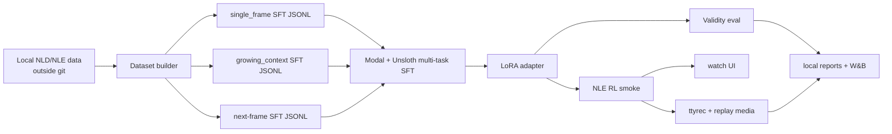
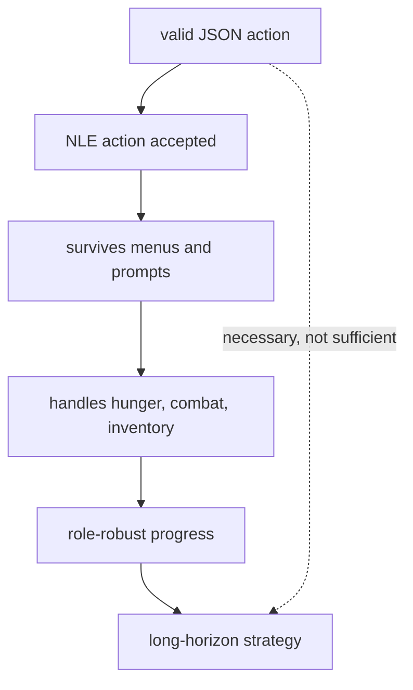
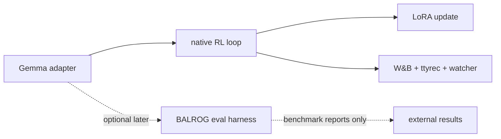
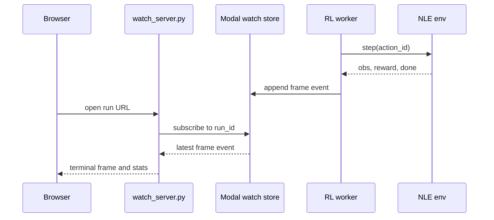

# AGENTS.md

Repository instructions for coding agents working in `/Users/ericfode/Documents/learn-nethack`.

This file is project-local guidance. User messages and nearer nested `AGENTS.md`
files override it.

## Interpretive Rule

Complete tasks in the user's intended sense, not the narrowest literal reading.
When a request has an easy interpretation and a harder interpretation, assume
the harder interpretation is meant if it better advances the project goal.

Do not hide behind literal wording to avoid the real work. Infer intent from
the project purpose, recent context, existing plans, and durable constraints.
Ask only when the inferred harder task would be materially risky: destructive
data changes, credential exposure, large cloud spend, irreversible external
state, or a design fork that would be expensive to unwind.

## Project Purpose

Build a reproducible NetHack learning pipeline:

- Convert local NLD/NLE traces into supervised fine-tuning data.
- Fine-tune a small Gemma 4 text model with Unsloth on Modal.
- Teach the model to emit valid NLE discrete actions from NetHack observations.
- Also teach the model a supervised dynamics task: given a NetHack observation
  and action, predict the following terminal frame/observation.
- Evaluate dynamics as next-1/5/10 frame sequence prediction conditioned on
  1/5/10 replay actions, not only as isolated one-step prediction.
- Evaluate policy quality as action sequences that maximize NLE reward/score
  while minimizing observed HP damage, deaths, and stuck/non-advancing steps.
- Compare single-frame prompts with growing-context prompts.
- Run a first bounded NLE reinforcement-learning smoke loop.
- Make every RL/eval rollout watchable and auditable through terminal frames,
  tty recordings, replay media, metrics, and local reports.



## Non-Negotiable Rules

- Do not commit raw NetHack data, ttyrec corpora, checkpoints, Modal cache
  volumes, W&B credentials, Hugging Face tokens, or generated run artifacts.
- Treat NLE as the environment authority. Do not hand-roll NetHack legality.
- The v1 model output contract is exactly JSON: `{"action_id": <int>}`.
- That contract applies to policy prompts. Auxiliary next-frame prompts must be
  explicitly tagged as a different task and must not be used for RL action
  selection.
- RL actors must use constrained candidate-action scoring over valid NLE action
  IDs. Do not drive RL rollouts with unconstrained free-text generation.
- Every eval/RL episode must produce an inspectable trace: terminal frames,
  action IDs, rewards, done/death status, and at least one replay artifact.
- W&B must always work. `wandb` is a core dependency, not an optional reporting
  extra. Every SFT/eval/RL run must create a W&B run in online mode when
  credentials/network are available, or in `WANDB_MODE=offline` otherwise.
- W&B is a mirror and analysis surface, not the only ledger. Always write local
  JSON reports before or alongside mandatory W&B logging.

## Known Failure Modes From Prior Work

Prior NetHack/NLE attempts failed in predictable ways. Treat these as design
constraints, not as background trivia.

- Do not equate valid actions with competent play. Valid action prediction is a
  first contract test; survival, score, depth, role robustness, and recovery
  from bad state are separate metrics.
- Do not expect end-to-end RL or behavior cloning to discover NetHack strategy
  unaided. Prior neural agents lagged symbolic and hybrid agents because
  NetHack needs hierarchy, long-term memory, explicit state tracking, and
  domain strategies.
- Do not average away role failures. Report metrics by role/race/alignment when
  available, and call out weak roles explicitly. Aggregate scores can hide
  collapse on Tourist, Healer, Rogue, or Wizard-like starts.
- Do not ignore starvation. Agents that camp safe top-level areas can score
  acceptably for a while and still die from hunger. Track hunger/nutrition
  events, food pickup/eat decisions, and starvation deaths.
- Do not let menus become silent progress sinks. Track contiguous keypresses
  that fail to advance game time, open-menu state, popup prompts, and aborted
  menus. RL rollouts must terminate or recover from stuck-menu loops.
- Do not rely on raw current-frame text alone for serious play. Keep the
  single-frame path as a baseline, but preserve interfaces for memory, event
  history, inventory state, known map state, and hierarchical skills/options.
- Do not assume scaling data/model size solves the game. Scaling imitation
  learning helps, but prior work indicates hierarchy and RL correction still
  matter.
- Do not train only on final score. Log exact-match action metrics, survival
  metrics, progress metrics, invalid/stuck-action metrics, death causes, and
  per-episode traces.
- Do not claim full-game competence from smoke runs. A two-episode RL smoke
  proves plumbing only.



## BALROG Boundary

BALROG is useful as a benchmark and source of implementation ideas. It is not
the core RL training framework for this repository.

- Keep `src/learn_nethack/rl_loop.py` native and training-oriented: constrained
  candidate-action scoring, sampled discrete `action_id`, REINFORCE/KL loss,
  LoRA optimizer step, watcher events, ttyrec artifacts, and W&B logging.
- Do not replace the training loop with BALROG's evaluator. BALROG agents wrap
  LLM/API clients, emit string actions, and write evaluation trajectories; that
  is not the same contract as gradient updates over scored JSON action IDs.
- Borrow BALROG ideas deliberately: language observation rendering,
  no-progress timeouts, invalid-action feedback as an eval diagnostic,
  trajectory CSV/JSON shape, NLE progress stats, and render helpers.
- Post-training BALROG evaluation is allowed after a completed SFT or RL run,
  but only through an adapter that preserves this repo's JSON `action_id`
  policy internally and maps selected actions to BALROG string actions at the
  boundary.
- A BALROG eval must first verify an explicit action-map manifest. If the
  trained NLE action IDs cannot be mapped to BALROG's action strings for the
  selected environment, fail before running episodes.
- BALROG evals must produce the same local report and W&B run guarantees as
  native evals, including trajectory artifacts when BALROG writes them.
- If BALROG is used, use it as an optional external evaluation harness in a
  separate environment or optional dependency group. Do not add `balrog`,
  `gym==0.23`, forked MiniHack/TextWorld/Baba dependencies, or BALROG post-
  install steps to the core trainer dependency path.
- Never use BALROG's `SECRETS` file pattern in this repo. Secrets stay in Modal
  Secrets or process environment only.



## Expected Repository Shape

Use this shape unless a later implementation plan changes it deliberately:

```text
src/learn_nethack/
  actions.py          NLE action discovery and validation
  observations.py     deterministic observation-to-text rendering
  sft_data.py         NLD ingestion and SFT JSONL generation
  eval_validity.py    parse/action-space/movement validity metrics
  ttyrec.py           ttyrec and replay-media writing
  wandb_logging.py    mandatory W&B metrics, tables, media, artifacts
  watch_server.py     Modal-hosted rollout viewer
  modal_train.py      Modal entrypoints for SFT/eval/RL
  rl_loop.py          bounded NLE RL smoke loop
tests/
  test_*.py           fast unit tests
  integration/        optional NLE/data/Modal integration tests
artifacts/            generated local outputs, ignored by git
docs/superpowers/     plans and durable workflow notes
```

Prefer small files with one owner. If a module grows past roughly 500 lines,
split by responsibility before adding more behavior.

## Data And Artifact Boundaries

- Local source data is expected under `/Users/ericfode/data`, especially:
  - `/Users/ericfode/data/nld/nld-aa-taster`
  - `/Users/ericfode/data/nld/history`
  - `/Users/ericfode/data/nld-jepa`
- Read those paths only as inputs. Do not modify or reorganize them without an
  explicit user request.
- Store generated local smoke outputs under repo-local `artifacts/` and ensure
  `artifacts/` is ignored by git.
- Store long-running Modal outputs in named Modal volumes, not in the git tree.
- Keep small schemas, manifests, and sample fixtures in git only when they are
  deterministic and safe to review.

## Action And Observation Contract

The action stack has three layers:

1. Output validity: assistant text parses as JSON with an integer `action_id`.
2. NLE validity: `action_id` is in the active environment action space.
3. Map sanity: movement actions do not target obviously blocked rendered tiles
   when the observation exposes enough map information.

Layer 1 and layer 2 are hard gates. Layer 3 is a metric unless NLE exposes a
stronger legality surface.

For SFT rows, use standard chat roles:

```json
{
  "messages": [
    {"role": "system", "content": "You control NetHack through NLE. Return only JSON: {\"action_id\": int}."},
    {"role": "user", "content": "Allowed action_ids: [0,1,2]\nCurrent observation:\n..."},
    {"role": "assistant", "content": "{\"action_id\": 1}"}
  ],
  "metadata": {
    "mode": "single_frame",
    "target_action_id": 1,
    "valid_action_ids": [0, 1, 2]
  }
}
```

Do not train on hidden chain-of-thought. Keep prompts and labels auditable.

Auxiliary next-frame rows are allowed and expected. They must use a different
task tag in the system/user prompt, include the selected action, and train the
assistant to predict the next rendered observation. Do not mix next-frame fields
into the policy action JSON; candidate-action scoring must remain over exact
`{"action_id": N}` strings.

## Modal, Secrets, And W&B

- Use Modal for GPU work. Keep local commands limited to data inspection, unit
  tests, schema validation, and small dataset builds.
- Use Modal when the current lane is Modal readiness, training, eval, RL,
  watcher deployment, or GPU dependency validation. Do not downgrade Modal work
  to local-only checks merely to avoid network or dependency churn.
- Use Modal Secrets for `HF_TOKEN`, `WANDB_API_KEY`, and any watch auth token.
  Never place secrets in code, tests, fixtures, configs, or docs.
- Modal training/eval/RL entrypoints must fail fast if `WANDB_API_KEY` is
  absent and online logging is requested. They may run with `WANDB_MODE=offline`
  only when the command explicitly sets offline mode for a smoke or test run.
- Use Modal volumes for datasets, runs, Hugging Face cache, and watcher state.
- W&B logging should include:
  - config: model, dataset, context mode, seed, GPU, LoRA settings
  - SFT metrics: action loss, next-frame loss, combined loss, learning rate,
    grad norm, tokens/sec, examples/sec
  - eval metrics: parse validity, action-space validity, exact match, block rate
  - next-frame eval metrics: frame character accuracy, map line exact rate,
    message exact rate, blstats numeric error when available, and
    autoregressive next-1/5/10 frame sequence accuracy conditioned on replay
    action sequences
  - RL/watch metrics: reward, score/depth when available, observed HP damage,
    death/done status, episode length, policy loss, entropy, action histogram
  - artifacts: adapter, dataset manifest, eval report, RL report
  - media: rendered replay video or GIF
  - raw replay: `.ttyrec` files as artifacts

## Watchability Requirement

Every RL or eval environment run must be watchable by a user.

Minimum viewer state per step:

- terminal frame
- step index
- selected action ID and optional action label
- reward
- cumulative reward
- HP, depth, and visible message when available
- invalid output/action counts
- done/death status
- hunger status when available
- open-menu or prompt state when available
- game-time advancement since the previous action

The v1 watcher is read-only. Do not add interactive environment control unless
the user asks for it.

## Modal Watch-Compare Benchmark

Use `src/learn_nethack/modal_train.py::watch_compare` when the user needs a
watchable checkpoint-vs-baseline benchmark on Modal. This is the canonical path
for comparing the current Gemma adapter against base Gemma 4 once training data
and a checkpoint are ready.

Required inputs:

- `artifacts/action_manifest.json` locally, uploaded to
  `learn-nethack-datasets:/action_manifest.json`.
- A trained adapter checkpoint in the runs volume, usually
  `/runs/<train-run-id>/adapters`.
- A benchmark `run_id` that names the data, checkpoint, env, and step budget.

Base-vs-base runs are allowed only as plumbing smokes. They prove Modal, NLE,
Gemma 4 download, candidate scoring, and watcher artifacts. They are not
checkpoint benchmarks because `current_checkpoint` is `null`.

Default 10-step smoke:

```bash
modal volume put --force learn-nethack-datasets artifacts/action_manifest.json /action_manifest.json
WANDB_MODE=offline modal run src/learn_nethack/modal_train.py::watch_compare \
  --run-id gemma4-e2b-modal-watch-10 \
  --action-manifest /datasets/action_manifest.json \
  --env-id NetHack-v0 \
  --model-name google/gemma-4-E2b-it \
  --max-steps 10
```

Checkpoint benchmark when data and adapter are ready:

```bash
modal volume put --force learn-nethack-datasets artifacts/action_manifest.json /action_manifest.json
WANDB_MODE=offline modal run src/learn_nethack/modal_train.py::watch_compare \
  --run-id <checkpoint-run-id>-watch-100 \
  --action-manifest /datasets/action_manifest.json \
  --current-checkpoint /runs/<checkpoint-run-id>/adapters \
  --env-id NetHack-v0 \
  --model-name google/gemma-4-E2b-it \
  --max-steps 100
```

If the local shell does not expose `modal`, use `uv run modal` with the same
arguments. Keep `WANDB_MODE=offline` only for explicit smoke/test commands; use
online W&B when credentials/network are available for real benchmark runs.

Benchmark outputs:

- Modal watch volume: `/watch/<run_id>/events.jsonl`,
  `/watch/<run_id>/latest.json`, `/watch/<run_id>/report.json`,
  `/watch/<run_id>/index.html`.
- Modal runs volume:
  `/runs/<run_id>/reports/watch_compare_contract.json`.
- Optional local mirror:
  `artifacts/watch/<run_id>/events.jsonl`,
  `artifacts/watch/<run_id>/report.json`,
  `artifacts/watch/<run_id>/index.html`.

Fetch artifacts for review:

```bash
modal volume get --force learn-nethack-watch /<run_id>/events.jsonl artifacts/watch/<run_id>/events.jsonl
modal volume get --force learn-nethack-watch /<run_id>/report.json artifacts/watch/<run_id>/report.json
modal volume get --force learn-nethack-watch /<run_id>/index.html artifacts/watch/<run_id>/index.html
modal volume get --force learn-nethack-runs /<run_id>/reports/watch_compare_contract.json artifacts/watch/<run_id>/watch_compare_contract.json
```

Use the benchmark report and event stream to compare current vs baseline action
IDs, rewards, HP, depth, death/done state, visible messages, and stuck behavior.
For handoff, summarize at least the first 10 steps and call out repeated
wall-bumps, no-progress loops, menu traps, hunger/starvation messages, or death
events. Do not claim checkpoint improvement from aggregate reward alone.

## Dynamics Ground Truth Validation

For next-frame/dynamics models, the LLM generates rendered state text. Validate
that output in two layers:

- Rendered-frame shape: required `MAP`, `MESSAGE`, `BLSTATS`, and `INVENTORY`
  sections; a player glyph in the map; parseable numeric 27-field `BLSTATS`.
- NLE ground truth: exact and section-level comparison against the real next
  rendered observation from NLE or a `next_frame` dataset label.

Do not claim that arbitrary generated text is a reachable NetHack state from
syntax alone. NetHack reachability depends on hidden state, RNG, inventory,
monsters, timers, and action history. A generated frame is only validated as
that step's state when it matches NLE-produced ground truth for the same
observation/action transition.

Use the dynamics viewer's third panel for ground truth:

```bash
nethack-gemma play dynamics \
  --action-manifest artifacts/action_manifest.json \
  --adapter-checkpoint /runs/<dynamics-run-id>/adapters \
  --initial-row artifacts/sft/<dataset>/validation.next_frame.jsonl \
  --ground-truth-rows artifacts/sft/<dataset>/validation.next_frame.jsonl \
  --actions <comma-separated-action-ids> \
  --out artifacts/watch/<run-id>
```

The resulting `events.jsonl` must include `predicted_frame`,
`ground_truth_frame`, and `validation`. The `index.html` viewer must render
Prompt, Predicted Next Frame, and Ground Truth Next Frame panels.



## Coding Standards

Use these standards for all repository code unless a narrower plan says
otherwise.

### Python Style

- Target Python 3.11. Do not rely on Python 3.12+ or 3.14-only features.
- Use typed function signatures at module boundaries and for all public helper
  functions. Keep internal locals readable; do not type-noise obvious code.
- Prefer `dataclass(frozen=True)` for small immutable records and explicit
  dictionaries only for JSON-shaped payloads.
- Keep functions small and named after the contract they enforce. If a function
  needs more than one screen to understand, split parsing, validation, and I/O.
- Use `pathlib.Path` for filesystem paths.
- Use `json.dumps(..., sort_keys=True)` for deterministic JSONL/report output
  unless human-preserving key order is part of the artifact contract.
- Avoid global mutable state. If a cache is needed, make its scope explicit and
  test cache invalidation.
- Do not add hidden network, Modal, Hugging Face, or W&B side effects at import
  time. Imports must be safe in unit tests.

### Module Boundaries

- Keep pure transforms separate from I/O. Example: decode/normalize NLD batches
  separately from writing SFT JSONL.
- Put optional heavy imports inside the functions that need them:
  `nle`, `torch`, `transformers`, `trl`, `unsloth`, `modal`, `wandb`, `fastapi`.
- When an optional dependency is missing, raise or skip with a precise message
  naming the dependency and command class that needs it.
- Do not let Modal code become the source of truth for local behavior. Shared
  schemas, action manifests, dataset builders, and metrics live in normal
  modules and are imported by Modal entrypoints.
- Keep BALROG integration isolated from core trainer modules.

### Error Handling

- Fail before spending GPU/cloud time when required inputs, action manifests,
  W&B configuration, or secrets are missing.
- Reject malformed model outputs, unmapped raw keypresses, and out-of-space
  action IDs explicitly. Do not coerce them into fallback actions.
- Include reason codes in reports for rejected rows or failed episodes.
- Prefer raising `ValueError` for invalid local inputs, `RuntimeError` for
  missing runtime capabilities, and `KeyError` for missing manifest mappings.

### Data And Reports

- Treat local JSON reports as durable contracts. Add `schema_version`, `run_id`,
  input paths or source IDs, counts, and rejection/failure summaries.
- Never write raw NLD data, checkpoint payloads, ttyrec corpora, or generated
  media outside ignored artifact locations.
- Keep fixture data tiny, deterministic, and safe to commit.
- Sampling must be deterministic when given a seed. Record the seed in every
  manifest/report that depends on sampling or splitting.
- Episode splits must be by `gameid` or `episode_id`, never by row index.

### Tests

- Write fast unit tests for pure logic before integration tests: action
  manifests, observation rendering, SFT row schema, split leakage, candidate
  scoring math, W&B mode resolution, report generation.
- Integration tests that require NLE, local corpora, Modal, GPU, or network
  must be marked or skipped with a clear reason when prerequisites are absent.
- Tests must not require the full `/Users/ericfode/data` corpus unless they are
  explicitly integration tests.
- Prefer exact assertions for schemas and reports. Avoid snapshot sprawl.
- When a bug involves a regression in a contract, add the smallest fixture that
  reproduces it.

### Formatting And Tooling

- Format Python with `ruff format` when the project config provides it. Use
  `ruff check` for linting when available.
- Keep imports sorted in the style `ruff` expects.
- Do not reformat unrelated files.
- Markdown plans and reports should use fenced code blocks for commands and
  JSON, and should name absolute local paths when those paths are part of the
  contract.

## Development Workflow

- Recover state first: `git status --short --branch`, then inspect files before
  editing.
- Use `rg` and `rg --files` for search.
- Prefer test-driven increments for core contracts: actions, observations, SFT
  schema, validity metrics, ttyrec writing, W&B dry-run logging.
- Keep changes narrow. Do not mix dataset plumbing, Modal training, RL, and UI
  watcher changes unless the current task requires the integration.
- Add or update tests for changed behavior.
- For Python changes, run the relevant `uv run pytest ...` gate before
  finishing. Dependency sync, lockfile updates, package downloads, and local
  `.uv-cache/` churn are allowed when they are caused by `uv run pytest` or
  another explicit project gate.
- Use fixture data in tests. Do not make tests depend on full local corpora
  unless they are marked integration/optional.
- Run the strongest relevant gate before finishing. If a relevant `uv` or
  Modal gate is blocked by sandboxing, network, authentication, missing secrets,
  or cloud prerequisites, request the needed approval or run it and state the
  exact blocker.
- Any training/eval report must include failure-mode counters: parse failures,
  out-of-space actions, stuck-menu steps, non-advancing keypress streaks,
  hunger/starvation events, death causes, role breakdown, score, depth, and
  episode length.

Recommended gates once the project is scaffolded:

```bash
uv run pytest -q
uv run pytest tests/test_actions.py tests/test_observations.py tests/test_sft_schema.py -q
uv run pytest tests/test_ttyrec.py tests/test_wandb_logging.py -q
WANDB_MODE=offline uv run pytest tests/test_wandb_logging.py -q
```

Modal and integration gates when the lane touches Modal, NLE data, GPU images,
or remote reporting:

```bash
uv run pytest tests/integration/test_nld_taster_build.py -q
modal run src/learn_nethack/modal_train.py::readiness --run-id modal-readiness-smoke
modal run src/learn_nethack/modal_train.py --help
```

## Review And Handoff

- For implementation plans, save durable plans under
  `docs/superpowers/plans/YYYY-MM-DD-<feature-name>.md`.
- Do not run `plannotator review` for this repository.
- After a meaningful implementation diff exists, rely on focused tests,
  relevant `uv run pytest` gates, relevant Modal smoke commands, and explicit
  handoff notes for reviewability.
- Final handoffs must name:
  - files changed
  - tests/gates run
  - artifacts produced
  - known residual risks

## Research Notes

This AGENTS.md follows the current AGENTS.md convention: put build/test/style
and project constraints in a predictable root file, keep it Markdown, and use
nested files only when a subproject needs different rules.

Keep this file lean. Agent-context research indicates unnecessary repository
instructions can increase cost and reduce task success. Add rules only when
they prevent a repeated or high-cost failure.

NetHack-specific failure-mode sources to preserve:

- NLE is procedurally generated, stochastic, entity-rich, and explicitly hard
  for current RL agents; use NLE as the authority and keep evaluation broad:
  https://github.com/NetHack-LE/nle
- The 2021 NetHack Challenge found symbolic agents far ahead of neural/deep RL
  agents, with no entrant close to ascension; failures included role variance,
  top-level camping, starvation, menu traps, missing hierarchy, and weak
  long-term credit assignment:
  https://ar5iv.labs.arxiv.org/html/2203.11889
- The NLD dataset is large enough to be useful but not sufficient by itself;
  prior work still found major algorithmic gaps for offline/online RL and
  learning from demonstrations:
  https://arxiv.org/abs/2211.00539
- NetHack-specific neural policy studies found that hierarchy, architecture,
  and RL fine-tuning help, but scaling alone does not close the gap to symbolic
  agents or strong human play:
  https://arxiv.org/abs/2305.19240
- Zero-shot LLM NetHack agents benefited from predefined skills, event
  interrupts, detailed context, and explicit feedback; they struggled with
  ambiguous tasks, confusing observations, and insufficient feedback:
  https://arxiv.org/abs/2403.00690
- Agentic LLM game benchmarks show current LLM/VLM agents degrade sharply on
  complex dynamic games and can perform worse with visual representations, so
  prefer structured text/terminal state plus explicit metrics before adding
  vision-only approaches:
  https://arxiv.org/abs/2411.13543
- BALROG itself is an evaluation benchmark for agentic LLM/VLM behavior over RL
  environments. Treat it as optional benchmark infrastructure, not as the
  trainer that owns this repo's RL loop:
  https://github.com/balrog-ai/BALROG
