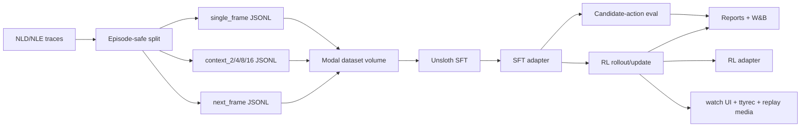
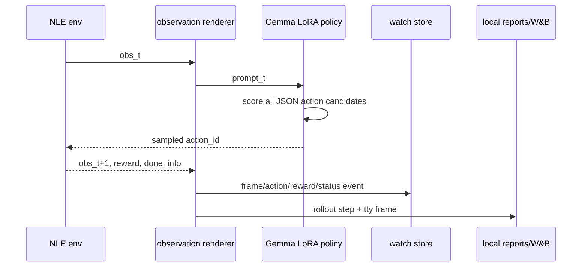
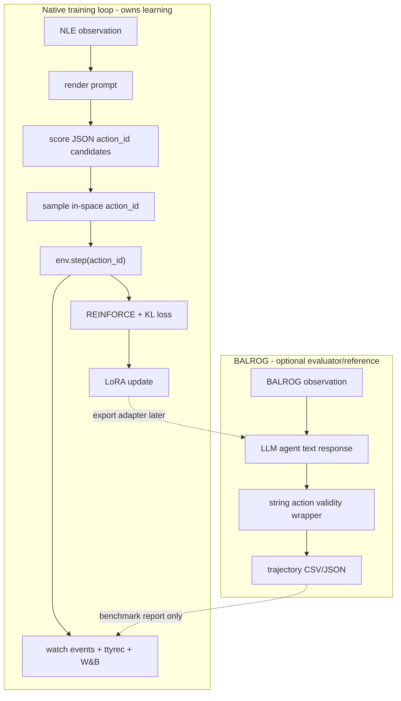

# Gemma NetHack Training Loop Implementation Plan

> **For agentic workers:** REQUIRED SUB-SKILL: Use superpowers:subagent-driven-development (recommended) or superpowers:executing-plans to implement this plan task-by-task. Steps use checkbox (`- [ ]`) syntax for tracking.

**Goal:** Build a reproducible Gemma/Unsloth/Modal pipeline that learns to emit valid NLE discrete actions from NetHack observations, learns to predict the following frame after an action, compares single-frame and growing-context inputs, and runs a watchable first RL training loop with W&B and ttyrec artifacts.

**Architecture:** Local code turns NLD/NLE traces into chat-format SFT JSONL and validates action/observation contracts with small fixture tests. SFT is multi-task: `policy_action` rows train exact `{"action_id": N}` answers, and `next_frame` rows train `obs_t + action_t -> obs_t+1` dynamics predictions under a distinct prompt. Modal owns GPU work: Unsloth LoRA SFT, candidate-action evaluation, and a bounded RL loop that samples only from NLE-valid action IDs. Every environment rollout writes local reports, live watcher events, tty recordings, replay media, and mandatory W&B metrics/artifacts; offline W&B mode is used only as a fallback for tests and local smokes.

**Tech Stack:** Python 3.11, uv, pytest, pydantic/dataclasses, gymnasium, NetHack-LE/nle, Modal, Unsloth, Transformers, TRL, PyTorch, W&B, FastAPI/WebSocket, JSONL. BALROG is optional external evaluation/reference infrastructure, not a core trainer dependency.

---

## File Structure

- Create `pyproject.toml`: package metadata, dependency groups, CLI entrypoint `nethack-gemma`.
- Create `.gitignore`: exclude `artifacts/`, caches, checkpoints, secrets, local data mirrors.
- Create `README.md`: quickstart commands and data boundary notes.
- Create `src/learn_nethack/cli.py`: minimal Typer app stub, expanded in data tasks.
- Create `src/learn_nethack/actions.py`: action discovery, action metadata, in-space validation.
- Create `src/learn_nethack/observations.py`: deterministic observation-to-text rendering.
- Create `src/learn_nethack/schemas.py`: shared dataclasses for SFT rows, action candidates, rollout events, reports.
- Create `src/learn_nethack/sft_data.py`: NLD ingestion, episode-safe splits, action JSONL writing, next-frame JSONL writing.
- Create `src/learn_nethack/policy_scoring.py`: candidate JSON action scoring and distribution construction.
- Create `src/learn_nethack/sft_train.py`: Unsloth SFT trainer setup and checkpoint/eval hooks.
- Create `src/learn_nethack/rl_loop.py`: rollout collection, reward computation, REINFORCE-with-KL update.
- Create `src/learn_nethack/eval_validity.py`: parse/action-space/exact-match/failure-mode metrics.
- Create `src/learn_nethack/ttyrec.py`: terminal-frame ttyrec writer and replay media wrapper.
- Create `src/learn_nethack/wandb_logging.py`: mandatory W&B logging, artifacts, tables, media.
- Create `src/learn_nethack/watch_server.py`: Modal ASGI/WebSocket viewer.
- Create `src/learn_nethack/modal_train.py`: Modal app entrypoints for data upload, SFT, eval, RL, watcher.
- Create `tests/`: fast fixture tests for contracts.
- Create `tests/integration/`: optional NLE/Modal/data tests.

## Core Contracts

### Policy Action Output

The model output is always exactly this JSON object:

```json
{"action_id": 7}
```

No text may precede or follow it. The parser rejects extra prose. The RL actor does not rely on free generation; it scores fixed candidate strings and samples from them.

This contract applies to policy prompts, candidate-action scoring, eval action
validity, and RL rollouts.

### SFT Rows

`policy_action` row:

```json
{
  "episode_id": "nld-aa-000001",
  "step": 42,
  "task": "policy_action",
  "mode": "single_frame",
  "messages": [
    {"role": "system", "content": "You control NetHack through NLE. Return only JSON: {\"action_id\": int}."},
    {"role": "user", "content": "Allowed action_ids: [0,1,2]\nCurrent observation:\nMAP:\n@..\nMESSAGE:\n<missing>\nBLSTATS:\n<missing>\nINVENTORY:\n<missing>"},
    {"role": "assistant", "content": "{\"action_id\": 1}"}
  ],
  "metadata": {
    "source": "nld-aa-taster",
    "env_id": "NetHackScore-v0",
    "valid_action_ids": [0, 1, 2],
    "target_action_id": 1
  }
}
```

`valid_action_ids` means action IDs in the configured NLE action space. It does not claim per-state NetHack legality.

`next_frame` row:

```json
{
  "episode_id": "nld-aa-000001",
  "step": 42,
  "task": "next_frame",
  "mode": "single_frame",
  "messages": [
    {"role": "system", "content": "You predict NetHack transition dynamics from NLE traces. Return only JSON: {\"next_frame\": str}."},
    {"role": "user", "content": "Action taken: {\"action_id\": 1}\nCurrent observation:\nMAP:\n@..\nMESSAGE:\n<missing>\nBLSTATS:\n<missing>\nINVENTORY:\n<missing>"},
    {"role": "assistant", "content": "{\"next_frame\": \"MAP:\\n.@.\\nMESSAGE:\\nYou move east.\\nBLSTATS:\\n<missing>\\nINVENTORY:\\n<missing>\"}"}
  ],
  "metadata": {
    "conditioning_action_id": 1,
    "target_frame_kind": "rendered_observation_text"
  }
}
```

`next_frame` rows are supervised dynamics examples. They must never be used as
RL action prompts and must never add fields to the policy action JSON.

### Candidate Scoring

For prompt `p` and action ID `a`, define the target string:

```python
target = '{"action_id": %d}' % a
```

The policy score is the sum of assistant-target token log probabilities only:

```text
score_theta(p, a) = sum_k log P_theta(target_token_k | p, target_token_<k)
```

The action distribution is:

```text
pi_theta(a | p) = softmax(score_theta(p, a) / temperature)
```

Only action IDs discovered from the active NLE environment are scored.

### SFT Objective

SFT trains the LoRA adapter with prompt tokens masked out. Policy rows optimize:

```text
L_policy(theta) = -mean_i sum_k log P_theta(action_json_i_token_k | prompt_i, action_json_i_token_<k)
```

Next-frame rows optimize:

```text
L_next_frame(theta) = -mean_i sum_k log P_theta(next_frame_json_i_token_k | prompt_i, next_frame_json_i_token_<k)
```

Combined supervised objective:

```text
L_sft(theta) = L_policy(theta) + frame_loss_weight * L_next_frame(theta)
```

Default `frame_loss_weight` is `0.25`. Use a dynamics warmup, mixed
policy/frame training, and final policy-only calibration. Use standard Gemma 4
chat roles: `system`, `user`, `assistant`. Do not train hidden chain-of-thought.

### RL Objective

The first RL loop is deliberately small and auditable. It updates only LoRA parameters.

For each rollout step:

```text
p_t = render_prompt(obs_t, memory_t, mode)
scores_t = [score_theta(p_t, a) for a in env_action_ids]
pi_t = softmax(scores_t / temperature)
a_t ~ Categorical(pi_t)
obs_{t+1}, env_reward_t, terminated, truncated, info = env.step(a_t)
```

Reward for v1:

```text
r_t = env_reward_t
      - 0.02 * I[game_time_did_not_advance]
      - 1.00 * I[action_wrapper_failed]
```

`action_wrapper_failed` should be zero because the wrapper samples only in-space IDs. Keep it in the formula so regressions hurt immediately.

For a rollout of length `T`, compute discounted returns:

```text
G_t = sum_{k=t}^{T-1} gamma^(k-t) * r_k
A_t = normalize(G_t)
```

Use a frozen SFT adapter as the reference policy. For the current policy and reference policy distributions over candidate actions:

```text
KL_t = sum_a pi_theta(a | p_t) * (log pi_theta(a | p_t) - log pi_ref(a | p_t))
H_t = -sum_a pi_theta(a | p_t) * log pi_theta(a | p_t)
L_rl(theta) = mean_t[-A_t * log pi_theta(a_t | p_t) + beta_kl * KL_t - entropy_coef * H_t]
```

Default RL smoke hyperparameters:

```json
{
  "episodes_per_update": 2,
  "max_env_steps": 80,
  "gamma": 0.99,
  "temperature": 1.0,
  "beta_kl": 0.02,
  "entropy_coef": 0.001,
  "learning_rate": 0.00001,
  "max_grad_norm": 1.0,
  "non_advancing_streak_limit": 20
}
```

An RL smoke run proves rollout, logging, watcher, ttyrec, and optimizer plumbing. It does not prove full-game competence.

## Formal Training Pipeline





## BALROG Framework Decision

Decision: do not use BALROG as the RL loop framework for v1. Use it as a
reference implementation and optional later benchmark harness.

Why:

- BALROG is an evaluator for agentic LLM/VLM behavior over game environments.
  Its normal loop is `agent.act(obs) -> string action -> env.step(action) ->
  CSV/JSON trajectory`. It does not own LoRA optimization, Unsloth training, or
  REINFORCE/KL updates.
- The project contract is stricter: the policy scores fixed JSON candidates
  such as `{"action_id": 7}`, samples only active NLE discrete action IDs, and
  updates LoRA parameters from candidate-action log probabilities.
- BALROG's NLE wrapper uses language/string actions plus letters and digits for
  menus. That is useful for prompt design, but it is not the same target as the
  NLD/SFT `action_id` contract.
- BALROG's dependency path includes its own environment stack, `gym==0.23`,
  `balrog-nle`, and forked MiniHack/TextWorld/Baba packages. Keep that out of
  the core trainer. If used, isolate it behind a separate optional environment.
- BALROG supports a `SECRETS` file pattern. This repo must not use that pattern;
  secrets stay in Modal Secrets or environment variables.

Borrow from BALROG:

- NLE language/hybrid observation rendering ideas.
- `no_progress_timeout` as a hard rollout stop condition.
- invalid-action feedback as an eval diagnostic, not as the primary training
  action path.
- trajectory CSV/JSON fields for replay and debugging.
- NLE progress stats: score, depth, gold, XP, time, hunger, death/end reason.
- terminal/image rendering helpers as references for replay artifacts.

Do not borrow:

- unconstrained free-text action generation for RL actors.
- defaulting invalid actions to `esc` during training as if that were a valid
  policy decision.
- BALROG's core dependency stack in `pyproject.toml`.
- any file-based secret convention.



## Tasks

### Task 1: Scaffold Project And Static Contracts

**Files:**
- Create: `pyproject.toml`
- Create: `.gitignore`
- Create: `README.md`
- Create: `src/learn_nethack/__init__.py`
- Create: `src/learn_nethack/cli.py`
- Create: `src/learn_nethack/schemas.py`
- Test: `tests/test_schemas.py`

- [ ] **Step 1: Create package metadata**

Create `pyproject.toml` with:

```toml
[project]
name = "learn-nethack"
version = "0.1.0"
requires-python = ">=3.11"
dependencies = [
  "pydantic>=2",
  "typer>=0.12",
  "rich>=13",
  "wandb>=0.17",
]

[project.optional-dependencies]
dev = ["pytest>=8", "ruff>=0.5"]
local-nle = ["gymnasium>=0.29", "nle"]
modal-train = [
  "modal>=1",
  "torch",
  "transformers",
  "datasets",
  "trl",
  "unsloth",
]
watch = ["fastapi>=0.110", "uvicorn>=0.30", "websockets>=12"]

[project.scripts]
nethack-gemma = "learn_nethack.cli:app"

[tool.pytest.ini_options]
testpaths = ["tests"]
markers = [
  "integration: requires local NLE/data/Modal state",
]
```

- [ ] **Step 2: Create raw-data-safe ignore rules**

Create `.gitignore` with:

```gitignore
.venv/
__pycache__/
.pytest_cache/
.ruff_cache/
.modal/
.wandb/
wandb/
artifacts/
checkpoints/
*.safetensors
*.pt
*.pth
*.ckpt
*.ttyrec
*.ttyrec*
*.mp4
*.gif
.env
.env.*
```

- [ ] **Step 3: Create shared schemas**

Create `src/learn_nethack/cli.py` with:

```python
import typer

app = typer.Typer(no_args_is_help=True)
```

Then create `src/learn_nethack/schemas.py` with dataclasses for `SftRow`, `ActionCandidate`, `RolloutStep`, and `RunReport`. Required fields:

```python
from dataclasses import dataclass
from typing import Any, Literal

@dataclass(frozen=True)
class ActionCandidate:
    action_id: int
    target_text: str

@dataclass(frozen=True)
class SftRow:
    episode_id: str
    step: int
    task: Literal["policy_action", "next_frame"]
    mode: str
    messages: list[dict[str, str]]
    metadata: dict[str, Any]

@dataclass(frozen=True)
class RolloutStep:
    run_id: str
    episode_id: str
    step: int
    action_id: int
    reward: float
    cumulative_reward: float
    done: bool
    game_time_advanced: bool
    terminal_frame: str
    info: dict[str, Any]

@dataclass(frozen=True)
class RunReport:
    run_id: str
    kind: Literal["sft", "eval", "rl"]
    metrics: dict[str, float]
    artifacts: dict[str, str]
    config: dict[str, Any]
```

- [ ] **Step 4: Test schema serialization**

Create `tests/test_schemas.py` that instantiates each dataclass, converts it with `dataclasses.asdict`, and asserts stable keys.

Run: `uv run pytest tests/test_schemas.py -q`

Expected: `1 passed`.

- [ ] **Step 5: Commit**

```bash
git add pyproject.toml .gitignore README.md src/learn_nethack/__init__.py src/learn_nethack/cli.py src/learn_nethack/schemas.py tests/test_schemas.py
git commit -m "chore: scaffold NetHack Gemma training project"
```

### Task 2: Implement Action And Observation Contracts

**Files:**
- Create: `src/learn_nethack/actions.py`
- Create: `src/learn_nethack/observations.py`
- Test: `tests/test_actions.py`
- Test: `tests/test_observations.py`

- [ ] **Step 1: Add action helpers**

Implement:

```python
def make_action_candidates(action_ids: list[int]) -> list[ActionCandidate]:
    return [
        ActionCandidate(action_id=action_id, target_text=f'{{"action_id": {action_id}}}')
        for action_id in action_ids
    ]

def validate_action_id(action_id: int, valid_action_ids: set[int]) -> None:
    if action_id not in valid_action_ids:
        raise ValueError(f"action_id {action_id} is not in active NLE action space")
```

Add `discover_env_action_ids(env) -> list[int]` that returns `range(env.action_space.n)` for `gymnasium.spaces.Discrete`.

- [ ] **Step 2: Test action candidates and validation**

`tests/test_actions.py` must assert:

```python
assert make_action_candidates([0, 2])[1].target_text == '{"action_id": 2}'
validate_action_id(1, {0, 1, 2})
with pytest.raises(ValueError):
    validate_action_id(3, {0, 1, 2})
```

Run: `uv run pytest tests/test_actions.py -q`

Expected: pass.

- [ ] **Step 3: Add observation renderer**

Implement `render_observation_text(obs: dict, *, max_message_chars: int = 240) -> str`.

Required output sections, in order:

```text
MAP:
@..
MESSAGE:
<missing>
BLSTATS:
<missing>
INVENTORY:
<missing>
```

If a field is absent, write `<missing>`. For `tty_chars`, convert integer byte values to ASCII characters row by row. Strip NUL bytes.

- [ ] **Step 4: Test observation renderer**

Create a fixture with a 2x3 `tty_chars` grid, one message, and small `blstats`. Assert exact rendered text.

Run: `uv run pytest tests/test_observations.py -q`

Expected: pass.

- [ ] **Step 5: Commit**

```bash
git add src/learn_nethack/actions.py src/learn_nethack/observations.py tests/test_actions.py tests/test_observations.py
git commit -m "feat: define NLE action and observation contracts"
```

### Task 3: Build Multi-Task SFT Data For Actions And Next Frames

**Files:**
- Create: `src/learn_nethack/sft_data.py`
- Create: `src/learn_nethack/cli.py`
- Test: `tests/test_sft_schema.py`
- Test: `tests/test_sft_context.py`
- Test: `tests/integration/test_nld_taster_build.py`

- [ ] **Step 1: Implement prompt builders**

Implement:

```python
POLICY_SYSTEM_PROMPT = 'You control NetHack through NLE. Return only JSON: {"action_id": int}.'
NEXT_FRAME_SYSTEM_PROMPT = (
    "You predict NetHack transition dynamics from NLE traces. "
    "Return only the next rendered observation frame text. "
    "Begin with MAP: and include MESSAGE:, BLSTATS:, and INVENTORY: sections."
)

def build_user_prompt(
    observation_text: str,
    valid_action_ids: list[int],
    history: list[tuple[str, int]] | None = None,
) -> str:
    lines = [f"Allowed action_ids: {valid_action_ids}"]
    if history:
        lines.append("Recent history:")
        for prior_obs, prior_action in history:
            lines.append(prior_obs)
            lines.append(f"Previous action_id: {prior_action}")
    lines.append("Current observation:")
    lines.append(observation_text)
    return "\n".join(lines)

def build_next_frame_prompt(
    observation_text: str,
    action_id: int,
    history: list[tuple[str, int]] | None = None,
) -> str:
    lines = [f'Action taken: {{"action_id": {action_id}}}']
    if history:
        lines.append("Recent history:")
        for prior_obs, prior_action in history:
            lines.append(prior_obs)
            lines.append(f"Previous action_id: {prior_action}")
    lines.append("Current observation:")
    lines.append(observation_text)
    return "\n".join(lines)
```

- [ ] **Step 2: Implement policy action row builder**

Implement:

```python
def build_policy_action_row(
    *,
    episode_id: str,
    step: int,
    mode: str,
    observation_text: str,
    valid_action_ids: list[int],
    target_action_id: int,
    source: str,
    env_id: str,
    history: list[tuple[str, int]] | None = None,
) -> SftRow:
    user_prompt = build_user_prompt(observation_text, valid_action_ids, history)
    return SftRow(
        episode_id=episode_id,
        step=step,
        task="policy_action",
        mode=mode,
        messages=[
            {"role": "system", "content": POLICY_SYSTEM_PROMPT},
            {"role": "user", "content": user_prompt},
            {"role": "assistant", "content": f'{{"action_id": {target_action_id}}}'},
        ],
        metadata={
            "source": source,
            "env_id": env_id,
            "valid_action_ids": valid_action_ids,
            "target_action_id": target_action_id,
        },
    )
```

- [ ] **Step 3: Implement next-frame row builder**

Implement:

```python
import json

def build_next_frame_row(
    *,
    episode_id: str,
    step: int,
    mode: str,
    observation_text: str,
    next_observation_text: str,
    conditioning_action_id: int,
    source: str,
    env_id: str,
    history: list[tuple[str, int]] | None = None,
) -> SftRow:
    user_prompt = build_next_frame_prompt(observation_text, conditioning_action_id, history)
    return SftRow(
        episode_id=episode_id,
        step=step,
        task="next_frame",
        mode=mode,
        messages=[
            {"role": "system", "content": NEXT_FRAME_SYSTEM_PROMPT},
            {"role": "user", "content": user_prompt},
            {"role": "assistant", "content": json.dumps({"next_frame": next_observation_text}, sort_keys=True)},
        ],
        metadata={
            "source": source,
            "env_id": env_id,
            "conditioning_action_id": conditioning_action_id,
            "target_frame_kind": "rendered_observation_text",
        },
    )
```

Build this row only when same-episode `obs_t+1` exists.

- [ ] **Step 4: Implement context modes**

Modes:

```python
single_frame: history=[]
context_2: last 2 (observation_text, action_id) pairs before current step
context_4: last 4 pairs
context_8: last 8 pairs
context_16: last 16 pairs
```

History must not cross episode boundaries.

- [ ] **Step 5: Implement JSONL writer**

Write `train.jsonl`, `train.policy_action.jsonl`, `train.next_frame.jsonl`,
`validation.jsonl`, `validation.policy_action.jsonl`,
`validation.next_frame.jsonl`, `test.jsonl`, `test.policy_action.jsonl`,
`test.next_frame.jsonl`, and `manifest.json`.

Episode split defaults:

```json
{"train": 0.90, "validation": 0.05, "test": 0.05}
```

Split by stable hash of `episode_id`, not by row index.

- [ ] **Step 6: Implement CLI commands**

Create Typer app with:

```bash
nethack-gemma data inspect --nld-root /Users/ericfode/data/nld/nld-aa-taster/unpacked/nld-aa-taster/nle_data
nethack-gemma data build-sft --mode single_frame --max-examples 1000 --out artifacts/sft/single_frame_smoke
nethack-gemma data build-sft --mode context_4 --max-examples 1000 --out artifacts/sft/context_4_smoke
nethack-gemma data build-sft --mode single_frame --tasks policy_action,next_frame --max-examples 1000 --out artifacts/sft/single_frame_multitask_smoke
```

- [ ] **Step 7: Test schema and context behavior**

Unit tests must verify:

- `policy_action` assistant content parses as JSON with integer `action_id`.
- `next_frame` assistant content parses as JSON with string `next_frame`.
- Target `action_id` is an integer in `valid_action_ids`.
- `context_4` includes no more than four prior observations.
- Context never includes a prior episode.

Run: `uv run pytest tests/test_sft_schema.py tests/test_sft_context.py -q`

Expected: pass.

- [ ] **Step 8: Integration smoke on local taster data**

Run:

```bash
uv run nethack-gemma data build-sft --mode single_frame --max-examples 64 --out artifacts/sft/single_frame_64
uv run pytest tests/integration/test_nld_taster_build.py -q
```

Expected: 64 policy rows built, at least one next-frame row built when same-
episode next observations are available, no split leakage, valid JSON labels.

- [ ] **Step 9: Commit**

```bash
git add src/learn_nethack/sft_data.py src/learn_nethack/cli.py tests/test_sft_schema.py tests/test_sft_context.py tests/integration/test_nld_taster_build.py
git commit -m "feat: build supervised NetHack action and frame datasets"
```

### Task 4: Implement Candidate-Action Scoring

**Files:**
- Create: `src/learn_nethack/policy_scoring.py`
- Test: `tests/test_policy_scoring.py`

- [ ] **Step 1: Define token scoring API**

Implement:

```python
import torch

def score_candidate_texts(model, tokenizer, prompt_text: str, candidates: list[ActionCandidate]) -> dict[int, float]:
    scores: dict[int, float] = {}
    prompt_ids = tokenizer(prompt_text, add_special_tokens=False)["input_ids"]
    device = next(model.parameters()).device
    for candidate in candidates:
        candidate_ids = tokenizer(candidate.target_text, add_special_tokens=False)["input_ids"]
        input_ids = prompt_ids + candidate_ids
        input_tensor = torch.tensor([input_ids], dtype=torch.long, device=device)
        with torch.no_grad():
            outputs = model(input_ids=input_tensor)
            log_probs = torch.log_softmax(outputs.logits, dim=-1)
        offset = len(prompt_ids)
        score = 0.0
        for index, token_id in enumerate(candidate_ids):
            absolute_position = offset + index
            score += float(log_probs[0, absolute_position - 1, token_id].detach().cpu())
        scores[candidate.action_id] = score
    return scores
```

Required behavior:

- Tokenize `prompt_text + candidate.target_text`.
- Mask prompt tokens.
- Sum log probabilities for candidate tokens only.
- Return `{action_id: score}`.

- [ ] **Step 2: Define distribution API**

Implement:

```python
import math

def action_distribution(scores: dict[int, float], temperature: float = 1.0) -> dict[int, float]:
    if not scores:
        raise ValueError("scores must not be empty")
    if temperature <= 0:
        raise ValueError("temperature must be positive")
    scaled = {action_id: score / temperature for action_id, score in scores.items()}
    max_score = max(scaled.values())
    weights = {action_id: math.exp(score - max_score) for action_id, score in scaled.items()}
    total = sum(weights.values())
    return {action_id: weight / total for action_id, weight in weights.items()}
```

Use numerically stable softmax. Raise `ValueError` for empty scores or non-positive temperature.

- [ ] **Step 3: Test with fake model logits**

Use a fake tokenizer/model fixture where candidate 2 has the highest known score. Assert:

```python
dist = action_distribution({0: 0.0, 1: 1.0, 2: 2.0})
assert max(dist, key=dist.get) == 2
assert abs(sum(dist.values()) - 1.0) < 1e-6
```

Run: `uv run pytest tests/test_policy_scoring.py -q`

Expected: pass.

- [ ] **Step 4: Commit**

```bash
git add src/learn_nethack/policy_scoring.py tests/test_policy_scoring.py
git commit -m "feat: score constrained NetHack action candidates"
```

### Task 5: Implement Unsloth SFT Training

**Files:**
- Create: `src/learn_nethack/sft_train.py`
- Modify: `src/learn_nethack/modal_train.py`
- Test: `tests/test_sft_train_config.py`

- [ ] **Step 1: Add SFT config dataclass**

Fields and defaults:

```python
model_name = "google/gemma-4-E4b-it"
max_seq_length = 2048
load_in_16bit = True
load_in_4bit = False
lora_r = 16
lora_alpha = 16
lora_dropout = 0.0
learning_rate = 2e-4
per_device_train_batch_size = 1
gradient_accumulation_steps = 4
warmup_steps = 10
max_steps = 100
logging_steps = 1
seed = 3407
```

- [ ] **Step 2: Implement text conversion**

Convert each JSONL row to a single `text` string using the tokenizer chat template. Preserve only visible final assistant JSON as the supervised answer.

- [ ] **Step 3: Implement trainer construction**

Use Unsloth pattern:

```python
from unsloth import FastLanguageModel
from trl import SFTTrainer, SFTConfig

model, tokenizer = FastLanguageModel.from_pretrained(
    model_name=config.model_name,
    max_seq_length=config.max_seq_length,
    load_in_4bit=config.load_in_4bit,
    load_in_16bit=config.load_in_16bit,
    full_finetuning=False,
)
model = FastLanguageModel.get_peft_model(
    model,
    r=config.lora_r,
    target_modules=["q_proj", "k_proj", "v_proj", "o_proj", "gate_proj", "up_proj", "down_proj"],
    lora_alpha=config.lora_alpha,
    lora_dropout=config.lora_dropout,
    bias="none",
    use_gradient_checkpointing="unsloth",
    random_state=config.seed,
    max_seq_length=config.max_seq_length,
)
```

- [ ] **Step 4: Add eval hook**

Every eval run must produce `eval_validity.json` with:

```json
{
  "parse_valid_rate": 1.0,
  "action_space_valid_rate": 1.0,
  "exact_match_rate": 0.0,
  "movement_block_rate": 0.0,
  "stuck_menu_steps": 0,
  "non_advancing_keypress_streak_max": 0
}
```

The exact values above are example shape values in tests; real values come from eval.

- [ ] **Step 5: Test config defaults**

Run: `uv run pytest tests/test_sft_train_config.py -q`

Expected: pass.

- [ ] **Step 6: Commit**

```bash
git add src/learn_nethack/sft_train.py src/learn_nethack/modal_train.py tests/test_sft_train_config.py
git commit -m "feat: add Unsloth supervised fine-tuning loop"
```

### Task 6: Implement Validity Evaluation

**Files:**
- Create: `src/learn_nethack/eval_validity.py`
- Test: `tests/test_eval_validity.py`

- [ ] **Step 1: Implement parser**

`parse_action_json(text: str) -> int` must reject:

- non-JSON text
- extra prose before/after JSON
- missing `action_id`
- non-integer `action_id`

- [ ] **Step 2: Implement metrics**

Given predictions and labels, compute:

```python
parse_valid_rate
action_space_valid_rate
exact_match_rate
movement_block_rate
invalid_count
out_of_space_count
```

- [ ] **Step 3: Include failure-mode counters**

Report fields:

```python
stuck_menu_steps
non_advancing_keypress_streak_max
hunger_events
starvation_deaths
death_causes
role_breakdown
score_mean
depth_max
episode_length_mean
```

Use zeros or empty dictionaries when an offline dataset does not expose the field.

- [ ] **Step 4: Test parser and metrics**

Run: `uv run pytest tests/test_eval_validity.py -q`

Expected: pass.

- [ ] **Step 5: Commit**

```bash
git add src/learn_nethack/eval_validity.py tests/test_eval_validity.py
git commit -m "feat: evaluate constrained NetHack action outputs"
```

### Task 7: Implement Watchable Rollouts, Ttyrec, And Mandatory W&B Logging

**Files:**
- Create: `src/learn_nethack/ttyrec.py`
- Create: `src/learn_nethack/wandb_logging.py`
- Create: `src/learn_nethack/watch_server.py`
- Test: `tests/test_ttyrec.py`
- Test: `tests/test_wandb_logging.py`
- Test: `tests/test_watch_events.py`

- [ ] **Step 1: Implement rollout event shape**

Each step event must contain:

```json
{
  "run_id": "run",
  "episode_id": "episode-0",
  "step": 0,
  "terminal_frame": "@..\n---\nHP:12 Pw:3 AC:10",
  "action_id": 1,
  "reward": 0.0,
  "cumulative_reward": 0.0,
  "hp": 12,
  "depth": 1,
  "message": "",
  "hunger": "",
  "menu_open": false,
  "game_time_advanced": true,
  "done": false
}
```

- [ ] **Step 2: Implement ttyrec writer**

Write terminal frames with timestamps to `episode_<seed>_<idx>.ttyrec`. Tests should assert the file exists and is non-empty for three frames.

- [ ] **Step 3: Implement replay media wrapper**

Add a function:

```python
def render_replay_media(ttyrec_path: str, out_path: str) -> str:
    source = Path(ttyrec_path)
    target = Path(out_path)
    target.write_text(
        f"Replay source: {source.name}\nBytes: {source.stat().st_size}\n",
        encoding="utf-8",
    )
    return str(target)
```

For v1, this may render a simple text-frame GIF/MP4 from stored frames. If external rendering tools are unavailable, write a deterministic `.txt` replay and log it as an artifact; do not silently skip replay output.

- [ ] **Step 4: Implement mandatory W&B logger**

`wandb_logging.py` must:

- Work with `WANDB_MODE=offline`.
- Import `wandb` as a required dependency; if import fails, raise `RuntimeError("wandb is a required learn-nethack dependency; run uv sync before training")`.
- Create a W&B run for every SFT, eval, and RL run.
- Use online W&B when `WANDB_API_KEY` is present and `WANDB_MODE` is not `offline`.
- Use `WANDB_MODE=offline` for local tests/smokes when credentials or network are unavailable.
- Refuse to run cloud SFT/eval/RL entrypoints without either `WANDB_API_KEY` or explicit `WANDB_MODE=offline`.
- Log scalar metrics.
- Log prediction tables.
- Log adapter/report/dataset artifacts.
- Log `.ttyrec` files as artifacts.
- Log replay media with `wandb.Video` when media exists.

- [ ] **Step 5: Implement watcher server**

`watch_server.py` serves:

- `GET /`: minimal HTML terminal viewer.
- `GET /health`: `{"ok": true}`.
- `GET /runs/{run_id}/latest`: latest event JSON.
- `WS /runs/{run_id}/stream`: event stream.

- [ ] **Step 6: Test logging and watcher units**

Run:

```bash
uv run pytest tests/test_ttyrec.py tests/test_wandb_logging.py tests/test_watch_events.py -q
WANDB_MODE=offline uv run pytest tests/test_wandb_logging.py -q
```

Expected: pass.

- [ ] **Step 7: Commit**

```bash
git add src/learn_nethack/ttyrec.py src/learn_nethack/wandb_logging.py src/learn_nethack/watch_server.py tests/test_ttyrec.py tests/test_wandb_logging.py tests/test_watch_events.py
git commit -m "feat: record and watch NetHack rollouts"
```

### Task 8: Implement RL Rollout And Update Loop

**Files:**
- Create: `src/learn_nethack/rl_loop.py`
- Test: `tests/test_rl_loop.py`

- [ ] **Step 1: Implement reward function**

Implement:

```python
def compute_step_reward(env_reward: float, *, game_time_advanced: bool, action_wrapper_failed: bool) -> float:
    reward = float(env_reward)
    if not game_time_advanced:
        reward -= 0.02
    if action_wrapper_failed:
        reward -= 1.0
    return reward
```

- [ ] **Step 2: Implement discounted returns**

Implement:

```python
def discounted_returns(rewards: list[float], gamma: float) -> list[float]:
    running = 0.0
    out = []
    for reward in reversed(rewards):
        running = reward + gamma * running
        out.append(running)
    return list(reversed(out))
```

Add `normalize_advantages(values)` with zero-variance protection.

- [ ] **Step 3: Implement rollout collection**

`collect_rollout(env, model, tokenizer, config, watcher, ttyrec_writer)` must:

- Reset env.
- Render prompt from observation.
- Score all active action candidates.
- Sample action from candidate distribution.
- Step env.
- Append `RolloutStep`.
- Stream watcher event.
- Write tty frame.
- Stop on done, truncation, `max_env_steps`, or `non_advancing_streak_limit`.

- [ ] **Step 4: Implement RL loss**

Use:

```text
L_rl = mean(-advantage * sampled_logprob + beta_kl * kl_to_reference - entropy_coef * entropy)
```

Compute KL and entropy over the candidate action distribution, not over the full token vocabulary.

- [ ] **Step 5: Implement update**

Update LoRA parameters only. Clip gradient norm to `max_grad_norm`. Save an adapter checkpoint and `rl_report.json` after each update.

- [ ] **Step 6: Test pure RL math**

Tests must verify:

- `discounted_returns([1, 1], gamma=0.5) == [1.5, 1.0]`.
- Non-advancing step receives `-0.02` penalty.
- Action wrapper failure receives `-1.0` penalty.
- Advantage normalization does not divide by zero.

Run: `uv run pytest tests/test_rl_loop.py -q`

Expected: pass.

- [ ] **Step 7: Commit**

```bash
git add src/learn_nethack/rl_loop.py tests/test_rl_loop.py
git commit -m "feat: formalize NetHack RL training loop"
```

### Task 9: Wire Modal Entrypoints

**Files:**
- Create: `src/learn_nethack/modal_train.py`
- Test: `tests/test_modal_config.py`

- [ ] **Step 1: Define Modal resources**

Volumes:

```python
nethack-gemma-datasets
nethack-gemma-runs
nethack-gemma-hf-cache
nethack-gemma-watch
```

Secrets:

```python
HF_TOKEN
WANDB_API_KEY
WATCH_AUTH_TOKEN
```

`WANDB_API_KEY` is required for normal Modal SFT/eval/RL runs. Only smoke/test commands may explicitly set `WANDB_MODE=offline`.

- [ ] **Step 2: Add SFT entrypoint**

Command shape:

```bash
modal run src/learn_nethack/modal_train.py::sft \
  --dataset-volume-path /datasets/single_frame/train.jsonl \
  --run-id gemma4-nle-single-sft-smoke \
  --max-steps 20 \
  --gpu A100
```

- [ ] **Step 3: Add eval entrypoint**

Command shape:

```bash
modal run src/learn_nethack/modal_train.py::eval \
  --adapter-run-id gemma4-nle-single-sft-smoke \
  --validation-jsonl /datasets/single_frame/validation.jsonl
```

- [ ] **Step 4: Add RL smoke entrypoint**

Command shape:

```bash
modal run src/learn_nethack/modal_train.py::rl_smoke \
  --sft-run-id gemma4-nle-single-sft-smoke \
  --run-id gemma4-nle-single-rl-smoke \
  --episodes 2 \
  --max-env-steps 80 \
  --gpu A100
```

- [ ] **Step 5: Add watcher serve entrypoint**

Command shape:

```bash
modal serve src/learn_nethack/modal_train.py::watch
```

- [ ] **Step 6: Test Modal config construction without network**

Run: `uv run pytest tests/test_modal_config.py -q`

Expected: pass without contacting Modal.

- [ ] **Step 7: Commit**

```bash
git add src/learn_nethack/modal_train.py tests/test_modal_config.py
git commit -m "feat: wire Modal training and watcher entrypoints"
```

### Task 10: Run End-To-End Smokes And Compare Modes

**Files:**
- Modify: `README.md`
- Create: `docs/superpowers/reports/2026-06-15-training-loop-smoke.md`

- [ ] **Step 1: Build local smoke datasets**

Run:

```bash
uv run nethack-gemma data build-sft --mode single_frame --max-examples 1000 --out artifacts/sft/single_frame_smoke
uv run nethack-gemma data build-sft --mode context_2 --max-examples 1000 --out artifacts/sft/context_2_smoke
uv run nethack-gemma data build-sft --mode context_4 --max-examples 1000 --out artifacts/sft/context_4_smoke
uv run nethack-gemma data build-sft --mode context_8 --max-examples 1000 --out artifacts/sft/context_8_smoke
uv run nethack-gemma data build-sft --mode context_16 --max-examples 1000 --out artifacts/sft/context_16_smoke
```

Expected: each output has `train.jsonl`, `validation.jsonl`, `test.jsonl`, and `manifest.json`.

- [ ] **Step 2: Run unit gates**

```bash
uv run pytest tests -q
```

Expected: all non-integration tests pass.

- [ ] **Step 3: Run one Modal SFT smoke**

```bash
modal run src/learn_nethack/modal_train.py::sft --dataset-volume-path /datasets/single_frame/train.jsonl --run-id gemma4-nle-single-sft-smoke --max-steps 20 --gpu A100
```

Expected: adapter, config, train metrics, and eval report written to runs volume.

- [ ] **Step 4: Run one RL smoke**

```bash
modal run src/learn_nethack/modal_train.py::rl_smoke --sft-run-id gemma4-nle-single-sft-smoke --run-id gemma4-nle-single-rl-smoke --episodes 2 --max-env-steps 80 --gpu A100
```

Expected: `rl_report.json`, ttyrec files, replay media or text replay, W&B offline/online logs, and watch events.

- [ ] **Step 5: Write smoke report**

Create `docs/superpowers/reports/2026-06-15-training-loop-smoke.md` with:

- command list
- run IDs
- exact gates run
- parse/action validity
- exact-match rates
- role breakdown when available
- death causes
- stuck-menu/non-advancing counters
- watcher URL or reason it was not served
- W&B run URL or offline run directory
- artifact paths

- [ ] **Step 6: Commit**

```bash
git add README.md docs/superpowers/reports/2026-06-15-training-loop-smoke.md
git commit -m "docs: record Gemma NetHack training loop smoke"
```

## Test Plan

- Fast unit gate: `uv run pytest tests -q`.
- W&B offline gate: `WANDB_MODE=offline uv run pytest tests/test_wandb_logging.py -q`.
- Local data gate: `uv run pytest tests/integration/test_nld_taster_build.py -q`.
- Modal config gate: `uv run pytest tests/test_modal_config.py -q`.
- Modal SFT smoke: 20 Unsloth steps on one dataset shard.
- Modal RL smoke: 2 episodes, max 80 env steps, candidate-action sampling only.
- Watch gate: `GET /health`, `GET /runs/{run_id}/latest`, and one WebSocket event.

## Acceptance Criteria

- No raw NLD data, secrets, checkpoints, ttyrecs, videos, or generated run artifacts are committed.
- SFT datasets have disjoint train/validation/test episode IDs.
- Every `policy_action` assistant label parses as exact JSON with integer `action_id`.
- Every new `next_frame` assistant label is raw rendered frame text and carries
  metadata `next_frame_response_format="raw_frame"`.
- Candidate-action scoring never emits an action outside the active NLE action space.
- Next-frame metrics include exact match, character accuracy, map line exact
  rate, and message exact rate.
- RL reports include parse failures, out-of-space actions, stuck-menu steps, non-advancing streaks, hunger/starvation events, death causes, role breakdown, score, depth, and episode length.
- Every RL/eval episode has a watch event stream and a replay artifact.
- W&B logging always produces a run: online when credentials/network are available, offline for tests or explicitly offline smokes.
- BALROG is not a core dependency and does not own the RL training loop. Any
  BALROG use is isolated as optional evaluation/reference work and never uses a
  file-based secrets pattern.

## Assumptions

- The first competent artifact is a valid-action and rollout-plumbing system, not an ascension-capable NetHack agent.
- The maintained NLE package/API is the target, even if older references point to `facebookresearch/nle`.
- `single_frame` is the baseline. `context_2`, `context_4`, `context_8`, and `context_16` are controlled comparison modes.
- The RL smoke objective updates LoRA weights with REINFORCE plus KL-to-SFT-reference over candidate action distributions.
- Hierarchical skills/options are preserved as interfaces and metrics, but the first RL smoke does not implement a full AutoAscend-style strategy hierarchy.

## Self-Review

- Spec coverage: includes Gemma SFT, Unsloth, Modal, NLE, NLD data, single-frame and growing-context datasets, next-frame prediction, watchable RL, ttyrec/W&B logging, known NetHack failure modes, BALROG framework assessment, and a formal RL loop.
- Placeholder scan: no unknown file paths, no unspecified output contracts, no unbounded "handle later" steps.
- Type consistency: `ActionCandidate`, `SftRow`, `RolloutStep`, candidate scoring, SFT, eval, watcher, and RL tasks use the same `action_id` JSON contract throughout.
