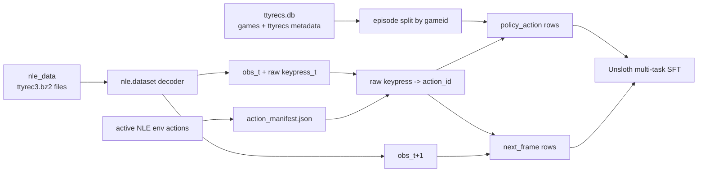
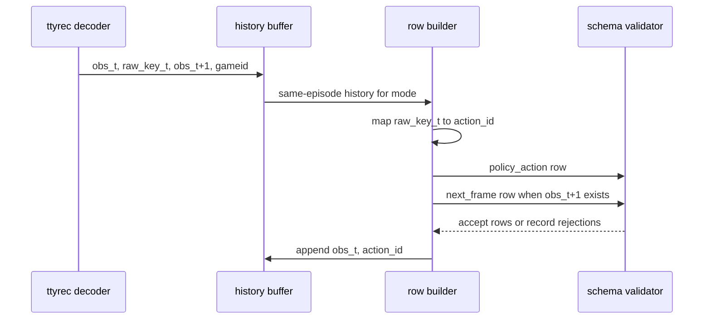

# NLD SFT Loop Implementation Plan

> **For agentic workers:** REQUIRED SUB-SKILL: Use superpowers:subagent-driven-development (recommended) or superpowers:executing-plans to implement this plan task-by-task. Steps use checkbox (`- [ ]`) syntax for tracking.

**Goal:** Build the supervised fine-tuning loop that converts local NLD ttyrec traces into Gemma chat rows and trains/evaluates a multi-task model that emits valid NLE `action_id` JSON, predicts next-1/5/10 NetHack frames conditioned on action sequences, and improves live rollout reward while minimizing observed HP damage.

**Architecture:** The local path reads NLD metadata from SQLite, decodes ttyrec3 streams through `nle.dataset`, maps raw replay keypresses to the active NLE discrete action manifest, pairs each transition with its next observation when available, and writes episode-safe SFT JSONL for `single_frame`, fixed context, `growing_context`, `feedback_context_N`, and `feedback_growing_context` modes. The training path uses two explicit task families: `policy_action` rows train exact `{"action_id": N}` answers, while `next_frame` rows train exact next-observation predictions conditioned on the current observation and selected action. Feedback-context rows add only prior action outcomes from earlier transitions: previous `action_id`, visible message, HP, depth, and unknown placeholders for reward/cumulative reward/game-time advancement when those are unavailable in offline NLD traces. Unsloth LoRA training uses completed full-build JSONL and an auto full-pass step resolver for the full-data run. Evaluation now includes single-step teacher-forced likelihood, single generated next-frame metrics, autoregressive next-1/5/10 sequence dynamics metrics, and live NLE watch rollouts summarized by reward and HP damage. Local JSON reports are authoritative and W&B logging is mandatory for dataset builds, SFT runs, and validation runs.

**Tech Stack:** Python 3.11, uv, pytest, sqlite3, NetHack-LE/nle dataset APIs, pydantic/dataclasses, Hugging Face Datasets, Transformers, TRL, Unsloth, PyTorch, W&B, JSONL.

---

## Evidence From Local Data

Use these facts as the starting contract:

- Local taster root: `/Users/ericfode/data/nld/nld-aa-taster`.
- Local taster ttyrec root: `/Users/ericfode/data/nld/nld-aa-taster/unpacked/nld-aa-taster/nle_data`.
- Local metadata DB: `/Users/ericfode/data/nld/nld-aa-taster/ttyrecs.db`.
- DB tables present: `meta`, `ttyrecs`, `games`, `datasets`, `roots`.
- DB tables absent: no `transitions` table. Do not design ingestion around labelled SQL transitions.
- `games` count in the taster DB: `1934`.
- `ttyrecs` count in the taster DB: `1934`.
- `roots` row observed: `nld-aa-taster`, root path above, ttyrec version `3`.
- Prior local artifact shows raw keypress vocabulary size `257` for a NLD-AA taster experiment.

## Archive-Backed Full-Data Path

Do not stage the full NAO/NLD ttyrec tree as millions of extracted files in a
Modal volume. A Modal extraction run hit the dataset-volume inode ceiling early:
the volume reported 402,140 of 500,000 inodes used after only the first staged
player subset. Full NAO has 3,427,501 ttyrec files, so extracted full-data
training is not the viable path.

Use archive shards plus per-shard NLD DB sidecars instead:

1. Store each player tar shard under `/datasets/nld-shards/`.
   The tar builder must dereference the repo-local staging symlinks so the
   archive contains ttyrec files, not symlink entries. Validate new shards have
   zero tar link members before trusting them.
2. Store each matching sidecar DB under `/datasets/nld-shard-dbs/`.
3. Store `/datasets/nld-nao-archive.jsonl` with rows:

```json
{"shard_tar": "/datasets/nld-shards/nld-nao-shard-000001.tar", "shard_db": "/datasets/nld-shard-dbs/nld-nao-shard-000001.ttyrecs.db"}
```

During SFT/eval, a Modal worker reads the manifest, extracts one tar shard at a
time to ephemeral local storage, rewrites that shard's sidecar DB root to the
ephemeral extraction path, decodes through `nle.dataset`, and then lets the temp
directory disappear. This keeps the Modal dataset volume inode count bounded by
shards and sidecar files instead of ttyrec files.

Current staged archive status as of 2026-06-17:

- Remote manifest uploaded: `/datasets/nld-nao-archive.jsonl`.
- Remote tar shards uploaded: 31.
- Remote sidecar DBs uploaded: 31.
- Local manifest mirror: `artifacts/nld-nao-archive-current.local.jsonl`.
- Local planner validation: dataset `nld-nao`, 31 shards, 123,595 per-shard
  game IDs, 118,042 deduped split game IDs, and 5,553 repeated game IDs across
  shards. Repeated game IDs must be assigned to one split globally, not rejected.
- Archive progress ledger: `artifacts/modal-archive-nld-nao-players.jsonl`
  contains 8,000 player upload records and marks 7,488 unique DB-indexed
  players as archive-staged.

Important data distinction:

- `nld-aa-taster` has ttyrec version `3` and decodes with `keypresses`; it is
  sufficient to prove the SFT data builder and trainer loop.
- The staged `nld-nao` archive has ttyrec version `1` and currently decodes
  only `done`, `gameids`, `timestamps`, `tty_chars`, `tty_colors`, and
  `tty_cursor`. It has no `keypresses` or `actions` field under the current
  NLE decoder path, so it cannot train `policy_action` rows or
  action-conditioned `next_frame` rows under this plan's supervised contract.

This is not the entire dataset yet. It is the corrected staging and training
access pattern to continue full-data staging without exhausting Modal volume
inodes.

## Frame-Only Archive Pseudo-Label Path

The staged `nld-nao` archive cannot provide true human keypress labels through
the current NLE decoder path. To keep moving toward full-archive training
without lying about label provenance, the pipeline now has an explicit
`pseudo_visible_player_delta` label source.

Contract:

- Frame-only batches are normalized into observation pairs without inventing
  `raw_key_code`.
- A pseudo policy label is emitted only when exactly one visible `@` appears in
  both `obs_t` and `obs_t+1`, and the player position moves exactly one cell in
  a compass direction.
- The inferred direction is mapped through the active action manifest using
  `CompassDirection.{N,NE,E,SE,S,SW,W,NW}` entries.
- Pseudo rows keep the normal policy output contract
  `{"action_id": <int>}`, but metadata must include
  `label_source="pseudo_visible_player_delta"`,
  `true_keypress_label_available=false`, `label_confidence`, `label_reason`,
  and the inferred direction/action name.
- Pseudo-label mode supports `policy_action` and action-conditioned
  `next_frame` rows. The action is still explicitly marked as inferred from
  visible movement, not as a true human keypress.

Modal smoke evidence as of 2026-06-17:

- Run ID: `full-archive-pseudo-sft-smoke-20260617-01`.
- Command shape: archive manifest `/datasets/nld-nao-archive.jsonl`,
  `--tasks policy_action`, `--label-source pseudo_visible_player_delta`,
  `--max-rows 32`, `--max-steps 1`.
- Data-build result: 32 accepted pseudo-policy rows, 86 rejected frame pairs.
- Training: `google/gemma-4-E4b-it`, Unsloth Git build, A100, 1 optimizer
  step, 36,700,160 trainable LoRA parameters.
- Training metrics: `train_loss=0.36499`, `train/grad_norm=0.23802`,
  `train/global_step=1`.
- W&B data-build run:
  `https://wandb.ai/ericfode/learn-nethack/runs/srlmoje9`.
- W&B training run:
  `https://wandb.ai/ericfode/learn-nethack/runs/m0ie7nbu`.
- Result: completed; adapter saved under
  `/runs/full-archive-pseudo-sft-smoke-20260617-01/adapters` and uploaded as
  W&B artifact `sft-adapter-full-archive-pseudo-sft-smoke-20260617-01`.

This is a path-opening smoke, not an improvement claim. Full-dataset training
still requires a larger pseudo-label build/train run plus baseline-vs-trained
policy, next-frame, and watch/play evaluation.

Archive pseudo-dynamics sizing evidence as of 2026-06-17:

- Run ID: `full-archive-pseudo-dynamics-sizing-512-20260617-01`.
- Command shape: archive manifest `/datasets/nld-nao-archive.jsonl`,
  `--tasks policy_action,next_frame`,
  `--label-source pseudo_visible_player_delta`, `--max-rows 512`.
- Result: completed without GPU trainer state.
- Data-build result: 512 accepted pseudo-policy rows, 512 accepted pseudo
  next-frame rows, 474 rejected frame pairs.
- Rejection reason: `pseudo_label_unavailable=474`.
- W&B data-build run:
  `https://wandb.ai/ericfode/learn-nethack/runs/qpc6ntqi`.
- Local pulled reports:
  `artifacts/full-archive-pseudo-dynamics-sizing-512-20260617-01/sft_build_report.json`,
  `artifacts/full-archive-pseudo-dynamics-sizing-512-20260617-01/manifest.json`,
  `artifacts/full-archive-pseudo-dynamics-sizing-512-20260617-01/rejection_report.json`.

A 4,096-row sizing probe was intentionally aborted after several quiet minutes
and replaced with the 512-row probe above. The next scaling step should use a
detached Modal run or add periodic archive-build progress logging before
retrying a larger cap.

Archive pseudo-dynamics baseline eval evidence as of 2026-06-17:

- Run ID:
  `full-archive-pseudo-dynamics-baseline-next-frame-8-20260617-01`.
- Command shape: archive manifest `/datasets/nld-nao-archive.jsonl`,
  validation split, `--eval-tasks next_frame`,
  `--label-source pseudo_visible_player_delta`, teacher-forced scoring,
  `--max-rows 8`.
- Model: baseline `google/gemma-4-E4b-it`, no adapter.
- Build result: 8 accepted pseudo next-frame rows, 43 rejected frame pairs.
- Metrics: teacher-forced mean NLL `13.407751937984496`, token accuracy
  `0.009302325581395349`, token count `1290`, row count `8`.
- W&B eval run:
  `https://wandb.ai/ericfode/learn-nethack/runs/zywqtmzw`.
- Local pulled reports:
  `artifacts/full-archive-pseudo-dynamics-baseline-next-frame-8-20260617-01/sft_eval_metrics.json`,
  `artifacts/full-archive-pseudo-dynamics-baseline-next-frame-8-20260617-01/sft_eval_report.json`,
  `artifacts/full-archive-pseudo-dynamics-baseline-next-frame-8-20260617-01/validation.next_frame.jsonl`.

Archive pseudo-dynamics 4,096-row training evidence as of 2026-06-17:

- Run ID: `full-archive-pseudo-dynamics-sft-4096-20260617-01`.
- Command shape: archive manifest `/datasets/nld-nao-archive.jsonl`,
  `--tasks policy_action,next_frame`,
  `--label-source pseudo_visible_player_delta`, `--max-rows 4096`,
  `--max-steps 25`.
- Data-build result: 4,096 accepted pseudo-policy rows, 4,096 accepted pseudo
  next-frame rows, 4,459 rejected frame pairs.
- Training: `google/gemma-4-E4b-it`, A100, 25 optimizer steps, 8,192 JSONL
  examples, 36,700,160 trainable LoRA parameters.
- Training metrics: `train_loss=0.3808742046356201`,
  `train_runtime=119.4557`, `train_steps_per_second=0.209`,
  `train/global_step=25`.
- W&B data-build run:
  `https://wandb.ai/ericfode/learn-nethack/runs/63pct0r0`.
- W&B training run:
  `https://wandb.ai/ericfode/learn-nethack/runs/owx8vanw`.
- Adapter path:
  `/runs/full-archive-pseudo-dynamics-sft-4096-20260617-01/adapters`.
- Local pulled reports:
  `artifacts/full-archive-pseudo-dynamics-sft-4096-20260617-01/sft_train_report.json`,
  `artifacts/full-archive-pseudo-dynamics-sft-4096-20260617-01/manifest.json`,
  `artifacts/full-archive-pseudo-dynamics-sft-4096-20260617-01/rejection_report.json`.

Archive pseudo-dynamics 4,096-row score-to-beat evidence as of 2026-06-17:

- Baseline eval run ID:
  `full-archive-pseudo-dynamics-baseline-eval-64-20260617-01`.
- Trained eval run ID:
  `full-archive-pseudo-dynamics-trained-eval-64-20260617-01`.
- Eval shape: archive validation split, `--eval-tasks policy_action,next_frame`,
  `--label-source pseudo_visible_player_delta`, teacher-forced next-frame
  scoring, `--max-rows 64`.
- Baseline metrics: exact-match `0.125`, parse validity `1.0`, action-space
  validity `1.0`, next-frame NLL `13.896828981841178`, next-frame token
  accuracy `0.007679103803414943`.
- Trained metrics: exact-match `0.125`, parse validity `1.0`, action-space
  validity `1.0`, next-frame NLL `13.652543138494895`, next-frame token
  accuracy `0.01192519649471497`.
- Formal comparison: `verdict="improved"` because teacher-forced next-frame
  NLL, perplexity, and token accuracy improved. Policy exact-match did not
  improve.
- W&B baseline eval run:
  `https://wandb.ai/ericfode/learn-nethack/runs/h6rnfklp`.
- W&B trained eval run:
  `https://wandb.ai/ericfode/learn-nethack/runs/otec4uhl`.
- Local pulled reports:
  `artifacts/full-archive-pseudo-dynamics-baseline-eval-64-20260617-01/sft_eval_metrics.json`,
  `artifacts/full-archive-pseudo-dynamics-trained-eval-64-20260617-01/sft_eval_metrics.json`,
  `artifacts/full-archive-pseudo-dynamics-sft-4096-20260617-01-comparison/score_to_beat_64.json`.

Archive pseudo-dynamics generated next-frame evidence as of 2026-06-17:

- Baseline generated-frame eval run ID:
  `full-archive-pseudo-dynamics-baseline-next-frame-generate-4-20260617-01`.
- Trained generated-frame eval run ID:
  `full-archive-pseudo-dynamics-trained-next-frame-generate-4-20260617-01`.
- Eval shape: archive validation split, `--eval-tasks next_frame`,
  `--next-frame-eval-mode generate`, `--next-frame-max-new-tokens 128`,
  `--label-source pseudo_visible_player_delta`, `--max-rows 4`.
- Baseline generated metrics: parse validity `1.0`, frame character accuracy
  `0.0`, exact-match `0.0`, map-line exact `0.0`, message exact `0.0`.
- Trained generated metrics: parse validity `0.0`, frame character accuracy
  `0.0`, exact-match `0.0`, map-line exact `0.0`, message exact `0.0`.
- Formal comparison: `verdict="regressed"` because generated next-frame parse
  validity fell from `1.0` to `0.0`. The earlier teacher-forced next-frame
  likelihood improvement does not yet translate into valid generated
  `{"next_frame": str}` predictions.
- W&B baseline generated-frame eval run:
  `https://wandb.ai/ericfode/learn-nethack/runs/qizwatkq`.
- W&B trained generated-frame eval run:
  `https://wandb.ai/ericfode/learn-nethack/runs/3xe3aewc`.
- Local pulled reports:
  `artifacts/full-archive-pseudo-dynamics-baseline-next-frame-generate-4-20260617-01/sft_eval_metrics.json`,
  `artifacts/full-archive-pseudo-dynamics-trained-next-frame-generate-4-20260617-01/sft_eval_metrics.json`,
  `artifacts/full-archive-pseudo-dynamics-next-frame-generate-4-20260617-01-comparison/score_to_beat.json`.

Archive pseudo-dynamics 4,096-row watch evidence as of 2026-06-17:

- Run ID: `full-archive-pseudo-dynamics-watch-10-20260617-01`.
- Command shape: side-by-side `NetHack-v0`, seed `20260615`,
  `--max-steps 10`, baseline `google/gemma-4-E4b-it` versus adapter
  `/runs/full-archive-pseudo-dynamics-sft-4096-20260617-01/adapters`.
- Result: both baseline and trained cumulative reward were `0.0`; neither side
  reached `done`; deterministic NLE seeding was true.
- Qualitative event check: the trained side still repeatedly chose action `1`
  and reached `"It's a wall."` messages by the end of the 10-step rollout.
- W&B watch run:
  `https://wandb.ai/ericfode/learn-nethack/runs/xrzctdpx`.
- Local pulled artifacts:
  `artifacts/full-archive-pseudo-dynamics-watch-10-20260617-01/report.json`,
  `artifacts/full-archive-pseudo-dynamics-watch-10-20260617-01/events.jsonl`,
  `artifacts/full-archive-pseudo-dynamics-watch-10-20260617-01/index.html`.

Conclusion from this increment: the first non-smoke archive SFT improved
teacher-forced next-frame likelihood, did not improve generated next-frame
validity, did not improve policy exact-match, and did not improve short-horizon
NetHack reward. The next scale-up should preserve the two-task archive path but
must either train generated-frame JSON format more directly or keep next-frame
as a scored auxiliary task rather than treating it as a deployable dynamics
model.

Archive pseudo-policy 4,096-row training evidence as of 2026-06-17:

- Run ID: `full-archive-pseudo-policy-sft-4096-20260617-01`.
- Command shape: archive manifest `/datasets/nld-nao-archive.jsonl`,
  `--tasks policy_action`, `--label-source pseudo_visible_player_delta`,
  `--max-rows 4096`, `--max-steps 50`.
- Data-build result: 4,096 accepted pseudo-policy rows, 0 next-frame rows,
  4,459 rejected frame pairs.
- Training: `google/gemma-4-E4b-it`, A100, 50 optimizer steps, 4,096 JSONL
  examples, 36,700,160 trainable LoRA parameters.
- Training metrics: `train_loss=0.2354464715719223`,
  `train_runtime=118.2252`, `train_steps_per_second=0.423`,
  `train/global_step=50`.
- W&B data-build run:
  `https://wandb.ai/ericfode/learn-nethack/runs/8xnwgc4f`.
- W&B training run:
  `https://wandb.ai/ericfode/learn-nethack/runs/fgax21ly`.
- Adapter path:
  `/runs/full-archive-pseudo-policy-sft-4096-20260617-01/adapters`.
- Local pulled reports:
  `artifacts/full-archive-pseudo-policy-sft-4096-20260617-01/sft_train_report.json`,
  `artifacts/full-archive-pseudo-policy-sft-4096-20260617-01/manifest.json`,
  `artifacts/full-archive-pseudo-policy-sft-4096-20260617-01/rejection_report.json`.

Archive pseudo-policy 4,096-row score-to-beat evidence as of 2026-06-17:

- Trained eval run ID:
  `full-archive-pseudo-policy-trained-eval-64-20260617-01`.
- Eval shape: archive validation split, `--eval-tasks policy_action`,
  `--label-source pseudo_visible_player_delta`, `--max-rows 64`.
- Baseline used for comparison:
  `full-archive-pseudo-dynamics-baseline-eval-64-20260617-01`.
- Baseline metrics: exact-match `0.125`, parse validity `1.0`, action-space
  validity `1.0`.
- Trained metrics: exact-match `0.171875`, parse validity `1.0`, action-space
  validity `1.0`.
- Formal comparison: `verdict="improved"` because policy exact-match improved
  by `0.046875`.
- W&B trained eval run:
  `https://wandb.ai/ericfode/learn-nethack/runs/o0qdfnbt`.
- Local pulled reports:
  `artifacts/full-archive-pseudo-policy-trained-eval-64-20260617-01/sft_eval_metrics.json`,
  `artifacts/full-archive-pseudo-policy-trained-eval-64-20260617-01/sft_eval_report.json`,
  `artifacts/full-archive-pseudo-policy-sft-4096-20260617-01-comparison/score_to_beat_64.json`.

Archive pseudo-policy 4,096-row watch evidence as of 2026-06-17:

- 10-step run ID: `full-archive-pseudo-policy-watch-10-20260617-01`.
- 50-step run ID: `full-archive-pseudo-policy-watch-50-20260617-01`.
- Command shape: side-by-side `NetHack-v0`, seed `20260615`, baseline
  `google/gemma-4-E4b-it` versus adapter
  `/runs/full-archive-pseudo-policy-sft-4096-20260617-01/adapters`.
- Result: both 10-step and 50-step watch runs had baseline cumulative reward
  `0.0` and trained cumulative reward `0.0`; deterministic NLE seeding was
  true.
- Qualitative event check: policy-only training changed action selection and
  initially avoided the immediate baseline wall pattern, but by step 50 both
  sides still had wall/solid-stone messages and no reward.
- W&B watch runs:
  `https://wandb.ai/ericfode/learn-nethack/runs/76ooja50`,
  `https://wandb.ai/ericfode/learn-nethack/runs/o4djn1fy`.
- Local pulled artifacts:
  `artifacts/full-archive-pseudo-policy-watch-10-20260617-01/report.json`,
  `artifacts/full-archive-pseudo-policy-watch-10-20260617-01/events.jsonl`,
  `artifacts/full-archive-pseudo-policy-watch-50-20260617-01/report.json`,
  `artifacts/full-archive-pseudo-policy-watch-50-20260617-01/events.jsonl`.

Conclusion from the policy-only increment: isolating the policy objective
improved offline pseudo-action exact match, unlike the mixed two-task run, but
still did not improve NetHack reward in watch evaluation. The next real step is
not another same-shape 4,096-row run; it is either full-dataset policy-only
training with progress logging or a better action target than visible movement
alone, followed by multi-seed watch/score evaluation.

Full archive pseudo-policy build progress evidence as of 2026-06-17:

- Run ID: `full-archive-pseudo-policy-build-full-20260617-01`.
- Command shape: archive manifest `/datasets/nld-nao-archive.jsonl`,
  `--tasks policy_action`, `--label-source pseudo_visible_player_delta`,
  `--full-dataset`, no row cap.
- Archive scale estimate from local sidecar DBs: 31 shard DBs, 123,595 games,
  282,841 ttyrec parts.
- Foreground Modal build was intentionally aborted after proving progress
  logging. Final observed progress event: 22,576 processed transitions, 11,000
  accepted policy rows, 11,576 rejected rows, 0 next-frame rows.
- Progress event schema:
  `learn-nethack.sft-build-progress.v1`, including run ID, label source, tasks,
  processed transitions, accepted policy rows, accepted next-frame rows,
  rejected rows, reason, last game ID, and last step.
- Modal app URL:
  `https://modal.com/apps/ericfode/main/ap-udnA56Ssc1yxZfVnGKejmy`.
- No final dataset report was pulled because the foreground app was aborted.
  The complete full-dataset build should run detached or with a durable resume
  contract before full-dataset training.

Detached full archive pseudo-dynamics build evidence as of 2026-06-17:

- Run ID: `full-archive-pseudo-dynamics-build-full-20260617-02`.
- Modal app ID: `ap-chOeuLhcFuXMaTumqYeogS`.
- Command shape:
  `modal run --detach src/learn_nethack/modal_train.py::sft_build
  --run-id full-archive-pseudo-dynamics-build-full-20260617-02
  --action-manifest /datasets/action_manifest.json
  --archive-manifest /datasets/nld-nao-archive.jsonl --mode single_frame
  --full-dataset --batch-size 4 --seq-length 64
  --tasks policy_action,next_frame
  --label-source pseudo_visible_player_delta`.
- Local stream was disconnected with the detached app still running. Modal
  reported: `The detached App will keep running.`
- Latest observed progress before stop: 673,230 processed transitions,
  327,000 accepted policy rows, 327,000 padded next-frame rows, and 346,230
  rejected rows.
- Follow logs with:
  `modal app logs ap-chOeuLhcFuXMaTumqYeogS`.
- The app was stopped on 2026-06-17 after compact-frame targets superseded the
  padded next-frame contract. Do not train from this partial full build.

Existing-dataset training contract added as of 2026-06-17:

- Modal entrypoint: `sft_train_existing`.
- Contract schema:
  `learn-nethack.sft-train-existing-contract.v1`.
- Purpose: train from a completed `/runs/<build-run>/sft-data` directory
  without rebuilding the archive JSONL inside the GPU training job.
- Safety rule: `sft_train_existing` now requires `train.jsonl`,
  `manifest.json`, and `rejection_report.json`. The build writes JSONL files
  incrementally, so `train.jsonl` alone is not proof that the full build
  completed.
- Training-loop correction after the 20k proof: `sft_train_existing` now builds
  an explicit curriculum from completed task-specific JSONL files instead of
  sending shuffled combined `train.jsonl` directly into TRL. The phases are
  `dynamics_warmup` over `train.next_frame.jsonl`, `mixed` over all
  `train.policy_action.jsonl` plus a deterministic sampled fraction of
  `train.next_frame.jsonl`, and `policy_calibration` over
  `train.policy_action.jsonl`. One LoRA model is carried through all phases and
  phase metrics are logged into the same W&B run.
- Local follow-up helper:
  `uv run nethack-gemma sft full-build-followup --build-run-id
  full-archive-pseudo-dynamics-build-full-20260617-02 --train-run-id
  full-archive-pseudo-dynamics-sft-full-20260617-02 --app-id
  ap-chOeuLhcFuXMaTumqYeogS --max-steps 0`.
- The helper prints local artifact presence, exact `modal volume get` commands
  for small build reports, the exact `sft_train_existing` command, and the
  required baseline/trained `sft_eval` commands for both action prediction and
  action-conditioned next-1/5/10 frame prediction. It also prints the
  `watch_compare` command that evaluates rollout reward and observed HP damage.
  It does not pull the large `train.jsonl`.
- Expected full-data training command after the detached build completes:
  `modal run src/learn_nethack/modal_train.py::sft_train_existing
  --run-id full-archive-pseudo-dynamics-sft-full-20260617-02
  --dataset-dir /runs/full-archive-pseudo-dynamics-build-full-20260617-02/sft-data
  --model-name google/gemma-4-E4b-it --max-steps 0`.
- `--max-steps 0` means auto full-data curriculum training after completion
  markers exist. The planner computes a bounded dynamics warmup, one mixed pass
  over all policy rows plus sampled next-frame rows, and a final policy
  calibration phase.
- Full-build readiness audit command added after the partial-build failure:
  `uv run nethack-gemma sft full-build-status --build-run-id <build-run-id>
  --check-remote --out artifacts/<build-run-id>/full_build_status.json`.
  This command checks required markers before `sft_train_existing`: remote
  `train.jsonl`, `manifest.json`, `rejection_report.json`, and
  `reports/sft_build_report.json`. It does not download the large
  `train.jsonl`.
- Current audit for `full-archive-pseudo-dynamics-build-full-20260617-02`:
  `artifacts/full-archive-pseudo-dynamics-build-full-20260617-02/full_build_status.json`.
  Result: `train_ready: false`. The remote volume contains `train.jsonl` and
  task-specific JSONL files, but `manifest.json`, `rejection_report.json`, and
  `reports/sft_build_report.json` are missing. Do not train from this run.
- Detached replacement full build launched with the current feedback-context
  data shape:
  `full-archive-pseudo-dynamics-build-full-feedback-context6-20260618-01`.
  Modal app: `ap-ePBe8yGCAi4kvC1Nz9tnHL`.
  Command shape: archive manifest `/datasets/nld-nao-archive.jsonl`, action
  manifest `/datasets/action_manifest.json`, mode `feedback_context_6`, tasks
  `policy_action,next_frame`, label source `pseudo_visible_player_delta`,
  `--full-dataset`, batch size `4`, sequence length `64`.
- Build progress now writes a durable Modal volume ledger at
  `/runs/full-archive-pseudo-dynamics-build-full-feedback-context6-20260618-01/reports/sft_build_progress.jsonl`.
  Local pulled copy:
  `artifacts/full-archive-pseudo-dynamics-build-full-feedback-context6-20260618-01/sft_build_progress.jsonl`.
  `full-build-status` now summarizes this ledger under `progress.latest` so the
  train-readiness report contains both marker state and latest counters.
  Latest observed status artifact:
  `artifacts/full-archive-pseudo-dynamics-build-full-feedback-context6-20260618-01/full_build_status.json`.
  Current result: `train_ready: false`; the final `manifest.json`,
  `rejection_report.json`, and `sft_build_report.json` markers are still
  missing while the build continues. Latest pulled progress: `9,000` processed
  transitions, `4,215` accepted policy rows, `4,215` accepted next-frame rows,
  and `4,785` rejected rows. Follow with
  `modal app logs ap-ePBe8yGCAi4kvC1Nz9tnHL`.
- The resulting adapter must be evaluated against Gemma baseline with
  `--eval-tasks policy_action,next_frame` and
  `--next-frame-eval-mode both --next-frame-sequence-horizons 1,5,10
  --next-frame-generate-max-rows 64 --next-frame-sequence-max-windows 64`
  before claiming improvement. That records action exact match,
  parse/action-space validity, teacher-forced next-frame NLL/token accuracy,
  generated next-frame parse/exact/character/section metrics, and
  autoregressive next-1/5/10 frame sequence metrics. Generated metrics record
  their row/window/frame counts, so a later larger proof can raise the caps
  deliberately. Watch-compare is the live NLE rollout gate and reports
  cumulative reward plus observed HP damage deltas.

Larger baseline eval evidence for the full-data proof as of 2026-06-17:

- Run ID: `full-archive-pseudo-dynamics-baseline-eval-512-20260617-02`.
- Command shape: archive validation split, `--max-rows 512`,
  `--eval-tasks policy_action,next_frame`,
  `--label-source pseudo_visible_player_delta`,
  `--next-frame-eval-mode teacher_forced`.
- Model: baseline `google/gemma-4-E4b-it`, no adapter.
- Metrics: exact-match `0.271484375`, parse validity `1.0`,
  action-space validity `1.0`, next-frame teacher-forced mean NLL
  `14.764876039811076`, next-frame teacher-forced token accuracy
  `0.009822026834888625`.
- W&B eval run:
  `https://wandb.ai/ericfode/learn-nethack/runs/xanhfkvc`.
- Local pulled reports:
  `artifacts/full-archive-pseudo-dynamics-baseline-eval-512-20260617-02/sft_eval_metrics.json`,
  `artifacts/full-archive-pseudo-dynamics-baseline-eval-512-20260617-02/sft_eval_report.json`,
  `artifacts/full-archive-pseudo-dynamics-baseline-eval-512-20260617-02/sft_eval_contract.json`.

Generated next-frame baseline evidence for the full-data proof as of
2026-06-17:

- Run ID:
  `full-archive-pseudo-dynamics-sft-full-20260617-02-baseline-eval`.
- Command shape: archive validation split, `--max-rows 512`,
  `--eval-tasks policy_action,next_frame`,
  `--label-source pseudo_visible_player_delta`,
  `--next-frame-eval-mode both`.
- W&B eval run:
  `https://wandb.ai/ericfode/learn-nethack/runs/ix4jvn5l`.
- Metrics: exact-match `0.271484375`, parse validity `1.0`,
  action-space validity `1.0`, next-frame teacher-forced mean NLL
  `14.764876039811076`, next-frame teacher-forced token accuracy
  `0.009822026834888625`, generated next-frame parse validity `1.0`,
  generated next-frame exact match `0.0`, generated next-frame character
  accuracy `2.109375329589895e-06`, generated map-line exact rate `0.0`,
  and generated message exact rate `0.0`.
- This run predates next-1/5/10 sequence metrics. The final score-to-beat proof
  must rerun the baseline/trained evals with
  `--next-frame-sequence-horizons 1,5,10`.
- A replacement baseline sequence eval was started detached as Modal app
  `ap-BSBgxlRANQU7xyVKl6wpv7` with the same run ID and
  `--next-frame-sequence-horizons 1,5,10` before the explicit
  `--next-frame-sequence-max-windows` cap existed. Do not treat the existing
  report files as updated until `sft_eval_metrics.json` contains keys such as
  `next_10_frame_sequence_char_accuracy`. Latest observed app log reached
  generation after the dynamics predictor model load. If this run remains slow,
  rerun the baseline with `--next-frame-sequence-max-windows 64`.
- The uncapped replacement app was stopped and superseded by capped baseline
  sequence eval run ID
  `full-archive-pseudo-dynamics-sft-full-20260617-02-baseline-seq64-eval`,
  Modal app `ap-gFb7sQtpGN3czhhGLvZGsK`, using
  `--next-frame-sequence-max-windows 64`. Latest observed remote file state:
  contract written, metrics/report not yet present; app log reached generation
  after the second model load.
- That app was then stopped and superseded by the corrected bounded baseline
  eval run ID
  `full-archive-pseudo-dynamics-sft-full-20260617-02-baseline-gen64-seq64-eval`,
  Modal app `ap-X5uEATImn063ayM0uxMYQz`, using both
  `--next-frame-generate-max-rows 64` and
  `--next-frame-sequence-max-windows 64`.
- The gen64/seq64 app was still too slow for iteration and was stopped. It was
  superseded by quick-proof baseline eval run ID
  `full-archive-pseudo-dynamics-sft-full-20260617-02-baseline-gen16-seq8-eval`,
  Modal app `ap-ekfTXMlFZqKrHHA5sXgktu`, using
  `--next-frame-max-new-tokens 128`, `--next-frame-generate-max-rows 16`, and
  `--next-frame-sequence-max-windows 8`. The trained eval must use the matching
  run shape before comparison.
- Local pulled reports:
  `artifacts/full-archive-pseudo-dynamics-sft-full-20260617-02-baseline-eval/sft_eval_metrics.json`,
  `artifacts/full-archive-pseudo-dynamics-sft-full-20260617-02-baseline-eval/sft_eval_report.json`,
  `artifacts/full-archive-pseudo-dynamics-sft-full-20260617-02-baseline-eval/sft_eval_contract.json`.

20k pseudo-dynamics proof slice evidence as of 2026-06-17:

- Build run ID: `full-archive-pseudo-dynamics-build-20k-20260617-01`.
- Build result: completed with 20,000 pseudo-policy rows, 20,000 pseudo
  next-frame rows, and 26,545 `pseudo_label_unavailable` rejections.
- W&B data-build run:
  `https://wandb.ai/ericfode/learn-nethack/runs/gn3zxjxw`.
- Train run ID: `full-archive-pseudo-dynamics-sft-20k-steps250-20260617-01`.
- Training shape: completed pre-curriculum `sft_train_existing` from the
  completed 20k build directory, `google/gemma-4-E4b-it`, explicit
  `--max-steps 250`, 40,000 training JSONL rows, effective batch size 4. This
  run used the older combined-file trainer and is evidence for why the
  curriculum fix was needed.
- Training metrics: `train_loss=0.15993175493180753`,
  `train_runtime=426.6593`, `train_steps_per_second=0.586`.
- W&B train run:
  `https://wandb.ai/ericfode/learn-nethack/runs/lqj7w6g0`.
- Matched tiny eval shape: baseline run
  `full-archive-pseudo-dynamics-sft-20k-steps250-baseline-gen2-seq2-eval-20260617-01`
  versus trained run
  `full-archive-pseudo-dynamics-sft-20k-steps250-trained-gen2-seq2-eval-20260617-01`,
  archive validation split, `--max-rows 512`, `--next-frame-eval-mode both`,
  `--next-frame-max-new-tokens 64`, `--next-frame-generate-max-rows 2`,
  `--next-frame-sequence-max-windows 2`, horizons `1,5,10`.
- Baseline eval metrics: exact-match `0.271484375`, next-frame
  teacher-forced NLL `14.764876039811076`, teacher-forced token accuracy
  `0.009822026834888625`, generated next-frame parse validity `1.0`,
  next-1 sequence parse validity `1.0`, next-5 sequence parse validity `1.0`,
  no next-10 windows under the tiny cap.
- Trained eval metrics: exact-match `0.216796875`, next-frame teacher-forced
  NLL `14.962035660004249`, teacher-forced token accuracy
  `0.011644249783457811`, generated next-frame parse validity `0.0`,
  next-1 sequence parse validity `0.0`, next-5 sequence parse validity `0.0`,
  no next-10 windows under the tiny cap.
- Formal comparison:
  `artifacts/full-archive-pseudo-dynamics-sft-20k-steps250-comparison-20260617-01/score_to_beat.json`,
  verdict `mixed`: token accuracy improved, but policy exact match,
  generated parse validity, sequence parse validity, NLL, and perplexity
  regressed.
- Watch run ID:
  `full-archive-pseudo-dynamics-sft-20k-steps250-watch-50-20260617-01`.
- Watch result: deterministic paired 50-step `NetHack-v0` rollout; baseline
  cumulative reward `0.0`, current cumulative reward `0.0`, baseline observed
  HP damage `0`, current observed HP damage `0`, both depth max `1`, neither
  reached done/death. Current policy repeatedly hit a wall by the end; baseline
  repeatedly hit solid stone.
- W&B watch run:
  `https://wandb.ai/ericfode/learn-nethack/runs/cq7p9nge`.
- Local pulled artifacts:
  `artifacts/full-archive-pseudo-dynamics-build-20k-20260617-01/sft_build_report.json`,
  `artifacts/full-archive-pseudo-dynamics-sft-20k-steps250-20260617-01/sft_train_existing_report.json`,
  `artifacts/full-archive-pseudo-dynamics-sft-20k-steps250-baseline-gen2-seq2-eval-20260617-01/sft_eval_metrics.json`,
  `artifacts/full-archive-pseudo-dynamics-sft-20k-steps250-trained-gen2-seq2-eval-20260617-01/sft_eval_metrics.json`,
  `artifacts/full-archive-pseudo-dynamics-sft-20k-steps250-watch-50-20260617-01/report.json`,
  `artifacts/full-archive-pseudo-dynamics-sft-20k-steps250-watch-50-20260617-01/events.jsonl`.
- Conclusion: this larger "reasonable amount" run did not improve the project
  score. It overfit the pseudo-labelled SFT contract enough to lower training
  loss, but it regressed policy exact-match, regressed generated next-frame JSON
  validity, worsened teacher-forced NLL, and did not improve live NetHack
  reward or damage.
- Workflow fix added during this proof: generated next-frame eval now emits
  `learn-nethack.sft-eval-progress.v1` JSON progress events for generated rows
  and sequence windows, preventing future silent generation stalls.
- Workflow fix added after this proof: existing-dataset SFT now records and
  executes the phased policy/dynamics curriculum described above, with focused
  tests in `tests/test_sft_train.py`.

Corrected 20k curriculum proof evidence as of 2026-06-17:

- Train run ID:
  `full-archive-pseudo-dynamics-sft-20k-curriculum-steps250-20260617-03`.
- W&B train run:
  `https://wandb.ai/ericfode/learn-nethack/runs/swf73y6w`.
- Curriculum plan: `dynamics_warmup` 50 steps over 20,000 next-frame rows,
  `mixed` 180 steps over 20,000 policy rows plus 5,058 sampled next-frame rows,
  and `policy_calibration` 20 steps over 20,000 policy rows.
- Phase train losses: dynamics warmup `0.3513715103268623`, mixed
  `0.1283725717622373`, policy calibration `0.10173191539943219`.
- Implementation fixes proven by this run:
  `sft_train_existing` carries one LoRA model through all three phases; TRL
  dataset preprocessing sets `dataset_num_proc=None` to avoid the earlier
  `PyCapsule` multiprocessing pickle failure; the mixed phase writes one
  minimal-schema JSONL containing only `messages` and `task`, avoiding Arrow
  schema conflicts between policy metadata and next-frame metadata.
- Trained eval run ID:
  `full-archive-pseudo-dynamics-sft-20k-curriculum-steps250-trained-gen2-seq2-eval-20260617-01`.
- W&B eval run:
  `https://wandb.ai/ericfode/learn-nethack/runs/1kbb238d`.
- Matched baseline remains:
  `full-archive-pseudo-dynamics-sft-20k-steps250-baseline-gen2-seq2-eval-20260617-01`.
- Eval metrics versus that baseline:
  policy exact-match regressed from `0.271484375` to `0.193359375`;
  teacher-forced next-frame NLL improved from `14.764876039811076` to
  `14.599486835869191`; teacher-forced next-frame token accuracy improved from
  `0.009822026834888625` to `0.014185556227426498`; generated next-frame parse
  validity regressed from `1.0` to `0.0`; next-1 and next-5 sequence parse
  validity regressed from `1.0` to `0.0`; next-10 had zero completed generated
  frames under the tiny cap.
- Formal comparison:
  `artifacts/full-archive-pseudo-dynamics-sft-20k-curriculum-steps250-comparison-20260617-01/score_to_beat.json`,
  verdict `mixed`.
- Watch run ID:
  `full-archive-pseudo-dynamics-sft-20k-curriculum-steps250-watch-50-20260617-01`.
- W&B watch run:
  `https://wandb.ai/ericfode/learn-nethack/runs/32t1j3g4`.
- Watch result: deterministic paired 50-step `NetHack-v0` rollout; baseline
  cumulative reward `0.0`, current cumulative reward `0.0`, reward delta `0.0`,
  baseline observed HP damage `0`, current observed HP damage `0`, damage delta
  `0.0`, both depth max `1`, neither reached done/death. In the first 10
  events, the current adapter mostly walked east until it hit a wall; baseline
  alternated between east-like moves, wall bumps, and a `Never mind.` action.
- Local pulled artifacts:
  `artifacts/full-archive-pseudo-dynamics-sft-20k-curriculum-steps250-20260617-03/sft_train_existing_report.json`,
  `artifacts/full-archive-pseudo-dynamics-sft-20k-curriculum-steps250-trained-gen2-seq2-eval-20260617-01/sft_eval_metrics.json`,
  `artifacts/full-archive-pseudo-dynamics-sft-20k-curriculum-steps250-comparison-20260617-01/score_to_beat.json`,
  `artifacts/full-archive-pseudo-dynamics-sft-20k-curriculum-steps250-watch-50-20260617-01/report.json`,
  `artifacts/full-archive-pseudo-dynamics-sft-20k-curriculum-steps250-watch-50-20260617-01/events.jsonl`,
  and
  `artifacts/full-archive-pseudo-dynamics-sft-20k-curriculum-steps250-watch-50-20260617-01/index.html`.
- Conclusion: the corrected curriculum loop is mechanically valid and improves
  teacher-forced next-frame likelihood, but it still fails the project proof
  gate. It worsens action prediction, cannot generate valid next-frame JSON,
  and does not improve live reward or observed damage. Do not launch a long
  full-dataset SFT with this same objective unless explicitly overriding this
  20k gate; first fix generated next-frame supervision/evaluation so parse
  validity is trainable and inspect generated samples in reports.

Compact-frame 20k curriculum proof evidence as of 2026-06-17:

- Failure analysis: generated samples from
  `full-archive-pseudo-dynamics-sft-20k-curriculum-samples-eval-512-20260617-01`
  showed the padded-frame adapter emitted a valid `{"next_frame": ...}` prefix
  and plausible map text, then repeated escaped blank lines until
  `max_new_tokens` cut it off. The new eval counters classify this as
  `truncated_json`, not schema drift.
- Implementation fix: `render_observation_text(..., compact_map=True)` now
  removes empty terminal padding rows. Next-frame row builders use this compact
  renderer for dynamics prompts and labels, and mark metadata
  `target_frame_kind="compact_rendered_observation_text"`. Policy rows keep the
  full terminal observation renderer.
- Compact build run ID:
  `full-archive-pseudo-dynamics-build-20k-compact-frame-20260617-01`.
- Compact build result: 20,000 pseudo-policy rows, 20,000 compact pseudo
  next-frame rows, and 26,545 `pseudo_label_unavailable` rejections.
- W&B compact build run:
  `https://wandb.ai/ericfode/learn-nethack/runs/ld2ha41i`.
- Compact train run ID:
  `full-archive-pseudo-dynamics-sft-20k-compact-frame-curriculum-steps250-20260617-01`.
- W&B compact train run:
  `https://wandb.ai/ericfode/learn-nethack/runs/atxlt9nf`.
- Curriculum plan: `dynamics_warmup` 50 steps over 20,000 compact next-frame
  rows, `mixed` 180 steps over 20,000 policy rows plus 5,058 sampled compact
  next-frame rows, and `policy_calibration` 20 steps over 20,000 policy rows.
- Phase train losses: dynamics warmup `0.35168515890836716`, mixed
  `0.127797499526706`, policy calibration `0.1005061749368906`.
- Matched compact baseline eval:
  `full-archive-pseudo-dynamics-sft-20k-compact-frame-baseline-gen4-seq4-eval-20260617-01`,
  W&B `https://wandb.ai/ericfode/learn-nethack/runs/t1ahoa9y`.
- Matched compact trained eval:
  `full-archive-pseudo-dynamics-sft-20k-compact-frame-trained-gen4-seq4-eval-20260617-01`,
  W&B `https://wandb.ai/ericfode/learn-nethack/runs/bjztgc30`.
- Eval shape: archive validation split, `--max-rows 512`,
  `--next-frame-eval-mode both`, `--next-frame-max-new-tokens 512`,
  `--next-frame-generate-max-rows 4`, `--next-frame-sequence-max-windows 4`,
  horizons `1,5,10`.
- Eval metrics versus compact baseline: policy exact-match regressed from
  `0.271484375` to `0.251953125`; teacher-forced next-frame NLL improved from
  `15.097259798820673` to `15.05029483177246`; teacher-forced token accuracy
  improved from `0.011073534512660424` to `0.013258758237946583`; single
  generated next-frame parse validity stayed `1.0`; single generated
  next-frame character accuracy improved from `0.0` to
  `0.7348105789849892`; next-1 sequence parse validity regressed from `1.0`
  to `0.75` while next-1 character accuracy improved from `0.0` to
  `0.5886856656741812`; next-5 sequence parse validity stayed `1.0` and
  next-5 character accuracy improved from `0.0` to `0.40774459820344744`;
  next-10 produced zero frames in this bounded eval shape and remains
  unproven.
- Formal comparison:
  `artifacts/full-archive-pseudo-dynamics-sft-20k-compact-frame-comparison-20260617-01/score_to_beat.json`,
  verdict `mixed`.
- Compact watch run ID:
  `full-archive-pseudo-dynamics-sft-20k-compact-frame-watch-50-20260617-01`,
  W&B `https://wandb.ai/ericfode/learn-nethack/runs/c7slmzud`.
- Watch result: deterministic paired 50-step `NetHack-v0` rollout; baseline
  cumulative reward `0.0`, current cumulative reward `0.0`, reward delta
  `0.0`, baseline observed HP damage `0`, current observed HP damage `0`,
  damage delta `0.0`, both depth max `1`, neither reached done/death. Current
  action counts were 32 east-like `1`, 13 `3`, and 5 `0`; baseline action
  counts were 42 `1`, 6 `10`, and 2 `31`. Current hit walls 14 times and
  swapped with the kitten 6 times; baseline hit solid stone 32 times.
- Local pulled artifacts:
  `artifacts/full-archive-pseudo-dynamics-build-20k-compact-frame-20260617-01/sft_build_report.json`,
  `artifacts/full-archive-pseudo-dynamics-build-20k-compact-frame-20260617-01/sample_rows.jsonl`,
  `artifacts/full-archive-pseudo-dynamics-sft-20k-compact-frame-curriculum-steps250-20260617-01/sft_train_existing_report.json`,
  `artifacts/full-archive-pseudo-dynamics-sft-20k-compact-frame-baseline-gen4-seq4-eval-20260617-01/sft_eval_metrics.json`,
  `artifacts/full-archive-pseudo-dynamics-sft-20k-compact-frame-trained-gen4-seq4-eval-20260617-01/sft_eval_metrics.json`,
  `artifacts/full-archive-pseudo-dynamics-sft-20k-compact-frame-comparison-20260617-01/score_to_beat.json`,
  `artifacts/full-archive-pseudo-dynamics-sft-20k-compact-frame-watch-50-20260617-01/report.json`,
  `artifacts/full-archive-pseudo-dynamics-sft-20k-compact-frame-watch-50-20260617-01/events.jsonl`,
  and
  `artifacts/full-archive-pseudo-dynamics-sft-20k-compact-frame-watch-50-20260617-01/index.html`.
- Conclusion: compact next-frame targets fix the generated JSON runaway and
  improve next-frame prediction metrics, including generated-frame character
  accuracy. The run still fails the project proof gate because policy
  exact-match regressed and live score/damage did not improve. Do not launch
  full-data SFT yet; first separate or reweight policy and dynamics training,
  then rerun a compact 20k gate with nonzero next-10 windows.

## Modal Runtime Smoke Evidence

As of 2026-06-17, a labelled taster SFT smoke has completed on Modal:

- Run ID: `taster-sft-smoke-20260616-07`.
- Data source: `/datasets/nld/nld-aa-taster/ttyrecs.db` plus
  `/datasets/nld/nld-aa-taster/unpacked/nld-aa-taster/nle_data`.
- Action manifest: `/datasets/action_manifest.json`.
- Rows built: 32 `policy_action`, 31 `next_frame`, 1 rejected row.
- Training: `google/gemma-4-E4b-it`, Unsloth Git build, A100, 3 optimizer
  steps, 36,700,160 trainable LoRA parameters.
- Result: completed; adapter saved under
  `/runs/taster-sft-smoke-20260616-07/adapters` and uploaded as W&B artifact
  `sft-adapter-taster-sft-smoke-20260616-07`.
- Metrics: `train_loss=0.5862`, final logged `train/loss=0.74357`, final
  `train/grad_norm=0.2648`, final `train/learning_rate=4e-05`.
- W&B data-build run:
  `https://wandb.ai/ericfode/learn-nethack/runs/mqlph32l`.
- W&B training run:
  `https://wandb.ai/ericfode/learn-nethack/runs/zrlnefxr`.

## Reasonable Taster Run Evidence

As of 2026-06-17, a longer labelled-taster SFT run has also completed on Modal.
This run is the current evidence for whether the first SFT loop improves play
or next-frame prediction.

- Run ID: `taster-sft-reasonable-20260617-01`.
- Data source: `/datasets/nld/nld-aa-taster/ttyrecs.db` plus
  `/datasets/nld/nld-aa-taster/unpacked/nld-aa-taster/nle_data`.
- Action manifest: `/datasets/action_manifest.json`.
- Rows built: 512 `policy_action`, 504 `next_frame`, 10 rejected rows.
- Training: `google/gemma-4-E4b-it`, Unsloth Git build, A100, 50 optimizer
  steps, batch size 4, sequence length 64, 36,700,160 trainable LoRA
  parameters.
- Result: completed; adapter saved under
  `/runs/taster-sft-reasonable-20260617-01/adapters` and uploaded as W&B
  artifact `sft-adapter-taster-sft-reasonable-20260617-01`.
- Final metrics: `train_loss=0.1993`, final logged `train/loss=0.09422`,
  final `train/grad_norm=0.10151`.
- W&B data-build run:
  `https://wandb.ai/ericfode/learn-nethack/runs/7u1lb2ut`.
- W&B training run:
  `https://wandb.ai/ericfode/learn-nethack/runs/l5l7vs54`.

Validation evidence does not show improvement:

- Baseline 64-row policy eval:
  `https://wandb.ai/ericfode/learn-nethack/runs/och3z8p7`.
  `parse_valid_rate=1.0`, `action_space_valid_rate=1.0`,
  `exact_match_rate=0.03125`.
- Trained 64-row policy eval:
  `https://wandb.ai/ericfode/learn-nethack/runs/ljxcr90o`.
  `parse_valid_rate=1.0`, `action_space_valid_rate=1.0`,
  `exact_match_rate=0.01562`.
- Baseline next-frame eval on the same 64-row eval command reported
  `next_frame_char_accuracy=0.0`, `next_frame_exact_match_rate=0.0`,
  `next_frame_map_line_exact_rate=0.0`, and
  `next_frame_message_exact_rate=0.0`.
- Free-generation trained next-frame eval did not complete under bounded eval
  attempts. Combined 8-row and 64-row evals stalled during frame generation. A
  final one-row eval capped at `next_frame_max_new_tokens=128` was aborted after
  several minutes without progress logs.
- Teacher-forced next-frame eval now avoids the generation stall by scoring the
  exact target JSON response tokens. Baseline W&B run:
  `https://wandb.ai/ericfode/learn-nethack/runs/0puiwg7k`. Trained W&B run:
  `https://wandb.ai/ericfode/learn-nethack/runs/ksazui3l`.
- Teacher-forced next-frame score-to-beat report:
  `/Users/ericfode/Documents/learn-nethack/artifacts/taster-sft-reasonable-20260617-01-next-frame-tf-score-to-beat/score_to_beat.json`.
  Verdict: `regressed`. Baseline mean NLL `14.24517`, trained mean NLL
  `14.45819`; baseline token accuracy `0.00804`, trained token accuracy
  `0.00593`.

Short watch/play evidence also does not show improvement:

- Watch run ID: `taster-sft-reasonable-20260617-01-watch-10`.
- Local report path:
  `/Users/ericfode/Documents/learn-nethack/artifacts/taster-sft-reasonable-20260617-01-watch-10/report.json`.
- Local event path:
  `/Users/ericfode/Documents/learn-nethack/artifacts/taster-sft-reasonable-20260617-01-watch-10/events.jsonl`.
- Steps: 10.
- Current adapter cumulative reward: `0.0`.
- Baseline cumulative reward: `0.0`.
- Current actions: `[3, 3, 0, 3, 3, 3, 3, 3, 3, 3]`.
- Baseline actions: `[1, 1, 1, 1, 1, 1, 1, 1, 1, 1]`.
- Both final visible messages were `It's a wall.`
- Caveat: `deterministic_nle_seed=false`, so this was not a fair paired A/B
  environment. It is a smoke test for play plumbing and weak behavioral
  evidence only.

Conclusion: this first reasonable taster run proved the training, W&B, adapter,
eval, and watch plumbing, but it did not prove model improvement. The policy
exact-match metric regressed, the short play score did not improve, and the
teacher-forced next-frame metric regressed. Free-generation next-frame eval
remains too slow or stalled for routine use and should stay opt-in.

Runtime notes:

- Gemma 4 support requires current Unsloth and Unsloth Zoo from Git, not the
  older packaged Unsloth release.
- The model cache is a Modal volume: `learn-nethack-hf-cache` mounted at
  `/cache/huggingface`. The Modal image sets `HF_HOME`, `HF_HUB_CACHE`,
  `HF_DATASETS_CACHE`, and `TRANSFORMERS_CACHE` into that mount, and training
  commits the cache volume after model construction.
- For the smoke path, gradient checkpointing must stay disabled. With
  checkpointing enabled, Gemma 4 plus Unsloth/Torch Dynamo repeatedly failed
  before the first optimizer step with `Dynamo recompile limit exceeded`
  inside checkpointed backward recomputation.



## SFT Contracts

### Source Authority

The taster SQLite DB is metadata only. It selects games, splits episodes, and joins role/race/alignment/death metadata. It is not the source of per-step observations or labels.

Per-step observations and labels come from decoded ttyrec streams through `nle.dataset`. If `nle.dataset` is unavailable, unit tests use fixtures and the integration ingestion test is skipped with a clear reason.

### Action Label Authority

The model target is the active NLE discrete action ID, not the raw ttyrec byte.

Create an action manifest from the exact NLE environment used for SFT and eval:

```json
{
  "env_id": "NetHackChallenge-v0",
  "action_space_n": 23,
  "entries": [
    {
      "action_id": 0,
      "nle_action_name": "NORTH",
      "raw_key_code": 107,
      "key_label": "k"
    }
  ]
}
```

Label resolution:

1. Read a raw keypress from decoded NLD replay data.
2. Convert it to an integer raw key code.
3. Look up the raw key code in `action_manifest.entries[*].raw_key_code`.
4. Emit the corresponding `action_id`.
5. Reject the row if no mapping exists.

Do not silently remap unknown keypresses. Do not default unmapped labels to `esc`, `north`, or any other action.

### Row Schemas

Each SFT row is one supervised task. `policy_action` rows preserve the policy
contract used by RL and candidate-action scoring:

```json
{
  "schema_version": "learn-nethack.sft-row.v1",
  "dataset_name": "nld-aa-taster",
  "split": "train",
  "task": "policy_action",
  "mode": "single_frame",
  "gameid": 1,
  "episode_id": "nld-aa-taster:1",
  "step": 42,
  "messages": [
    {
      "role": "system",
      "content": "You control NetHack through NLE. Return only JSON: {\"action_id\": int}."
    },
    {
      "role": "user",
      "content": "Allowed action_ids: [0,1,2]\nCurrent observation:\nMAP:\n@..\nMESSAGE:\n<missing>\nBLSTATS:\n<missing>\nINVENTORY:\n<missing>"
    },
    {
      "role": "assistant",
      "content": "{\"action_id\": 1}"
    }
  ],
  "metadata": {
    "target_action_id": 1,
    "raw_key_code": 107,
    "raw_key_label": "k",
    "valid_action_ids": [0, 1, 2],
    "role": "Sam",
    "race": "Hum",
    "alignment": "Law",
    "death": "killed by a hobbit while frozen by a monster's gaze",
    "points": 1781,
    "turns": 9717
  }
}
```

For `policy_action` rows, assistant content must parse as exact JSON and
contain only `action_id`.

`next_frame` rows train supervised dynamics. They must use a different task tag
and a different system prompt so the model cannot confuse frame prediction with
policy action output:

```json
{
  "schema_version": "learn-nethack.sft-row.v1",
  "dataset_name": "nld-aa-taster",
  "split": "train",
  "task": "next_frame",
  "mode": "single_frame",
  "gameid": 1,
  "episode_id": "nld-aa-taster:1",
  "step": 42,
  "messages": [
    {
      "role": "system",
      "content": "You predict NetHack transition dynamics from NLE traces. Return only the next rendered observation frame text. Begin with MAP: and include MESSAGE:, BLSTATS:, and INVENTORY: sections."
    },
    {
      "role": "user",
      "content": "Action taken: {\"action_id\": 1}\nCurrent observation:\nMAP:\n@..\nMESSAGE:\n<missing>\nBLSTATS:\n<missing>\nINVENTORY:\n<missing>"
    },
    {
      "role": "assistant",
      "content": "MAP:\n.@.\nMESSAGE:\nYou move east.\nBLSTATS:\n[2, 1, 3]\nINVENTORY:\n<empty>"
    }
  ],
  "metadata": {
    "conditioning_action_id": 1,
    "raw_key_code": 107,
    "target_frame_kind": "rendered_observation_text",
    "next_frame_response_format": "raw_frame",
    "role": "Sam",
    "race": "Hum",
    "alignment": "Law"
  }
}
```

For new `next_frame` rows, assistant content is the rendered observation text
for `obs_t+1` directly. Legacy JSON rows with `{"next_frame": "..."}` remain
readable only for old artifacts and comparisons; do not build new dynamics
datasets with JSON-wrapped frame text because long frame strings repeatedly
truncated before the closing JSON delimiter during generated eval.
Rows without same-episode `obs_t+1` are rejected for the frame task with reason
`missing_next_observation`, but they may still produce `policy_action` rows.

### Multi-Task Objective

The model is one Gemma LoRA adapter trained on two supervised tasks:

```text
L_total = L_policy_action + frame_loss_weight * L_next_frame
```

Because next-frame targets are much longer than action targets, do not let raw
token count dominate training. Use this default schedule:

```json
{
  "dynamics_warmup_steps": 50,
  "mixed_training_steps": 100,
  "policy_calibration_steps": 20,
  "frame_auxiliary_ratio": 0.25,
  "frame_loss_weight": 0.25,
  "max_next_frame_chars": 4096
}
```

Training phases:

1. `dynamics_warmup`: train only `next_frame` rows so the adapter learns local
   transition structure.
2. `mixed`: train all `policy_action` rows plus sampled `next_frame` rows at
   `frame_auxiliary_ratio`.
3. `policy_calibration`: train only `policy_action` rows so final policy
   prompts remain sharply calibrated to exact `{"action_id": N}` output.

Candidate-action evaluation and RL use only `policy_action` prompts and exact
`{"action_id": N}` candidate scoring.

### Prompt Modes

Build these modes from the same decoded transitions:

- `single_frame`: current observation only.
- `context_2`: last two `(observation, action_id)` pairs in the same episode.
- `context_4`: last four pairs in the same episode.
- `context_8`: last eight pairs in the same episode.
- `context_16`: last sixteen pairs in the same episode.
- `growing_context`: all previous pairs from the same episode until the configured token budget is reached; trim oldest history first and always preserve the current observation.

No context may cross `gameid` or `episode_id`.



## File Structure

- Create `src/learn_nethack/nld_metadata.py`: SQLite metadata reads, root validation, game/ttyrec joins.
- Create `src/learn_nethack/nld_archive.py`: archive manifest parsing, per-shard DB planning, ephemeral shard extraction for full-data Modal builds.
- Create `src/learn_nethack/action_manifest.py`: active NLE action manifest and raw-key-to-action mapping.
- Create `src/learn_nethack/nld_decode.py`: NLE dataset adapter, batch normalization, transition iterator.
- Create `src/learn_nethack/observations.py`: deterministic terminal/message/blstats/inventory renderer.
- Create `src/learn_nethack/sft_rows.py`: prompt construction, history modes, action rows, next-frame rows, row validation.
- Create `src/learn_nethack/sft_build.py`: dataset split, JSONL writer, manifest writer, rejection report, task-count report.
- Create `src/learn_nethack/sft_train.py`: Unsloth LoRA SFT run with action and next-frame supervised phases.
- Create `src/learn_nethack/sft_eval.py`: validation exact-match, parse, action-space, next-frame, and role/death breakdown.
- Create `src/learn_nethack/wandb_logging.py`: W&B run creation for data build, SFT, and eval.
- Modify `src/learn_nethack/cli.py`: add `data inspect`, `data build-sft`, `sft train`, and `sft eval`.
- Test `tests/test_nld_metadata.py`.
- Test `tests/test_action_manifest.py`.
- Test `tests/test_nld_decode_fixtures.py`.
- Test `tests/test_sft_rows.py`.
- Test `tests/test_sft_build.py`.
- Test `tests/test_sft_eval.py`.
- Integration test `tests/integration/test_nld_taster_sft_build.py`.

## Tasks

### Task 1: Metadata Reader And Episode Split

**Files:**
- Create: `src/learn_nethack/nld_metadata.py`
- Test: `tests/test_nld_metadata.py`

- [ ] **Step 1: Write metadata tests**

Create fixture SQLite DBs in `tmp_path` with `games`, `ttyrecs`, and `roots`. Assert:

```python
from learn_nethack.nld_metadata import inspect_nld_db, split_gameids

def test_inspect_nld_db_reads_counts_and_root(tmp_path):
    db_path = make_fixture_db(tmp_path)
    report = inspect_nld_db(db_path)
    assert report.dataset_name == "nld-aa-taster"
    assert report.game_count == 3
    assert report.ttyrec_count == 3
    assert report.ttyrec_version == 3

def test_split_gameids_is_episode_safe_and_stable():
    splits = split_gameids([1, 2, 3, 4, 5], seed=20260615)
    assert sorted(splits.train + splits.validation + splits.test) == [1, 2, 3, 4, 5]
    assert not (set(splits.train) & set(splits.validation))
    assert split_gameids([1, 2, 3, 4, 5], seed=20260615) == splits
```

- [ ] **Step 2: Run tests and verify failure**

Run:

```bash
uv run pytest tests/test_nld_metadata.py -q
```

Expected: fail because `learn_nethack.nld_metadata` does not exist.

- [ ] **Step 3: Implement metadata reader**

Implement:

```python
from dataclasses import dataclass
from pathlib import Path
import hashlib
import sqlite3

@dataclass(frozen=True)
class NldDbReport:
    db_path: str
    dataset_name: str
    root: str
    ttyrec_version: int
    game_count: int
    ttyrec_count: int

@dataclass(frozen=True)
class GameSplit:
    train: list[int]
    validation: list[int]
    test: list[int]

def inspect_nld_db(db_path: str | Path) -> NldDbReport:
    path = Path(db_path)
    with sqlite3.connect(path) as conn:
        root_row = conn.execute(
            "select dataset_name, root, ttyrec_version from roots order by dataset_name limit 1"
        ).fetchone()
        if root_row is None:
            raise ValueError(f"{path} has no roots row")
        game_count = int(conn.execute("select count(*) from games").fetchone()[0])
        ttyrec_count = int(conn.execute("select count(*) from ttyrecs").fetchone()[0])
    return NldDbReport(
        db_path=str(path),
        dataset_name=str(root_row[0]),
        root=str(root_row[1]),
        ttyrec_version=int(root_row[2]),
        game_count=game_count,
        ttyrec_count=ttyrec_count,
    )

def _bucket(gameid: int, seed: int) -> float:
    digest = hashlib.sha256(f"{seed}:{gameid}".encode("utf-8")).hexdigest()
    return int(digest[:8], 16) / 0xFFFFFFFF

def split_gameids(
    gameids: list[int],
    *,
    seed: int,
    train_ratio: float = 0.90,
    validation_ratio: float = 0.05,
) -> GameSplit:
    train: list[int] = []
    validation: list[int] = []
    test: list[int] = []
    for gameid in sorted(gameids):
        value = _bucket(gameid, seed)
        if value < train_ratio:
            train.append(gameid)
        elif value < train_ratio + validation_ratio:
            validation.append(gameid)
        else:
            test.append(gameid)
    return GameSplit(train=train, validation=validation, test=test)
```

- [ ] **Step 4: Run tests and verify pass**

Run:

```bash
uv run pytest tests/test_nld_metadata.py -q
```

Expected: pass.

- [ ] **Step 5: Commit**

```bash
git add src/learn_nethack/nld_metadata.py tests/test_nld_metadata.py
git commit -m "feat: inspect NLD metadata and split episodes"
```

### Task 2: Action Manifest And Raw Key Mapping

**Files:**
- Create: `src/learn_nethack/action_manifest.py`
- Test: `tests/test_action_manifest.py`

- [ ] **Step 1: Write action manifest tests**

Test explicit mapping from raw key codes to active environment action IDs:

```python
from learn_nethack.action_manifest import ActionEntry, ActionManifest

def test_raw_key_maps_to_action_id():
    manifest = ActionManifest(
        env_id="NetHackChallenge-v0",
        entries=[
            ActionEntry(action_id=0, nle_action_name="NORTH", raw_key_code=107, key_label="k"),
            ActionEntry(action_id=1, nle_action_name="SOUTH", raw_key_code=106, key_label="j"),
        ],
    )
    assert manifest.action_id_for_raw_key(107) == 0
    assert manifest.valid_action_ids() == [0, 1]

def test_unknown_key_is_rejected():
    manifest = ActionManifest(env_id="NetHackChallenge-v0", entries=[])
    try:
        manifest.action_id_for_raw_key(999)
    except KeyError as exc:
        assert "raw key code 999" in str(exc)
    else:
        raise AssertionError("unknown raw key code should raise")
```

- [ ] **Step 2: Run tests and verify failure**

Run:

```bash
uv run pytest tests/test_action_manifest.py -q
```

Expected: fail because `learn_nethack.action_manifest` does not exist.

- [ ] **Step 3: Implement manifest**

Implement dataclasses with JSON save/load:

```python
from dataclasses import asdict, dataclass
from pathlib import Path
import json

@dataclass(frozen=True)
class ActionEntry:
    action_id: int
    nle_action_name: str
    raw_key_code: int
    key_label: str

@dataclass(frozen=True)
class ActionManifest:
    env_id: str
    entries: list[ActionEntry]

    def valid_action_ids(self) -> list[int]:
        return [entry.action_id for entry in self.entries]

    def action_id_for_raw_key(self, raw_key_code: int) -> int:
        for entry in self.entries:
            if entry.raw_key_code == raw_key_code:
                return entry.action_id
        raise KeyError(f"raw key code {raw_key_code} is not in active NLE action manifest")

    def save(self, path: str | Path) -> None:
        Path(path).write_text(json.dumps(asdict(self), indent=2) + "\n", encoding="utf-8")

def load_action_manifest(path: str | Path) -> ActionManifest:
    payload = json.loads(Path(path).read_text(encoding="utf-8"))
    return ActionManifest(
        env_id=payload["env_id"],
        entries=[ActionEntry(**entry) for entry in payload["entries"]],
    )
```

The environment-backed manifest builder belongs in the integration step because it imports `nle`.

- [ ] **Step 4: Run tests and verify pass**

Run:

```bash
uv run pytest tests/test_action_manifest.py -q
```

Expected: pass.

- [ ] **Step 5: Commit**

```bash
git add src/learn_nethack/action_manifest.py tests/test_action_manifest.py
git commit -m "feat: map NLD keypresses to NLE action ids"
```

### Task 3: Fixture Decoder And Observation Renderer

**Files:**
- Create: `src/learn_nethack/nld_decode.py`
- Create: `src/learn_nethack/observations.py`
- Test: `tests/test_nld_decode_fixtures.py`

- [ ] **Step 1: Write fixture decoder tests**

Use a fixture batch shaped like a decoded NLE batch:

```python
from learn_nethack.nld_decode import normalize_decoded_batch
from learn_nethack.observations import render_observation_text

def test_normalize_decoded_batch_yields_transitions():
    batch = {
        "gameids": [1, 1],
        "steps": [0, 1],
        "keypresses": [107, 106],
        "tty_chars": [[[64, 46], [46, 46]], [[46, 64], [46, 46]]],
        "message": [[72, 105], [77, 111, 118, 101, 100]],
        "blstats": [[1, 2, 3], [2, 2, 3]],
    }
    transitions = list(normalize_decoded_batch(batch))
    assert transitions[0].gameid == 1
    assert transitions[0].raw_key_code == 107
    assert transitions[0].step == 0
    assert transitions[0].next_observation["tty_chars"] == [[46, 64], [46, 46]]
    assert transitions[1].next_observation is None

def test_render_observation_text_is_stable():
    text = render_observation_text(
        {
            "tty_chars": [[64, 46], [46, 46]],
            "message": [72, 105],
            "blstats": [1, 2, 3],
            "inventory": [],
        }
    )
    assert text == "MAP:\n@.\n..\nMESSAGE:\nHi\nBLSTATS:\n[1, 2, 3]\nINVENTORY:\n<empty>"
```

- [ ] **Step 2: Run tests and verify failure**

Run:

```bash
uv run pytest tests/test_nld_decode_fixtures.py -q
```

Expected: fail because decoder and renderer do not exist.

- [ ] **Step 3: Implement normalized transition type**

Implement:

```python
from dataclasses import dataclass
from typing import Any, Iterable

@dataclass(frozen=True)
class DecodedTransition:
    gameid: int
    step: int
    raw_key_code: int
    observation: dict[str, Any]
    next_observation: dict[str, Any] | None

def _list_value(value: Any) -> Any:
    if hasattr(value, "tolist"):
        return value.tolist()
    return value

def normalize_decoded_batch(batch: dict[str, Any]) -> Iterable[DecodedTransition]:
    gameids = _list_value(batch["gameids"])
    steps = _list_value(batch.get("steps", list(range(len(gameids)))))
    keypresses = _list_value(batch.get("keypresses", batch.get("actions")))
    tty_chars = _list_value(batch["tty_chars"])
    messages = _list_value(batch.get("message", [[] for _ in gameids]))
    blstats = _list_value(batch.get("blstats", [[] for _ in gameids]))
    observations = []
    for index, gameid in enumerate(gameids):
        observations.append(
            {
                "tty_chars": tty_chars[index],
                "message": messages[index],
                "blstats": blstats[index],
                "inventory": [],
            }
        )
    for index, gameid in enumerate(gameids):
        next_observation = None
        if index + 1 < len(gameids) and int(gameids[index + 1]) == int(gameid):
            next_observation = observations[index + 1]
        yield DecodedTransition(
            gameid=int(gameid),
            step=int(steps[index]),
            raw_key_code=int(keypresses[index]),
            observation=observations[index],
            next_observation=next_observation,
        )
```

- [ ] **Step 4: Implement renderer**

Implement:

```python
from typing import Any

def _bytes_to_text(values: list[int]) -> str:
    chars = []
    for value in values:
        if int(value) == 0:
            continue
        chars.append(chr(int(value)))
    return "".join(chars).strip()

def _grid_to_text(grid: list[list[int]]) -> str:
    lines = []
    for row in grid:
        line = "".join(chr(int(value)) if int(value) else " " for value in row).rstrip()
        lines.append(line)
    return "\n".join(lines).rstrip()

def render_observation_text(obs: dict[str, Any]) -> str:
    map_text = _grid_to_text(obs.get("tty_chars", [])) or "<missing>"
    message = _bytes_to_text(obs.get("message", [])) or "<missing>"
    blstats = obs.get("blstats")
    inventory = obs.get("inventory")
    blstats_text = str(blstats) if blstats else "<missing>"
    inventory_text = "<empty>" if inventory == [] else str(inventory or "<missing>")
    return "\n".join(
        [
            "MAP:",
            map_text,
            "MESSAGE:",
            message,
            "BLSTATS:",
            blstats_text,
            "INVENTORY:",
            inventory_text,
        ]
    )
```

- [ ] **Step 5: Run tests and verify pass**

Run:

```bash
uv run pytest tests/test_nld_decode_fixtures.py -q
```

Expected: pass.

- [ ] **Step 6: Commit**

```bash
git add src/learn_nethack/nld_decode.py src/learn_nethack/observations.py tests/test_nld_decode_fixtures.py
git commit -m "feat: normalize decoded NLD batches"
```

### Task 4: SFT Row Builder With Context Modes

**Files:**
- Create: `src/learn_nethack/sft_rows.py`
- Test: `tests/test_sft_rows.py`

- [ ] **Step 1: Write row builder tests**

Assert exact assistant JSON, no cross-episode history, fixed context, and growing context truncation:

```python
import json
from learn_nethack.action_manifest import ActionEntry, ActionManifest
from learn_nethack.nld_decode import DecodedTransition
from learn_nethack.sft_rows import HistoryBuffer, build_next_frame_row, build_policy_action_row

def test_build_sft_row_exact_json_label():
    manifest = ActionManifest(
        env_id="NetHackChallenge-v0",
        entries=[ActionEntry(0, "NORTH", 107, "k")],
    )
    transition = DecodedTransition(
        1,
        0,
        107,
        {"tty_chars": [[64]], "message": [], "blstats": []},
        {"tty_chars": [[46, 64]], "message": [77], "blstats": [1]},
    )
    row = build_policy_action_row(
        dataset_name="nld-aa-taster",
        split="train",
        mode="single_frame",
        transition=transition,
        action_manifest=manifest,
        game_metadata={"role": "Sam", "race": "Hum", "align": "Law", "death": "quit"},
        history=[],
    )
    assert row["task"] == "policy_action"
    assert json.loads(row["messages"][2]["content"]) == {"action_id": 0}
    assert row["metadata"]["raw_key_code"] == 107

def test_build_next_frame_row_predicts_following_frame():
    manifest = ActionManifest(
        env_id="NetHackChallenge-v0",
        entries=[ActionEntry(0, "NORTH", 107, "k")],
    )
    transition = DecodedTransition(
        1,
        0,
        107,
        {"tty_chars": [[64]], "message": [], "blstats": []},
        {"tty_chars": [[46, 64]], "message": [77], "blstats": [1]},
    )
    row = build_next_frame_row(
        dataset_name="nld-aa-taster",
        split="train",
        mode="single_frame",
        transition=transition,
        action_manifest=manifest,
        game_metadata={"role": "Sam", "race": "Hum", "align": "Law", "death": "quit"},
        history=[],
    )
    payload = json.loads(row["messages"][2]["content"])
    assert row["task"] == "next_frame"
    assert payload["next_frame"].startswith("MAP:")
    assert "@" in payload["next_frame"]

def test_history_buffer_does_not_cross_gameid():
    buffer = HistoryBuffer(max_items=4)
    buffer.append(gameid=1, observation_text="old", action_id=0)
    assert buffer.history_for(gameid=2, mode="context_4", token_budget=1000) == []
```

- [ ] **Step 2: Run tests and verify failure**

Run:

```bash
uv run pytest tests/test_sft_rows.py -q
```

Expected: fail because `sft_rows.py` does not exist.

- [ ] **Step 3: Implement prompts and history**

Implement:

```python
POLICY_SYSTEM_PROMPT = 'You control NetHack through NLE. Return only JSON: {"action_id": int}.'
NEXT_FRAME_SYSTEM_PROMPT = (
    "You predict NetHack transition dynamics from NLE traces. "
    "Return only the next rendered observation frame text. "
    "Begin with MAP: and include MESSAGE:, BLSTATS:, and INVENTORY: sections."
)

def build_user_prompt(
    *,
    observation_text: str,
    valid_action_ids: list[int],
    history: list[tuple[str, int]],
) -> str:
    lines = [f"Allowed action_ids: {valid_action_ids}"]
    if history:
        lines.append("Recent history:")
        for prior_observation, prior_action_id in history:
            lines.append(prior_observation)
            lines.append(f"Previous action_id: {prior_action_id}")
    lines.append("Current observation:")
    lines.append(observation_text)
    return "\n".join(lines)

def build_next_frame_prompt(
    *,
    observation_text: str,
    action_id: int,
    history: list[tuple[str, int]],
) -> str:
    lines = [f'Action taken: {{"action_id": {action_id}}}']
    if history:
        lines.append("Recent history:")
        for prior_observation, prior_action_id in history:
            lines.append(prior_observation)
            lines.append(f"Previous action_id: {prior_action_id}")
    lines.append("Current observation:")
    lines.append(observation_text)
    return "\n".join(lines)
```

`HistoryBuffer.history_for` rules:

- `single_frame` returns `[]`.
- `context_N` returns the last `N` same-game entries.
- `growing_context` returns same-game entries from oldest to newest, then trims oldest entries until the approximate character budget is below `token_budget * 4`.

- [ ] **Step 4: Implement action and next-frame row builders**

Use `render_observation_text`, map raw key to `action_id`, and include metadata.
The policy row builder is:

```python
def build_policy_action_row(
    *,
    dataset_name: str,
    split: str,
    mode: str,
    transition,
    action_manifest,
    game_metadata: dict,
    history: list[tuple[str, int]],
) -> dict:
    action_id = action_manifest.action_id_for_raw_key(transition.raw_key_code)
    observation_text = render_observation_text(transition.observation)
    user_prompt = build_user_prompt(
        observation_text=observation_text,
        valid_action_ids=action_manifest.valid_action_ids(),
        history=history,
    )
    return {
        "schema_version": "learn-nethack.sft-row.v1",
        "dataset_name": dataset_name,
        "split": split,
        "task": "policy_action",
        "mode": mode,
        "gameid": transition.gameid,
        "episode_id": f"{dataset_name}:{transition.gameid}",
        "step": transition.step,
        "messages": [
            {"role": "system", "content": POLICY_SYSTEM_PROMPT},
            {"role": "user", "content": user_prompt},
            {"role": "assistant", "content": f'{{"action_id": {action_id}}}'},
        ],
        "metadata": {
            "target_action_id": action_id,
            "raw_key_code": transition.raw_key_code,
            "valid_action_ids": action_manifest.valid_action_ids(),
            "role": game_metadata.get("role"),
            "race": game_metadata.get("race"),
            "alignment": game_metadata.get("align"),
            "death": game_metadata.get("death"),
            "points": game_metadata.get("points"),
            "turns": game_metadata.get("turns"),
        },
    }
```

The next-frame row builder is:

```python
import json

def build_next_frame_row(
    *,
    dataset_name: str,
    split: str,
    mode: str,
    transition,
    action_manifest,
    game_metadata: dict,
    history: list[tuple[str, int]],
    max_next_frame_chars: int = 4096,
) -> dict:
    if transition.next_observation is None:
        raise ValueError("missing_next_observation")
    action_id = action_manifest.action_id_for_raw_key(transition.raw_key_code)
    observation_text = render_observation_text(transition.observation)
    next_frame = render_observation_text(transition.next_observation)
    if len(next_frame) > max_next_frame_chars:
        next_frame = next_frame[:max_next_frame_chars]
    user_prompt = build_next_frame_prompt(
        observation_text=observation_text,
        action_id=action_id,
        history=history,
    )
    return {
        "schema_version": "learn-nethack.sft-row.v1",
        "dataset_name": dataset_name,
        "split": split,
        "task": "next_frame",
        "mode": mode,
        "gameid": transition.gameid,
        "episode_id": f"{dataset_name}:{transition.gameid}",
        "step": transition.step,
        "messages": [
            {"role": "system", "content": NEXT_FRAME_SYSTEM_PROMPT},
            {"role": "user", "content": user_prompt},
            {"role": "assistant", "content": json.dumps({"next_frame": next_frame}, sort_keys=True)},
        ],
        "metadata": {
            "conditioning_action_id": action_id,
            "raw_key_code": transition.raw_key_code,
            "target_frame_kind": "rendered_observation_text",
            "valid_action_ids": action_manifest.valid_action_ids(),
            "role": game_metadata.get("role"),
            "race": game_metadata.get("race"),
            "alignment": game_metadata.get("align"),
            "death": game_metadata.get("death"),
            "points": game_metadata.get("points"),
            "turns": game_metadata.get("turns"),
        },
    }
```

- [ ] **Step 5: Run tests and verify pass**

Run:

```bash
uv run pytest tests/test_sft_rows.py -q
```

Expected: pass.

- [ ] **Step 6: Commit**

```bash
git add src/learn_nethack/sft_rows.py tests/test_sft_rows.py
git commit -m "feat: build action and next-frame SFT rows"
```

### Task 5: Dataset Builder And Reports

**Files:**
- Create: `src/learn_nethack/sft_build.py`
- Modify: `src/learn_nethack/cli.py`
- Test: `tests/test_sft_build.py`

- [ ] **Step 1: Write build tests**

Use fixture transitions and a fixture manifest. Assert:

```python
from learn_nethack.sft_build import write_sft_dataset

def test_write_sft_dataset_outputs_jsonl_and_reports(tmp_path):
    result = write_sft_dataset(
        dataset_name="fixture",
        mode="single_frame",
        transitions=fixture_transitions(),
        action_manifest=fixture_manifest(),
        game_metadata_by_id={1: {"role": "Sam", "race": "Hum", "align": "Law"}},
        splits={"train": {1}, "validation": set(), "test": set()},
        out_dir=tmp_path,
        max_rows=10,
    )
    assert result.accepted_policy_rows == 1
    assert result.accepted_next_frame_rows == 1
    assert result.rejected_rows == 0
    assert (tmp_path / "train.jsonl").exists()
    assert (tmp_path / "train.policy_action.jsonl").exists()
    assert (tmp_path / "train.next_frame.jsonl").exists()
    assert (tmp_path / "manifest.json").exists()
    assert (tmp_path / "rejection_report.json").exists()
```

- [ ] **Step 2: Run tests and verify failure**

Run:

```bash
uv run pytest tests/test_sft_build.py -q
```

Expected: fail because `sft_build.py` does not exist.

- [ ] **Step 3: Implement JSONL writer**

Implement deterministic JSONL writing:

```python
import json
from dataclasses import dataclass
from pathlib import Path

@dataclass(frozen=True)
class SftBuildResult:
    accepted_policy_rows: int
    accepted_next_frame_rows: int
    rejected_rows: int
    output_dir: str

def _write_jsonl(path: Path, rows: list[dict]) -> None:
    with path.open("w", encoding="utf-8") as handle:
        for row in rows:
            handle.write(json.dumps(row, sort_keys=True) + "\n")
```

Write:

- `train.jsonl`
- `train.policy_action.jsonl`
- `train.next_frame.jsonl`
- `validation.jsonl`
- `validation.policy_action.jsonl`
- `validation.next_frame.jsonl`
- `test.jsonl`
- `test.policy_action.jsonl`
- `test.next_frame.jsonl`
- `manifest.json`
- `split_manifest.json`
- `action_manifest.json`
- `rejection_report.json`
- `sample_rows.jsonl`

- [ ] **Step 4: Implement rejection accounting**

Rejected rows must include reason counts:

```json
{
  "schema_version": "learn-nethack.sft-rejections.v1",
  "total_rejected": 12,
  "reasons": {
    "unmapped_raw_key_code": 12
  }
}
```

Continue building after rejected rows.
Fail the build if `accepted_policy_rows == 0`. Do not fail solely because
`accepted_next_frame_rows == 0` in a tiny smoke, but record
`next_frame_status: "no_rows"` in `manifest.json`.

- [ ] **Step 5: Add CLI commands**

Add:

```bash
uv run nethack-gemma data inspect --db /Users/ericfode/data/nld/nld-aa-taster/ttyrecs.db
uv run nethack-gemma data build-sft --db /Users/ericfode/data/nld/nld-aa-taster/ttyrecs.db --mode single_frame --max-rows 1000 --out artifacts/sft/nld-aa-taster-single-frame-smoke
uv run nethack-gemma data build-sft --db /Users/ericfode/data/nld/nld-aa-taster/ttyrecs.db --mode growing_context --max-rows 1000 --out artifacts/sft/nld-aa-taster-growing-context-smoke
uv run nethack-gemma data build-sft --db /Users/ericfode/data/nld/nld-aa-taster/ttyrecs.db --mode single_frame --tasks policy_action,next_frame --max-rows 1000 --out artifacts/sft/nld-aa-taster-multitask-smoke
```

- [ ] **Step 6: Run tests and verify pass**

Run:

```bash
uv run pytest tests/test_sft_build.py -q
```

Expected: pass.

- [ ] **Step 7: Commit**

```bash
git add src/learn_nethack/sft_build.py src/learn_nethack/cli.py tests/test_sft_build.py
git commit -m "feat: write NLD supervised fine-tuning datasets"
```

### Task 6: NLD Taster Integration Build

**Files:**
- Create: `tests/integration/test_nld_taster_sft_build.py`
- Modify: `src/learn_nethack/nld_decode.py`
- Modify: `src/learn_nethack/action_manifest.py`

- [ ] **Step 1: Write integration test with skip gates**

Test must skip unless:

- `/Users/ericfode/data/nld/nld-aa-taster/ttyrecs.db` exists.
- `import nle.dataset` succeeds.

Test:

```python
def test_nld_taster_builds_64_rows(tmp_path):
    result = build_taster_sft_smoke(
        db_path="/Users/ericfode/data/nld/nld-aa-taster/ttyrecs.db",
        mode="single_frame",
        max_rows=64,
        out_dir=tmp_path,
    )
    assert result.accepted_policy_rows == 64
    assert result.accepted_next_frame_rows > 0
    assert (tmp_path / "train.jsonl").exists()
    assert (tmp_path / "manifest.json").exists()
```

- [ ] **Step 2: Implement NLE dataset adapter**

Add an adapter that imports `nle.dataset` inside the function:

```python
def iter_nld_ttyrec_batches(*, dataset_name: str, batch_size: int):
    try:
        import nle.dataset as nld
    except ImportError as exc:
        raise RuntimeError("nle.dataset is required for NLD ttyrec decoding") from exc
    dataset = nld.TtyrecDataset(dataset_name, batch_size=batch_size)
    for batch in dataset:
        yield batch
```

Record the first batch key set in `manifest.json` so API drift is visible.

- [ ] **Step 3: Implement environment manifest builder**

Import NLE only inside this function. Build entries from the active environment actions. If the NLE API exposes enum values, use those as raw key codes. If it exposes integer action codes, use those directly. If the API cannot expose raw key codes, raise a clear `RuntimeError`.

- [ ] **Step 4: Run integration test**

Run:

```bash
uv run pytest tests/integration/test_nld_taster_sft_build.py -q
```

Expected when `nle.dataset` is absent: skipped with message `nle.dataset is required for NLD ttyrec decoding`.

Expected when `nle.dataset` is installed: pass and write 64 accepted policy rows
plus at least one next-frame row.

- [ ] **Step 5: Commit**

```bash
git add src/learn_nethack/nld_decode.py src/learn_nethack/action_manifest.py tests/integration/test_nld_taster_sft_build.py
git commit -m "test: add NLD taster supervised build smoke"
```

### Task 7: Unsloth SFT Training Loop

**Files:**
- Create: `src/learn_nethack/sft_train.py`
- Test: `tests/test_sft_train.py`

- [ ] **Step 1: Write trainer config tests**

Assert defaults:

```python
from learn_nethack.sft_train import SftTrainConfig

def test_sft_train_config_defaults():
    config = SftTrainConfig()
    assert config.model_name == "google/gemma-4-E4b-it"
    assert config.max_seq_length == 2048
    assert config.lora_r == 16
    assert config.learning_rate == 2e-4
    assert config.train_on_assistant_only is True
    assert config.dynamics_warmup_steps == 50
    assert config.frame_auxiliary_ratio == 0.25
    assert config.policy_calibration_steps == 20
```

- [ ] **Step 2: Run tests and verify failure**

Run:

```bash
uv run pytest tests/test_sft_train.py -q
```

Expected: fail because `sft_train.py` does not exist.

- [ ] **Step 3: Implement config and text conversion**

Implement:

```python
from dataclasses import dataclass

@dataclass(frozen=True)
class SftTrainConfig:
    model_name: str = "google/gemma-4-E4b-it"
    max_seq_length: int = 2048
    load_in_16bit: bool = True
    load_in_4bit: bool = False
    lora_r: int = 16
    lora_alpha: int = 16
    lora_dropout: float = 0.0
    learning_rate: float = 2e-4
    per_device_train_batch_size: int = 1
    gradient_accumulation_steps: int = 4
    warmup_steps: int = 10
    max_steps: int = 100
    logging_steps: int = 1
    seed: int = 3407
    train_on_assistant_only: bool = True
    dynamics_warmup_steps: int = 50
    mixed_training_steps: int = 100
    policy_calibration_steps: int = 20
    frame_auxiliary_ratio: float = 0.25
    frame_loss_weight: float = 0.25
    max_next_frame_chars: int = 4096
```

Convert each row through the tokenizer chat template. Mask all labels before
the assistant answer. Preserve `task` in the dataset so training can construct
phase-specific loaders:

- `dynamics_warmup`: rows where `task == "next_frame"`.
- `mixed`: all rows where `task == "policy_action"` plus a deterministic
  seed-sampled subset of `next_frame` rows at `frame_auxiliary_ratio`.
- `policy_calibration`: rows where `task == "policy_action"`.

- [ ] **Step 4: Implement Unsloth trainer construction**

Use `FastLanguageModel.from_pretrained`, `FastLanguageModel.get_peft_model`,
and `trl.SFTTrainer`. W&B logging is required. The run must fail before
training if neither `WANDB_API_KEY` nor `WANDB_MODE=offline` is present.

Log these W&B/local metrics by phase:

- `sft/action_loss`
- `sft/next_frame_loss`
- `sft/combined_loss`
- `sft/policy_rows_seen`
- `sft/next_frame_rows_seen`
- `sft/frame_auxiliary_ratio`
- `sft/policy_calibration_loss`

- [ ] **Step 5: Run tests and verify pass**

Run:

```bash
uv run pytest tests/test_sft_train.py -q
```

Expected: pass.

- [ ] **Step 6: Commit**

```bash
git add src/learn_nethack/sft_train.py tests/test_sft_train.py
git commit -m "feat: define Gemma supervised fine-tuning loop"
```

### Task 8: SFT Evaluation And Score-To-Beat Report

**Files:**
- Create: `src/learn_nethack/sft_eval.py`
- Test: `tests/test_sft_eval.py`

- [ ] **Step 1: Write evaluation tests**

Test metrics:

```python
from learn_nethack.sft_eval import compute_sft_metrics

def test_compute_sft_metrics():
    metrics = compute_sft_metrics(
        predictions=[{"action_id": 1}, {"action_id": 2}],
        labels=[1, 1],
        valid_action_ids={1, 2, 3},
        metadata=[{"role": "Sam"}, {"role": "Wiz"}],
    )
    assert metrics["parse_valid_rate"] == 1.0
    assert metrics["action_space_valid_rate"] == 1.0
    assert metrics["exact_match_rate"] == 0.5
    assert metrics["role_exact_match/Sam"] == 1.0
    assert metrics["role_exact_match/Wiz"] == 0.0

def test_compute_next_frame_metrics():
    metrics = compute_next_frame_metrics(
        predictions=["MAP:\n@.\nMESSAGE:\nHi"],
        labels=["MAP:\n@.\nMESSAGE:\nHi"],
    )
    assert metrics["next_frame_exact_match_rate"] == 1.0
    assert metrics["next_frame_char_accuracy"] == 1.0
```

- [ ] **Step 2: Run tests and verify failure**

Run:

```bash
uv run pytest tests/test_sft_eval.py -q
```

Expected: fail because `sft_eval.py` does not exist.

- [ ] **Step 3: Implement metrics**

Report:

- `parse_valid_rate`
- `action_space_valid_rate`
- `exact_match_rate`
- `unmapped_label_rate`
- `role_exact_match/<role>`
- `death_contains_starvation_count`
- `row_count`
- `score_to_beat/baseline_exact_match_rate`
- `next_frame_exact_match_rate`
- `next_frame_char_accuracy`
- `next_frame_map_line_exact_rate`
- `next_frame_message_exact_rate`
- `next_frame_eval_row_count`

The first baseline to beat is the base Gemma/BALROG score once that baseline exists. Until then, the SFT report must explicitly set:

```json
{
  "score_to_beat_status": "base_gemma_balrog_baseline_not_recorded"
}
```

- [ ] **Step 4: Run tests and verify pass**

Run:

```bash
uv run pytest tests/test_sft_eval.py -q
```

Expected: pass.

- [ ] **Step 5: Commit**

```bash
git add src/learn_nethack/sft_eval.py tests/test_sft_eval.py
git commit -m "feat: evaluate supervised NetHack action policy"
```

## Test Plan

- Metadata gate: `uv run pytest tests/test_nld_metadata.py -q`.
- Action mapping gate: `uv run pytest tests/test_action_manifest.py -q`.
- Fixture decode gate: `uv run pytest tests/test_nld_decode_fixtures.py -q`.
- Row builder gate: `uv run pytest tests/test_sft_rows.py -q`.
- Dataset writer gate: `uv run pytest tests/test_sft_build.py -q`.
- Trainer config gate: `uv run pytest tests/test_sft_train.py -q`.
- Eval gate: `uv run pytest tests/test_sft_eval.py -q`.
- Integration gate: `uv run pytest tests/integration/test_nld_taster_sft_build.py -q`.
- W&B offline gate for local tests: `WANDB_MODE=offline uv run pytest tests/test_sft_build.py tests/test_sft_train.py -q`.
- Multi-task SFT gate: `WANDB_MODE=offline uv run pytest tests/test_sft_rows.py tests/test_sft_build.py tests/test_sft_train.py tests/test_sft_eval.py -q`.

## Acceptance Criteria

- The SFT builder never reads raw data from inside the git tree.
- The builder does not assume a SQL `transitions` table.
- Splits are by `gameid`, and no `gameid` appears in more than one split.
- Every accepted `policy_action` row has exact assistant JSON `{"action_id": N}`.
- Every accepted new `next_frame` row has raw rendered frame assistant text and
  metadata `next_frame_response_format="raw_frame"`.
- Every accepted `action_id` exists in the active NLE action manifest.
- Every accepted `next_frame` row targets the same-episode observation following
  the conditioned action.
- Rejected rows are counted with reason codes.
- `single_frame` and `growing_context` datasets can be built from the same decoded transitions.
- Local reports are written before or alongside W&B logging.
- W&B creates an online run when credentials are available or an offline run when `WANDB_MODE=offline` is explicit.
- SFT evaluation reports action exact-match/validity metrics overall and by
  role, plus next-frame exact-match and character-level metrics.

## 2026-06-17 Policy-Only Control Proof

The compact 20k policy-only control was added because the previous mixed
policy+dynamics run improved generated next-frame metrics but regressed policy
exact-match. The objective split is now explicit in `SftTrainConfig` and Modal
contracts through `training_objective`:

- `policy_dynamics_phased`
- `policy_only`
- `dynamics_only`

Policy-only control run:

```bash
modal run src/learn_nethack/modal_train.py::sft_train_existing \
  --run-id full-archive-pseudo-policy-sft-20k-compact-frame-policy-only-steps250-20260617-01 \
  --dataset-dir /runs/full-archive-pseudo-dynamics-build-20k-compact-frame-20260617-01/sft-data \
  --model-name google/gemma-4-E4b-it \
  --max-steps 250 \
  --training-objective policy_only
```

Result:

- W&B online run:
  `https://wandb.ai/ericfode/learn-nethack/runs/a9fbex8o`.
- Phase: `policy_only`, 20,000 policy rows, 250 optimizer steps.
- Train loss: `0.14229234145581723`.
- Local report:
  `artifacts/full-archive-pseudo-policy-sft-20k-compact-frame-policy-only-steps250-20260617-01/sft_train_existing_report.json`.

Matched trained eval:

- W&B online run:
  `https://wandb.ai/ericfode/learn-nethack/runs/1l3jn5zo`.
- Local report:
  `artifacts/full-archive-pseudo-policy-sft-20k-compact-frame-policy-only-trained-gen4-seq4-eval-20260617-01/sft_eval_report.json`.
- Policy exact-match improved over base Gemma on the compact pseudo-label eval:
  `0.271484375 -> 0.3203125`.
- Policy parse validity and action-space validity remained `1.0`.
- Next-frame dynamics regressed:
  teacher-forced mean NLL `15.097259798820673 -> 15.472216441207076`,
  token accuracy `0.011073534512660424 -> 0.01060527228581339`,
  generated next-frame char accuracy stayed `0.0`.
- `next_10_frame_sequence_window_count` and
  `next_10_frame_sequence_frame_count` stayed `0.0`, so the stricter score
  report is correctly `verdict="unproven"` despite the policy exact-match
  improvement.
- Comparison artifact:
  `artifacts/full-archive-pseudo-policy-sft-20k-compact-frame-policy-only-comparison-20260617-01/score_to_beat.json`.

Watchable score/damage eval:

```bash
modal run src/learn_nethack/modal_train.py::watch_compare \
  --run-id full-archive-pseudo-policy-sft-20k-compact-frame-policy-only-watch-50-20260617-01 \
  --action-manifest /datasets/action_manifest.json \
  --current-checkpoint /runs/full-archive-pseudo-policy-sft-20k-compact-frame-policy-only-steps250-20260617-01/adapters \
  --env-id NetHack-v0 \
  --model-name google/gemma-4-E4b-it \
  --max-steps 50
```

Result:

- W&B online run:
  `https://wandb.ai/ericfode/learn-nethack/runs/cu08nglt`.
- Baseline cumulative reward `0.0`; current cumulative reward `0.0`.
- Baseline observed HP damage `0`; current observed HP damage `0`.
- Both stayed on depth 1, did not die, and did not finish.
- Current policy selected action `3` for all 50 steps.
- Current messages: one blank message, then 49 `"It's a wall."` messages.
- This is not a play improvement. It is an imitation-metric improvement that
  collapses into a wall-bump loop in live NLE.
- After this run, watch reports were patched to include `action_histogram`,
  `message_histogram`, `wall_message_count`, and
  `non_advancing_step_count` for each side. Modal W&B watch logging now mirrors
  wall-message and non-advancing-step scalar counters alongside reward and HP
  damage.
- Local artifacts:
  - `artifacts/full-archive-pseudo-policy-sft-20k-compact-frame-policy-only-watch-50-20260617-01/report.json`
  - `artifacts/full-archive-pseudo-policy-sft-20k-compact-frame-policy-only-watch-50-20260617-01/events.jsonl`
  - `artifacts/full-archive-pseudo-policy-sft-20k-compact-frame-policy-only-watch-50-20260617-01/index.html`
  - `artifacts/full-archive-pseudo-policy-sft-20k-compact-frame-policy-only-watch-50-20260617-01/watch_compare_contract.json`

Conclusion: do not launch full-dataset training from the mixed or policy-only
recipe yet. The next proof gate must use true-keypress sequence rows for
next-frame dynamics and a policy objective that penalizes repeated
wall/no-progress actions before using full-dataset Modal time.

## 2026-06-17 True-Keypress Sequence Dynamics Gate

The previous `next_10_frame_sequence_window_count == 0` result was not a model
result. It exposed an evaluation-data contract bug. NLD taster batches expose
batch-local steps, so grouping rows only by `episode_id` and `step` collapses
repeated windows from the same game into duplicate steps. The decoder and row
builders now persist `sequence_id` and `sequence_step` from NLD batch
timestamps, and sequence dynamics eval prefers those fields when present.

Local smoke:

```bash
WANDB_MODE=offline uv run nethack-gemma data build-sft \
  --db /Users/ericfode/data/nld/nld-aa-taster/ttyrecs.db \
  --out artifacts/true-keypress-sequence-smoke-20260617-04 \
  --max-rows 512 \
  --tasks policy_action,next_frame \
  --action-manifest artifacts/action_manifest.json \
  --batch-size 4 \
  --seq-length 32
```

Result:

- W&B offline run was created under the artifact-local `.wandb/` directory.
- Accepted rows: 512 `policy_action`, 496 `next_frame`, 18 rejected.
- Sequence diagnostics on `train.next_frame.jsonl`:
  - `next_frame_sequence_row_count=496`
  - `next_frame_sequence_segment_count=19`
  - `next_frame_sequence_max_segment_length=31`
  - `next_1_frame_sequence_available_window_count=496`
  - `next_5_frame_sequence_available_window_count=422`
  - `next_10_frame_sequence_available_window_count=337`
- This proves the true-keypress taster source can support next-1/5/10
  dynamics eval when sequence metadata is preserved.

The small smoke touches only early game IDs, so its validation and test split
files are empty. Treat it as a contract proof only. The next baseline/trained
proof must build or evaluate enough selected validation game IDs to produce
positive `next_10_frame_sequence_available_window_count` in the validation
split before running generation. The score-to-beat report must remain
`verdict="unproven"` when either baseline or trained eval has zero available
or generated next-n sequence evidence.

Local W&B reliability fix:

- `log_sft_build_to_wandb` now starts local data-build runs with W&B stats and
  machine-info probes disabled to avoid the macOS network-stats crash.
- It also defaults `WANDB_DIR`, `WANDB_DATA_DIR`, `WANDB_CONFIG_DIR`,
  `WANDB_ARTIFACT_DIR`, and `WANDB_CACHE_DIR` to artifact-local directories
  for the duration of the run unless the caller explicitly sets them.
- This preserves the project rule that W&B is mandatory while keeping local
  smokes writable under the repo sandbox.

Matched true-keypress dynamics eval evidence:

- Baseline run ID:
  `true-keypress-taster-baseline-dynamics-gen2-seq1-tok128-eval-20260617-01`.
- Trained run ID:
  `true-keypress-taster-trained-dynamics-gen2-seq1-tok128-eval-20260617-01`.
- Adapter:
  `/runs/taster-sft-reasonable-20260617-01/adapters`.
- Eval shape: true-keypress `nld-aa-taster` validation split,
  `--eval-tasks next_frame`, `--next-frame-eval-mode both`,
  `--max-rows 512`, `--next-frame-max-new-tokens 128`,
  `--next-frame-generate-max-rows 2`,
  `--next-frame-sequence-horizons 1,5,10`,
  `--next-frame-sequence-max-windows 1`.
- W&B baseline run:
  `https://wandb.ai/ericfode/learn-nethack/runs/0kzdmx6a`.
- W&B trained run:
  `https://wandb.ai/ericfode/learn-nethack/runs/5o6ap5sm`.
- Sequence evidence was positive for both runs:
  `next_10_frame_sequence_available_window_count=352` and
  `next_10_frame_sequence_frame_count=10`.
- Baseline generated dynamics: `next_frame_parse_valid_rate=1.0`,
  next-1/5/10 sequence parse-valid rates all `1.0`, generated character
  accuracies all `0.0`.
- Trained generated dynamics: `next_frame_parse_valid_rate=0.0`, next-1/5/10
  sequence parse-valid rates all `0.0`, generated character accuracies all
  `0.0`.
- Teacher-forced likelihood moved in mixed directions:
  mean NLL improved `14.882185216245357 -> 14.846771295076076`, but token
  accuracy regressed `0.01135737390679286 -> 0.006086018928956511`.
- Formal comparison:
  `artifacts/true-keypress-taster-dynamics-gen2-seq1-tok128-comparison-20260617-01/score_to_beat.json`,
  `verdict="mixed"`.
- Conclusion: the existing taster adapter does not improve action-conditioned
  generated next-frame dynamics. It slightly improves teacher-forced NLL but
  destroys parse validity under generated single-frame and next-1/5/10
  sequence rollout. Do not use this adapter as evidence for full-dataset
  improvement.

Matched true-keypress watch/score evidence:

- Watch run ID: `true-keypress-taster-watch-10-20260617-01`.
- Eval shape: side-by-side `NetHackChallenge-v0`, 10 steps, baseline
  `google/gemma-4-E4b-it` versus
  `/runs/taster-sft-reasonable-20260617-01/adapters`.
- W&B run: `https://wandb.ai/ericfode/learn-nethack/runs/mmi64uhw`.
- Local artifacts:
  `artifacts/true-keypress-taster-watch-10-20260617-01/report.json`,
  `artifacts/true-keypress-taster-watch-10-20260617-01/events.jsonl`,
  `artifacts/true-keypress-taster-watch-10-20260617-01/index.html`,
  `artifacts/true-keypress-taster-watch-10-20260617-01/watch_compare_contract.json`.
- Baseline cumulative reward: `16.0`; current cumulative reward: `0.0`;
  delta `-16.0`.
- Baseline observed HP damage: `0`; current observed HP damage: `0`.
- Baseline action histogram: `{1: 9, 10: 1}`.
- Current action histogram: `{3: 10}`.
- Baseline wall-message count: `6`; current wall-message count: `10`.
- Current message histogram: `{"It's a wall.": 10}`.
- Conclusion: the existing taster adapter does not improve action-sequence
  score/damage behavior. It collapses into a repeated wall action and scores
  worse than base Gemma over this bounded watch rollout.

Current compact true-keypress E4B phased proof:

- Data-build run ID:
  `true-keypress-taster-current-compact-build-4096-20260617-01`.
- Build shape: true-keypress `nld-aa-taster`, `--tasks
  policy_action,next_frame`, `--label-source true_keypress`, `--max-rows
  4096`, compact rendered next-frame targets.
- Build result: 4,096 accepted policy rows, 3,968 accepted next-frame rows,
  130 rejected rows (`missing_next_observation=128`,
  `ambiguous_raw_key_code=2`).
- W&B data-build run:
  `https://wandb.ai/ericfode/learn-nethack/runs/xrg8aph9`.
- Training run ID:
  `true-keypress-taster-current-compact-phased-4096-steps150-20260617-01`.
- Training shape: `google/gemma-4-E4b-it`, Unsloth LoRA on Modal A100,
  `--training-objective policy_dynamics_phased`, requested `--max-steps 150`.
- Training phases: 30 dynamics warmup steps, 105 mixed policy/dynamics steps,
  15 policy-calibration steps. Final phase train loss was
  `0.027653338760137557`; all W&B logging ran online.
- W&B training run:
  `https://wandb.ai/ericfode/learn-nethack/runs/grvvy5zo`.
- Adapter path:
  `/runs/true-keypress-taster-current-compact-phased-4096-steps150-20260617-01/adapters`.
- Local training reports:
  `artifacts/true-keypress-taster-current-compact-phased-4096-steps150-20260617-01/sft_train_existing_report.json`,
  `artifacts/true-keypress-taster-current-compact-phased-4096-steps150-20260617-01/sft_train_existing_contract.json`.

Current compact true-keypress E4B generated-dynamics evidence:

- Matched baseline run ID:
  `true-keypress-taster-current-compact-e4b-baseline-dynamics-gen4-seq2-tok128-eval-20260617-01`.
- Matched trained run ID:
  `true-keypress-taster-current-compact-phased-4096-steps150-trained-dynamics-gen4-seq2-tok128-eval-20260617-01`.
- Eval shape: true-keypress `nld-aa-taster` validation split,
  `--eval-tasks next_frame`, `--next-frame-eval-mode both`,
  `--max-rows 512`, `--next-frame-max-new-tokens 128`,
  `--next-frame-generate-max-rows 4`,
  `--next-frame-sequence-horizons 1,5,10`,
  `--next-frame-sequence-max-windows 2`.
- W&B baseline eval run:
  `https://wandb.ai/ericfode/learn-nethack/runs/56mitu7u`.
- W&B trained eval run:
  `https://wandb.ai/ericfode/learn-nethack/runs/imqmssau`.
- Sequence evidence was positive for both runs:
  `next_10_frame_sequence_available_window_count=352` and
  `next_10_frame_sequence_frame_count=20`.
- Baseline generated dynamics: one-step and next-1/5/10 sequence parse-valid
  rates all `1.0`, but generated frame fidelity remained `0.0`.
- Trained generated dynamics: one-step and next-1/5/10 sequence parse-valid
  rates all `0.0`; every generated dynamics failure was
  `truncated_json_rate=1.0`.
- Teacher-forced likelihood did not improve: mean NLL regressed
  `14.882185216245357 -> 14.976782077393075`; token accuracy improved only
  slightly `0.01135737390679286 -> 0.01243560560680484`.
- Formal comparison:
  `artifacts/true-keypress-taster-current-compact-e4b-dynamics-gen4-seq2-tok128-comparison-20260617-01/score_to_beat.json`,
  `verdict="mixed"`.
- Local pulled reports:
  `artifacts/true-keypress-taster-current-compact-e4b-baseline-dynamics-gen4-seq2-tok128-eval-20260617-01/sft_eval_metrics.json`,
  `artifacts/true-keypress-taster-current-compact-phased-4096-steps150-trained-dynamics-gen4-seq2-tok128-eval-20260617-01/sft_eval_metrics.json`.
- Conclusion: the corrected compact true-keypress phased adapter still does not
  satisfy the deployable next-frame prediction contract. It learns to emit
  plausible-looking NetHack frame text, but generation runs until the
  `max_new_tokens` cap and truncates before closing `{"next_frame": str}`.

Current compact true-keypress E4B watch/score evidence:

- Watch run ID:
  `true-keypress-taster-current-compact-phased-4096-steps150-watch-10-20260617-01`.
- Eval shape: side-by-side `NetHackChallenge-v0`, seed `20260615`, 10 steps,
  baseline `google/gemma-4-E4b-it` versus adapter
  `/runs/true-keypress-taster-current-compact-phased-4096-steps150-20260617-01/adapters`.
- W&B watch run:
  `https://wandb.ai/ericfode/learn-nethack/runs/u6jiicyz`.
- Local artifacts:
  `artifacts/watch/true-keypress-taster-current-compact-phased-4096-steps150-watch-10-20260617-01/report.json`,
  `artifacts/watch/true-keypress-taster-current-compact-phased-4096-steps150-watch-10-20260617-01/events.jsonl`,
  `artifacts/watch/true-keypress-taster-current-compact-phased-4096-steps150-watch-10-20260617-01/index.html`,
  `artifacts/watch/true-keypress-taster-current-compact-phased-4096-steps150-watch-10-20260617-01/watch_compare_contract.json`.
- Baseline cumulative reward: `0.0`; current cumulative reward: `0.0`.
- Baseline observed HP damage: `0`; current observed HP damage: `0`.
- Baseline action histogram: `{1: 10}`; current action histogram: `{1: 10}`.
- Baseline wall-message count: `9`; current wall-message count: `0`.
- Current event inspection: the current side initially moves without wall
  messages, then repeatedly remains at the same `--More--` prompt after the
  pet picks up gold. This is not score improvement.
- Conclusion: the current compact phased adapter has not improved the score or
  damage objective over this watch rollout. It changed failure shape from wall
  bumping to message/prompt stagnation while still selecting the same action
  every step.

Current raw-frame true-keypress E4B bounded proof:

- Contract change: new `next_frame` rows now train the assistant to emit raw
  rendered frame text beginning with `MAP:`. Legacy `{"next_frame": str}` rows
  remain readable, but new dynamics datasets must not JSON-wrap the frame text.
  The JSON wrapper was the direct cause of repeated generated-eval truncation.
- Local contract smoke:
  `artifacts/raw-frame-contract-smoke-20260617-01`, built from
  `nld-aa-taster` with `--max-rows 128`, produced 128 accepted policy rows,
  124 accepted raw-frame next-frame rows, and 4 rejected rows.
- Modal data-build run ID:
  `raw-frame-taster-build-1024-20260617-01`.
- Build shape: true-keypress `nld-aa-taster`, `--tasks
  policy_action,next_frame`, `--label-source true_keypress`, `--max-rows
  1024`, raw rendered next-frame targets.
- Build result: 1,024 accepted policy rows, 992 accepted next-frame rows, and
  34 rejected rows (`missing_next_observation=32`,
  `ambiguous_raw_key_code=2`).
- W&B data-build run:
  `https://wandb.ai/ericfode/learn-nethack/runs/0mzm5dx6`.
- Training run ID:
  `raw-frame-taster-phased-1024-steps60-20260617-01`.
- Training shape: `google/gemma-4-E4b-it`, Unsloth LoRA on Modal A100,
  `--training-objective policy_dynamics_phased`, 60 optimizer steps.
- Training phases: 12 dynamics warmup steps over 992 raw-frame rows, 42 mixed
  policy/dynamics steps, and 6 policy-calibration steps over 1,024 policy rows.
  Phase train losses were `0.64437`, `0.1128`, and `0.04257`.
- W&B training run:
  `https://wandb.ai/ericfode/learn-nethack/runs/vc42u05r`.
- Adapter path:
  `/runs/raw-frame-taster-phased-1024-steps60-20260617-01/adapters`.

Current raw-frame true-keypress generated-dynamics evidence:

- Matched baseline run ID:
  `raw-frame-taster-e4b-baseline-dynamics-gen2-seq1-tok256-eval-20260617-01`.
- Matched trained run ID:
  `raw-frame-taster-phased-1024-steps60-trained-dynamics-gen2-seq1-tok256-eval-20260617-01`.
- Eval shape: true-keypress `nld-aa-taster` validation split,
  `--eval-tasks next_frame`, `--next-frame-eval-mode both`,
  `--max-rows 128`, `--next-frame-max-new-tokens 256`,
  `--next-frame-generate-max-rows 2`,
  `--next-frame-sequence-horizons 1,5,10`,
  `--next-frame-sequence-max-windows 1`.
- W&B baseline eval run:
  `https://wandb.ai/ericfode/learn-nethack/runs/xo1nzqdc`.
- W&B trained eval run:
  `https://wandb.ai/ericfode/learn-nethack/runs/36w8xxf9`.
- One-step generated next-frame metrics improved: character accuracy
  `0.6878565607171964 -> 1.0`, exact-match
  `0.5 -> 1.0`, map-line exact `0.5 -> 1.0`, and message exact
  `0.5 -> 1.0`.
- Autoregressive sequence metrics improved at all requested horizons:
  next-1 character accuracy `0.4125766871165644 -> 1.0` and exact-match
  `0.0 -> 1.0`; next-5 character accuracy
  `0.2713224368499257 -> 0.5969905135754007` and exact-match
  `0.0 -> 0.4`; next-10 character accuracy
  `0.26929248723559446 -> 0.48286751934312333` and exact-match
  `0.0 -> 0.2`.
- Generated parse-valid rates stayed `1.0` for one-step and next-1/5/10
  sequence evaluation. Truncated-output failure rates stayed `0.0`.
- Teacher-forced NLL and perplexity improved
  `13.543743340831064 -> 13.389250621522434` and
  `762031.628352039 -> 652946.5954452263`, but teacher-forced token accuracy
  regressed `0.022611578075056232 -> 0.015094116254291464`.
- Formal comparison:
  `artifacts/raw-frame-taster-phased-1024-steps60-dynamics-comparison-20260617-01/score_to_beat.json`,
  `verdict="mixed"`. There are no proof failures, and the generated dynamics
  evidence is positive, but the teacher-forced token-accuracy regression keeps
  the comparison from being a clean win.

Current raw-frame true-keypress watch/score evidence:

- Watch run ID:
  `raw-frame-taster-phased-1024-steps60-watch-10-20260617-01`.
- Eval shape: side-by-side `NetHackChallenge-v0`, seed `20260615`, 10 steps,
  baseline `google/gemma-4-E4b-it` versus adapter
  `/runs/raw-frame-taster-phased-1024-steps60-20260617-01/adapters`.
- W&B watch run:
  `https://wandb.ai/ericfode/learn-nethack/runs/id58obhx`.
- Local artifacts:
  `artifacts/watch/raw-frame-taster-phased-1024-steps60-watch-10-20260617-01/report.json`,
  `artifacts/watch/raw-frame-taster-phased-1024-steps60-watch-10-20260617-01/events.jsonl`,
  `artifacts/watch/raw-frame-taster-phased-1024-steps60-watch-10-20260617-01/index.html`,
  `artifacts/watch/raw-frame-taster-phased-1024-steps60-watch-10-20260617-01/watch_compare_contract.json`.
- Baseline cumulative reward: `0.0`; current cumulative reward: `0.0`.
- Baseline observed HP damage: `0`; current observed HP damage: `0`.
- Baseline action histogram: `{1: 9, 10: 1}`; current action histogram:
  `{0: 6, 75: 4}`.
- Baseline wall-message count: `9`; current wall-message count: `5`.
- Conclusion: this bounded run proves raw-frame dynamics improvement, not
  score/damage improvement. The trained adapter reduces wall messages over 10
  steps but does not increase reward, depth, survival, or HP preservation.

Operational note:

- A broader baseline eval with 512-token generation and 4 sequence windows
  completed as
  `true-keypress-taster-baseline-dynamics-gen4-seq4-eval-20260617-01`
  (`https://wandb.ai/ericfode/learn-nethack/runs/w36q896w`), but the matching
  trained run was cancelled after generated invalid outputs stalled inside the
  next-5 sequence window.
- The evaluator now emits `next_frame_sequence_frame` progress events after
  each generated frame inside a sequence window. Use that before larger
  generated dynamics evals so slow invalid outputs are observable.

## 2026-06-17 ML-Analysis And Raw-Frame 20k Fitness Gate

The ML-analysis artifacts were read before extending the fitness gate.
Relevant takeaways:

- Prior action-conditioned JEPA evidence at
  `/Users/ericfode/data/nld-jepa/artifacts/nld-aa-taster-action-conditioned-jepa-20260614/jepa_report.json`
  showed useful offline transition signal: heldout MSE
  `0.002258829445099707` versus persistence baseline
  `0.009435914365606651` and action-agnostic baseline
  `0.0040912661470300276`. Multi-step error still worsened with horizon:
  h1 `0.002628237155276967`, h2 `0.0037197533800471345`, h4
  `0.004121143552863872`.
- Prior inverse-dynamics/action-prior evidence at
  `/Users/ericfode/data/nld-jepa/artifacts/ouroboros-ac-frequency-action-prior/inverse_dynamics_real_taster_report.json`
  showed frequency-prior top-1 only `0.07754950953174163`, but top-5
  `0.5428465667221913` and top-10 `0.6985008328706275`. Broad plausible
  candidate sets are cheap; exact imitation and live fitness are the hard
  contracts.
- The compact 20k policy-only control improved offline policy exact-match but
  live watch still scored `0.0 -> 0.0` and collapsed into repeated wall hits.
  This means reward-only and exact-match-only fitness are both too weak.

Fitness patch:

- `compare_watch` now reports `fitness_score` in addition to reward/depth/HP.
- Fitness components are: cumulative reward, depth bonus, HP damage penalty,
  wall-message penalty, non-advancing-step penalty, action-collapse penalty,
  and death penalty.
- W&B watch runs now log current/baseline/delta `fitness_score`.
- Focused local gate passed: `uv run pytest tests/test_compare_watch.py -q`
  -> 10 passed.

Raw-frame 20k archive pseudo-dynamics build:

- Build run ID:
  `full-archive-pseudo-dynamics-build-20k-raw-frame-20260617-01`.
- Build shape: archive manifest `/datasets/nld-nao-archive.jsonl`,
  `google/gemma-4-E4b-it` downstream model, `single_frame`,
  `--max-rows 20000`, `--tasks policy_action,next_frame`,
  `--label-source pseudo_visible_player_delta`, raw rendered next-frame text.
- Result: 20,000 accepted policy rows, 20,000 accepted raw-frame next-frame
  rows, 26,545 rejected rows (`pseudo_label_unavailable`).
- W&B build run: `https://wandb.ai/ericfode/learn-nethack/runs/m1hpl9k4`.
- Local reports:
  `artifacts/full-archive-pseudo-dynamics-build-20k-raw-frame-20260617-01/sft_build_report.json`,
  `artifacts/full-archive-pseudo-dynamics-build-20k-raw-frame-20260617-01/manifest.json`,
  `artifacts/full-archive-pseudo-dynamics-build-20k-raw-frame-20260617-01/rejection_report.json`,
  `artifacts/full-archive-pseudo-dynamics-build-20k-raw-frame-20260617-01/sample_rows.jsonl`.

Raw-frame 20k archive pseudo-dynamics training:

- Training run ID:
  `full-archive-pseudo-dynamics-sft-20k-raw-frame-curriculum-steps250-20260617-01`.
- Adapter path:
  `/runs/full-archive-pseudo-dynamics-sft-20k-raw-frame-curriculum-steps250-20260617-01/adapters`.
- Training objective: `policy_dynamics_phased`, 250 optimizer steps.
- Phases: 50-step dynamics warmup over 20,000 next-frame rows, 180-step mixed
  phase over 20,000 policy rows plus 5,058 sampled next-frame rows, and
  20-step policy calibration over 20,000 policy rows.
- Phase train losses: `0.3524550047516823`, `0.12833631585041683`,
  `0.10162547826766968`.
- W&B training run: `https://wandb.ai/ericfode/learn-nethack/runs/bojruku1`.
- Local reports:
  `artifacts/full-archive-pseudo-dynamics-sft-20k-raw-frame-curriculum-steps250-20260617-01/sft_train_existing_report.json`,
  `artifacts/full-archive-pseudo-dynamics-sft-20k-raw-frame-curriculum-steps250-20260617-01/sft_train_existing_contract.json`.

Raw-frame 20k matched eval evidence:

- Baseline eval run ID:
  `full-archive-pseudo-dynamics-raw-frame-20k-baseline-gen4-seq4-eval-20260617-01`.
- Trained eval run ID:
  `full-archive-pseudo-dynamics-raw-frame-20k-trained-gen4-seq4-eval-20260617-01`.
- Eval shape: validation split, `--max-rows 512`,
  `--next-frame-eval-mode both`, `--next-frame-max-new-tokens 256`,
  `--next-frame-generate-max-rows 4`,
  `--next-frame-sequence-horizons 1,5,10`,
  `--next-frame-sequence-max-windows 4`.
- W&B baseline eval:
  `https://wandb.ai/ericfode/learn-nethack/runs/b05xzef2`.
- W&B trained eval:
  `https://wandb.ai/ericfode/learn-nethack/runs/zfz65uk8`.
- Policy parse/action-space validity stayed `1.0`, but exact-match regressed
  `0.271484375 -> 0.1953125`.
- Generated one-step dynamics improved: char accuracy
  `0.3987645847632121 -> 0.7529169526424159`; exact-frame match stayed
  `0.0 -> 0.0`.
- Generated next-5 sequence char accuracy improved
  `0.39695389681668497 -> 0.586887944040598`; exact-frame match stayed
  `0.0 -> 0.0`.
- Generated next-10 sequence char accuracy regressed slightly
  `0.6174362631485113 -> 0.6147670250896058`; exact-frame match stayed
  `0.0 -> 0.0`; message exact improved `0.95 -> 1.0`; map-line exact stayed
  `0.0 -> 0.0`.
- Teacher-forced token accuracy improved
  `0.021531258554451146 -> 0.028714637668847166`, but mean NLL regressed
  `14.49513399220306 -> 14.738217275979574`.
- Formal comparison:
  `artifacts/full-archive-pseudo-dynamics-raw-frame-20k-comparison-20260617-01/score_to_beat.json`,
  `verdict="mixed"`.

Raw-frame 20k watch/fitness evidence:

- Watch run ID:
  `full-archive-pseudo-dynamics-sft-20k-raw-frame-fitness-watch-50-20260617-01`.
- Eval shape: side-by-side `NetHack-v0`, seed `20260615`, 50 steps,
  baseline `google/gemma-4-E4b-it` versus adapter
  `/runs/full-archive-pseudo-dynamics-sft-20k-raw-frame-curriculum-steps250-20260617-01/adapters`.
- W&B watch run:
  `https://wandb.ai/ericfode/learn-nethack/runs/p0rwwk1e`.
- Local artifacts:
  `artifacts/watch/full-archive-pseudo-dynamics-sft-20k-raw-frame-fitness-watch-50-20260617-01/report.json`,
  `artifacts/watch/full-archive-pseudo-dynamics-sft-20k-raw-frame-fitness-watch-50-20260617-01/events.jsonl`,
  `artifacts/watch/full-archive-pseudo-dynamics-sft-20k-raw-frame-fitness-watch-50-20260617-01/index.html`,
  `artifacts/watch/full-archive-pseudo-dynamics-sft-20k-raw-frame-fitness-watch-50-20260617-01/latest.json`,
  `artifacts/watch/full-archive-pseudo-dynamics-sft-20k-raw-frame-fitness-watch-50-20260617-01/watch_compare_contract.json`.
- Baseline cumulative reward: `0.0`; current cumulative reward: `0.0`.
- Baseline observed HP damage: `0`; current observed HP damage: `0`.
- Baseline depth max: `1`; current depth max: `1`.
- Baseline action histogram: `{1: 42, 10: 6, 31: 2}`; current action
  histogram: `{1: 39, 3: 11}`.
- Baseline wall-message count/rate: `38` / `0.76`; current wall-message
  count/rate: `20` / `0.4`.
- Baseline action-collapse excess/repeat rate: `5` / `0.84`; current
  action-collapse excess/repeat rate: `2` / `0.78`.
- Fitness score improved `-2.0 -> -1.04`, driven entirely by fewer wall
  messages and less action collapse. It did not improve reward, depth, score,
  survival, HP preservation, or inventory/progress behavior.

Composite proof gate:

- New command:
  `uv run nethack-gemma sft proof-gate --score-to-beat <score_to_beat.json> --watch-report <report.json> --out <training_proof_gate.json>`.
- Gate schema: `learn-nethack.training-proof-gate.v1`.
- Gate semantics: an adapter only counts as training-improved when policy
  parse/action validity does not regress, policy exact-match does not regress,
  generated next-1/5/10 sequence character accuracy improves with generated
  windows present, generated sequence parse validity/exact-match do not
  regress, live watch `fitness_score` improves, HP damage does not worsen, wall
  and action-repeat rates do not worsen, and live score/reward or dungeon depth
  improves.
- Current 20k proof-gate artifact:
  `artifacts/full-archive-pseudo-dynamics-raw-frame-20k-comparison-20260617-01/training_proof_gate.json`.
- Current proof-gate verdict: `failed`.
- Failing requirements for the current adapter:
  - `exact_match_rate`: `0.271484375 -> 0.1953125`
  - `next_10_frame_sequence_char_accuracy`:
    `0.6174362631485113 -> 0.6147670250896058`
  - `watch_score_or_depth_progress`: reward delta `0.0`, depth delta `0.0`
- The full-build follow-up command generator now includes:
  `pull_score_to_beat_policy_and_next_frame`, `pull_watch_report`, and
  `proof_gate_policy_next_frame_and_watch`, so future full-dataset runs end in
  this composite gate artifact by default.

Policy feedback prompt surface:

- The watch harness now keeps a bounded NLE feedback history per rollout side
  and prepends it to the next policy prompt before the rendered observation.
- The feedback transcript includes previous `action_id`, reward, cumulative
  reward, HP, depth, `game_time_advanced`, and visible message. This preserves
  the exact candidate-action scoring contract while making wall/no-progress
  failures visible to the model instead of relying on hidden chat context.
- Compare-watch events now include `policy_feedback_length` and
  `policy_feedback` for each side, so future watch artifacts can show whether
  the policy actually had feedback available when it repeated bad actions.
- SFT data now has explicit feedback history modes:
  `feedback_context_N` and `feedback_growing_context`. These modes reuse the
  same feedback renderer as compare-watch. Existing `context_N` and
  `growing_context` modes still use prior rendered observation/action pairs, so
  previous experiments remain comparable.
- Offline feedback rows are appended only after the current transition is
  written. For row `t+1`, the prompt may include action/outcome feedback from
  row `t`; it must not include row `t+1`'s target next frame. NLD lacks live
  reward and reliable game-time advancement in this path, so offline rows fill
  `reward`, `cumulative_reward`, and `game_time_advanced` with `<unknown>`.
- Focused local gate after SFT feedback alignment:
  `uv run pytest tests/test_nld_sft_data_loop.py tests/test_compare_watch.py -q`
  -> 64 passed.
- Full local gate after SFT feedback alignment:
  `uv run pytest -q` -> 165 passed, 1 warning;
  `uv run ruff check src tests` -> passed;
  `uv run ruff format --check src tests` -> passed;
  `git diff --check` -> passed.

Conclusion:

- This 20k raw-frame phased adapter is not a full-dataset success and should
  not be scaled blindly.
- The dynamics objective is learning short-horizon rendered-frame regularities,
  but exact frame reachability and map-line exactness remain weak.
- The policy objective is damaged by the current multi-task recipe: exact
  action imitation regressed and live play still stays on dungeon level 1 with
  zero reward.
- The next training loop needs a stronger live/policy objective before more
  full-dataset spend: candidate-action ranking should penalize repeated
  wall/no-progress actions, reward action diversity only when game time and
  position/progress advance, train a bounded `feedback_context_6` SFT slice
  before scaling, and gate adapters on `fitness_score`, score/depth, wall rate,
  action collapse, and horizon-10 dynamics together.

Feedback-context 20k and ML-analysis fitness update:

- The ML-analysis report was read and incorporated:
  `docs/superpowers/reports/2026-06-18-fitness-objective-analysis.md`.
- Its conclusion is now treated as a contract: offline likelihood and
  teacher-forced dynamics are auxiliary gates, not proof of competence. The
  primary live score must be environment-anchored and penalize wall loops,
  non-advancement, action collapse, prompt/menu loops, starvation/fainting, HP
  damage, death, and no score/depth progress.
- At that stage, `compare_watch` reported `fitness_objective_version =
  "live_rollout_utility_v4"` and a component ledger:
  normalized score delta, normalized cumulative reward, depth delta, capped
  visible-map novelty proxy, capped meaningful events, live progress events, HP
  damage, wall/solid-stone messages, bad messages, non-advancing steps, action
  collapse excess/rate, starvation/fainting events, prompt/menu step rate,
  stuck prompt/menu loops, zero-progress episodes, and death.
- W&B watch logging mirrors these component metrics for current, baseline, and
  deltas. The local JSON report remains the authority.
- At that stage, `sft proof-gate` required the versioned v4 watch objective. It
  also checked wall-message rate, bad-message rate, non-advancing step rate, action
  repeat rate, starvation/fainting count, prompt/menu step rate, stuck
  prompt/menu loop count, and score/reward-or-depth progress. Failed
  requirements take precedence over missing evidence, so an adapter with
  concrete failures is reported as `failed`, not merely `unproven`.
- The v4 objective superseded v3 because the ML-analysis and watch artifacts
  showed proxy novelty and "meaningful" message bonuses were still too easy to
  fool. V4 caps those bonuses, increases score/reward/depth weight, and adds
  explicit bad-message, prompt-rate, and zero-progress penalties.
- The later v7 update below is the current objective contract.
- `compare_watch` now fails fast when an action manifest contains action IDs
  outside the environment action tuple. The previous manual
  `NetHack-v0` + Challenge-manifest run failed late inside NLE; use a matching
  environment/action-manifest pair.

Feedback-context 20k run evidence:

- Dataset build run:
  `full-archive-pseudo-dynamics-build-20k-feedback-context6-20260617-01`.
- Dataset shape: mode `feedback_context_6`, tasks
  `policy_action,next_frame`, `20,000` accepted policy rows, `20,000`
  accepted next-frame rows, `26,545` pseudo-label rejections.
- W&B build:
  `https://wandb.ai/ericfode/learn-nethack/runs/xr2vsdw5`.
- Training run:
  `full-archive-pseudo-dynamics-sft-20k-feedback-context6-curriculum-steps250-20260617-01`.
- Adapter:
  `/runs/full-archive-pseudo-dynamics-sft-20k-feedback-context6-curriculum-steps250-20260617-01/adapters`.
- W&B training:
  `https://wandb.ai/ericfode/learn-nethack/runs/b6ztak6d`.
- Baseline eval:
  `full-archive-pseudo-dynamics-feedback-context6-20k-baseline-gen4-seq4-eval-20260617-01`,
  W&B `https://wandb.ai/ericfode/learn-nethack/runs/dszvxcls`.
- Trained eval:
  `full-archive-pseudo-dynamics-feedback-context6-20k-trained-gen4-seq4-eval-20260617-01`,
  W&B `https://wandb.ai/ericfode/learn-nethack/runs/byxflzjp`.
- Offline comparison:
  `artifacts/full-archive-pseudo-dynamics-sft-20k-feedback-context6-curriculum-steps250-20260617-01/score_to_beat_policy_and_next_frame.json`.
- Offline verdict: `mixed`.
- Offline exact-match improved `0.08984375 -> 0.619140625`.
- Next-1 sequence char accuracy improved
  `0.7167235494880546 -> 0.8654259126700071`.
- Next-5 sequence char accuracy regressed
  `0.6926855895196506 -> 0.6261962576774747`.
- Next-10 sequence char accuracy improved
  `0.5312015230573967 -> 0.6149379972761809`.

Feedback-context v2 watch evidence:

- Old pre-v2 watch run:
  `full-archive-pseudo-dynamics-sft-20k-feedback-context6-fitness-watch-50-20260617-01`,
  W&B `https://wandb.ai/ericfode/learn-nethack/runs/6u2oebtn`.
- Old watch already showed live regression: baseline fitness `-0.21`, current
  fitness `-1.65`, baseline wall-message count/rate `1` / `0.02`, current
  wall-message count/rate `33` / `0.66`.
- V2 watch run:
  `full-archive-pseudo-dynamics-sft-20k-feedback-context6-fitness-v2-watch-50-20260618-01`,
  W&B `https://wandb.ai/ericfode/learn-nethack/runs/heywo2fu`.
- V2 local artifacts:
  `artifacts/watch/full-archive-pseudo-dynamics-sft-20k-feedback-context6-fitness-v2-watch-50-20260618-01/report.json`,
  `artifacts/watch/full-archive-pseudo-dynamics-sft-20k-feedback-context6-fitness-v2-watch-50-20260618-01/events.jsonl`,
  `artifacts/watch/full-archive-pseudo-dynamics-sft-20k-feedback-context6-fitness-v2-watch-50-20260618-01/index.html`,
  `artifacts/watch/full-archive-pseudo-dynamics-sft-20k-feedback-context6-fitness-v2-watch-50-20260618-01/latest.json`,
  `artifacts/watch/full-archive-pseudo-dynamics-sft-20k-feedback-context6-fitness-v2-watch-50-20260618-01/watch_compare_contract.json`.
- V2 current fitness regressed hard: baseline `11.600000000000001`, current
  `-1.3000000000000003`, delta `-12.900000000000002`.
- Score/reward/depth still did not improve: score delta `0 -> 0`, cumulative
  reward `0.0 -> 0.0`, depth delta `0 -> 0`.
- Current wall-message count/rate was `44` / `0.88`; baseline was `1` /
  `0.02`.
- Current action-repeat rate worsened `0.90 -> 0.98`; action-collapse excess
  worsened `8 -> 12`.
- Current visible-map novelty was much lower: `58 -> 11`.
- V2 proof artifact:
  `artifacts/full-archive-pseudo-dynamics-sft-20k-feedback-context6-curriculum-steps250-20260617-01/training_proof_gate_v2.json`.
- V2 proof verdict: `failed`.
- Failing v2 requirements:
  - `next_5_frame_sequence_char_accuracy` regressed.
  - `watch_fitness_score` regressed by `-12.900000000000002`.
  - `watch_wall_message_rate` worsened by `0.86`.
  - `watch_action_repeat_rate` worsened by `0.07999999999999996`.
  - `watch_score_or_depth_progress` remained zero.

Updated conclusion after feedback-context v2:

- Do not scale this recipe to the full dataset yet.
- The feedback-context prompt improved action imitation and next-1/next-10
  dynamics, but it produced worse live behavior under the ML-analysis fitness
  objective.
- The next training objective needs true live action-outcome feedback or a
  preference/ranking stage over rollouts before another full SFT run. Pseudo
  visible-player-delta labels are insufficient as the policy driver.

Deterministic watch and preference-row update:

- A later check found that `NetHackChallenge-v0` does not provide paired
  deterministic initial states for side-by-side comparison. The environment
  defaults `character="@"`, and `NetHackChallenge` disables NLE seed-changing
  hooks; even with a fixed character, two env instances can reset to different
  rendered starts.
- `compare_watch` now captures the exact prompt frame and full
  `policy_observation_text` used for action scoring in every event. This is
  required for preference tuning because same-prompt DPO rows cannot be
  reconstructed honestly from only post-action frames.
- `compare_watch` now reports `paired_initial_state_equal`. The proof gate
  requires this to be true for live watch proof. Older or stochastic reports
  without this field are not sufficient proof.
- `make_nle_env` and watch CLI/Modal entrypoints now accept `--character`,
  defaulting to `mon-hum-neu-mal`, so deterministic envs can be compared from
  a fixed role/race/alignment.
- `data write-action-manifest` now uses the requested env's actual action
  tuple when available. This fixes `NetHack-v0` manifests: they now contain
  `86` actions instead of the global Challenge `121` actions.
- New local manifest:
  `artifacts/action_manifest_nethack_v0.json`.
- Modal dataset upload:
  `learn-nethack-datasets:/action_manifest_nethack_v0.json`.

Deterministic `NetHack-v0` 20-step watch:

- Run ID:
  `full-archive-pseudo-dynamics-sft-20k-feedback-context6-nethackv0-pref-v3-watch-20-20260618-01`.
- Env/action manifest: `NetHack-v0`, `mon-hum-neu-mal`,
  `/datasets/action_manifest_nethack_v0.json`.
- W&B:
  `https://wandb.ai/ericfode/learn-nethack/runs/h5a7dw5i`.
- Local watch artifacts:
  `artifacts/watch/full-archive-pseudo-dynamics-sft-20k-feedback-context6-nethackv0-pref-v3-watch-20-20260618-01/report.json`,
  `artifacts/watch/full-archive-pseudo-dynamics-sft-20k-feedback-context6-nethackv0-pref-v3-watch-20-20260618-01/events.jsonl`,
  `artifacts/watch/full-archive-pseudo-dynamics-sft-20k-feedback-context6-nethackv0-pref-v3-watch-20-20260618-01/index.html`,
  `artifacts/watch/full-archive-pseudo-dynamics-sft-20k-feedback-context6-nethackv0-pref-v3-watch-20-20260618-01/latest.json`,
  `artifacts/watch/full-archive-pseudo-dynamics-sft-20k-feedback-context6-nethackv0-pref-v3-watch-20-20260618-01/watch_compare_contract.json`.
- `paired_initial_state_equal`: `true`.
- Baseline fitness/current fitness: `5.800000000000001 -> 3.15`.
- Baseline/current wall-message rate: `0.25 -> 0.30`.
- Baseline/current action-repeat rate: `0.60 -> 0.70`.
- Score/reward/depth progress remained zero for both.
- Proof artifact:
  `artifacts/full-archive-pseudo-dynamics-sft-20k-feedback-context6-curriculum-steps250-20260617-01/training_proof_gate_nethackv0_watch20.json`.
- Proof verdict: `failed`.
- Failing requirements:
  - `next_5_frame_sequence_char_accuracy`
  - `watch_fitness_score`
  - `watch_wall_message_rate`
  - `watch_action_repeat_rate`
  - `watch_score_or_depth_progress`

Preference-row artifact:

- New module:
  `src/learn_nethack/rollout_preferences.py`.
- CLI:
  `uv run nethack-gemma watch build-preferences --watch-report <report.json> --out <preferences.jsonl> --report <preference_build_report.json>`.
- Preference rows are emitted only when current and baseline actions share the
  exact same `policy_observation_text`. Divergent-prompt comparisons are
  skipped instead of being mislabeled.
- The preference utility was tightened after reading the ML-analysis result and
  inspecting the first deterministic row. It now uses the same live-utility
  components as the watch report at transition scope, including score/depth,
  visible-map novelty, meaningful events, HP damage, wall/no-progress signals,
  starvation/fainting, menu/prompt loops, and death.
- Visible-map novelty now counts only likely dungeon-map rows. Prose prompt
  lines and status text inside the terminal render do not count as exploration.
- Preference rows require a minimum utility margin of `0.05` and either a
  positive chosen-side progress signal or clean avoidance of a worse rejected
  failure. Less-bad comparisons where both actions are failure modes are skipped.
- Original deterministic watch preference output:
  `artifacts/preferences/full-archive-pseudo-dynamics-sft-20k-feedback-context6-nethackv0-pref-v3-watch-20-20260618-01/policy_action_preferences.jsonl`.
- Original preference build report:
  `artifacts/preferences/full-archive-pseudo-dynamics-sft-20k-feedback-context6-nethackv0-pref-v3-watch-20-20260618-01/preference_build_report.json`.
- Original row count: `1`.
- The single original row was low quality: it preferred one failure mode over
  another around a wall/prompt interaction. Do not train from that artifact.
- Quality-filtered preference output:
  `artifacts/preferences/full-archive-pseudo-dynamics-sft-20k-feedback-context6-nethackv0-pref-quality-v4-watch-20-20260618-01/policy_action_preferences.jsonl`.
- Quality-filtered preference build report:
  `artifacts/preferences/full-archive-pseudo-dynamics-sft-20k-feedback-context6-nethackv0-pref-quality-v4-watch-20-20260618-01/preference_build_report.json`.
- Quality-filtered row count: `0`.
- Quality-filtered skips: `14` same-action events, `5` divergent-prompt
  events, `1` low-quality preference.
- Next step: run a multi-seed deterministic `NetHack-v0` watch sweep, but only
  use it for preference training if it yields positive-progress or clean
  failure-avoidance rows under the quality filter. Otherwise the next objective
  should be a curriculum that creates such states rather than DPO/ORPO on weak
  pairwise labels.

Multi-seed deterministic `NetHack-v0` sweep:

- New watch command:
  `uv run nethack-gemma watch sweep --run-id <run-id> --action-manifest <manifest> --seeds <comma-separated-seeds> ...`.
- New Modal entrypoint:
  `src/learn_nethack/modal_train.py::watch_compare_sweep`.
- Sweep reports use schema:
  `learn-nethack.compare-watch-sweep-report.v1`.
- Sweep proof gate support: `sft proof-gate` now accepts sweep reports by using
  `paired_initial_state_equal_count == seed_count` as the paired-start proof,
  but proof now requires at least `16` seeded episodes. Smaller sweeps are
  smoke evidence only.
- The first Modal sweep attempt
  `full-archive-pseudo-dynamics-sft-20k-feedback-context6-nethackv0-sweep3-10-20260618-01`
  reached W&B online but failed while uploading artifacts because per-seed files
  all had basename `events.jsonl`. The W&B artifact path bug was fixed by
  uploading seed files as `seed-<seed>/<filename>`.
- Successful Modal sweep run:
  `full-archive-pseudo-dynamics-sft-20k-feedback-context6-nethackv0-sweep3-10-20260618-02`.
- Env/action manifest: `NetHack-v0`, `mon-hum-neu-mal`,
  `/datasets/action_manifest_nethack_v0.json`.
- Seeds: `20260615`, `20260616`, `20260617`.
- Max steps per seed: `10`.
- W&B:
  `https://wandb.ai/ericfode/learn-nethack/runs/ywy4b04s`.
- Local aggregate artifacts:
  `artifacts/watch/full-archive-pseudo-dynamics-sft-20k-feedback-context6-nethackv0-sweep3-10-20260618-02/sweep_report.json`,
  `artifacts/watch/full-archive-pseudo-dynamics-sft-20k-feedback-context6-nethackv0-sweep3-10-20260618-02/watch_compare_sweep_contract.json`.
- Local per-seed artifacts:
  `artifacts/watch/full-archive-pseudo-dynamics-sft-20k-feedback-context6-nethackv0-sweep3-10-20260618-02/seed-20260615/{events.jsonl,report.json,index.html,latest.json}`,
  `artifacts/watch/full-archive-pseudo-dynamics-sft-20k-feedback-context6-nethackv0-sweep3-10-20260618-02/seed-20260616/{events.jsonl,report.json,index.html,latest.json}`,
  `artifacts/watch/full-archive-pseudo-dynamics-sft-20k-feedback-context6-nethackv0-sweep3-10-20260618-02/seed-20260617/{events.jsonl,report.json,index.html,latest.json}`.
- Sweep paired starts: `3 / 3`.
- Sweep deterministic NLE seeding: `3 / 3`.
- Aggregate baseline/current fitness: `2.033333333333333 -> 2.3333333333333335`.
- Aggregate baseline/current wall-message rate:
  `0.20000000000000004 -> 0.36666666666666664`.
- Aggregate baseline/current action-repeat rate:
  `0.6333333333333333 -> 0.7999999999999999`.
- Aggregate baseline/current visible-map novelty:
  `6.333333333333333 -> 7.666666666666667`.
- Aggregate baseline/current meaningful events: `4.0 -> 5.0`.
- Score/reward/depth progress remained zero for both policies across all three
  seeds.
- Per-seed summary:
  - `20260615`: fitness delta `-0.1499999999999999`, wall-rate delta `0.1`,
    repeat-rate delta `0.09999999999999998`, no score/reward/depth progress.
  - `20260616`: fitness delta `-0.6`, wall-rate delta `0.6`, repeat-rate delta
    `0.09999999999999998`, no score/reward/depth progress.
  - `20260617`: fitness delta `1.6499999999999995`, wall-rate delta `-0.2`,
    repeat-rate delta `0.30000000000000004`, no score/reward/depth progress.
- Proof artifact:
  `artifacts/full-archive-pseudo-dynamics-sft-20k-feedback-context6-curriculum-steps250-20260617-01/training_proof_gate_nethackv0_sweep3_10.json`.
- Sweep proof verdict: `failed`.
- Failing sweep proof requirements:
  - `next_5_frame_sequence_char_accuracy`
  - `watch_wall_message_rate`
  - `watch_action_repeat_rate`
  - `watch_score_or_depth_progress`
- Interpretation: the adapter has some short-horizon exploration/novelty signal,
  but it still fails the requested live objective. Do not claim improvement from
  aggregate `fitness_score` alone; the hard gates correctly reject worsening wall
  loops/action collapse and zero score/reward/depth progress.

2026-06-18 v7 fitness and full-build readiness update:

- The live rollout objective is now `live_rollout_utility_v7`.
- V6 was added after rereading the ML-analysis section and watch artifacts, then
  tightening the objective for the user concern that the fitness was still not
  high-quality enough. It treats v2/v3/v4/v5 novelty gains as suspect unless
  score, reward, depth, or clean failure avoidance also improve.
- V6 keeps the v5 caps and penalties, but visible-map novelty is no longer a
  scalar fitness bonus at all. It remains logged as a diagnostic and aggregate
  report field, but no training or proof score should improve from novelty
  alone.
- V6 increases the zero-progress episode penalty from `-1.00` to `-3.00`.
- V7 keeps the v6 changes and makes the progress bonus stricter: reward, score,
  or depth movement only receives `live_progress_event_count` credit when the
  event is clean. Progress inside wall/menu/prompt/bad-message/non-advancing
  states is reported as `dirty_live_progress_event_count` and receives an
  explicit penalty.
- V7 scoring inspects rendered terminal frames in addition to message fields
  for wall/solid-stone text, `--More--` screens, extended-command pages, and
  other prompt/menu screens. This matters because several bad watch states have
  `<missing>` messages while the terminal frame clearly shows a blocked or
  menu-stuck state.
- `sft proof-gate` now requires v7 reports and rejects regressions in
  `bad_message_rate`, `menu_or_prompt_step_rate`, and
  `dirty_live_progress_event_count` in addition to the previous wall,
  repetition, non-advancing, starvation, stuck prompt, HP damage, and
  score/reward/depth checks.
- `sft proof-gate` also has absolute current-policy quality gates. A run cannot
  pass merely by being less bad than a bad baseline: current v7 fitness must be
  positive, wall-message rate, bad-message rate, non-advancing rate,
  action-repeat rate, and menu/prompt rate must stay under proof ceilings,
  action-repeat rate is capped at `0.60`, zero-progress episodes must be absent
  from proof rollouts, and the current policy must show absolute score, reward,
  or depth progress.
- W&B watch logging now mirrors the new metrics:
  `bad_message_count`, `bad_message_rate`, `action_collapse_rate_excess`,
  capped novelty/meaningful-event counts, `raw_live_progress_event_count`,
  `clean_live_progress_event_count`, `live_progress_event_count`,
  `dirty_live_progress_event_count`, `menu_or_prompt_step_rate`, and
  `zero_progress_episode`.
- Current full build:
  `full-archive-pseudo-dynamics-build-full-feedback-context6-20260618-01`.
- Modal app:
  `https://modal.com/apps/ericfode/main/ap-ePBe8yGCAi4kvC1Nz9tnHL`.
- Readiness report:
  `artifacts/full-archive-pseudo-dynamics-build-full-feedback-context6-20260618-01/full_build_status.json`.
- Status after the latest check: `train_ready=false`.
- Present marker: `train_jsonl`.
- Missing markers: `manifest`, `rejection_report`, `sft_build_report`.
- Modal logs show the CPU worker was preempted and restarted. The readiness
  report now records max observed progress instead of trusting the final ledger
  row.
- Max observed progress before restart: `18465` processed transitions, `9000`
  accepted policy rows, `9000` accepted next-frame rows, `9465` rejected rows.
- Latest pulled ledger row after restart was lower, so do not launch
  `sft_train_existing` until the final completion markers exist.
- Later refreshes from the same active detached Modal run showed it was still
  making progress, not dead. Latest refreshed status:
  `358000` processed transitions, `165520` accepted policy rows, `165520`
  accepted next-frame rows, `192480` rejected rows, and `restart_count=2`. The
  build still was not train-ready because `manifest`, `rejection_report`, and
  `sft_build_report` were absent.
- Latest `modal app list` still showed the build app
  `ap-ePBe8yGCAi4kvC1Nz9tnHL` running with one task.
- Additional ML-analysis hardening: preference rows now require true live
  progress (`reward`, `score`, or `depth`) or clean avoidance of a bad rejected
  action. Visible-map novelty no longer affects scalar utility, no longer marks
  a chosen transition as a positive training signal, no longer counts as a
  meaningful event, and no longer avoids zero-progress punishment. This
  prevents DPO/ORPO data from encoding exactly the weak "busy but not better"
  behavior called out in the ML-analysis report.
- W&B state at that refresh: local `uv run nethack-gemma wandb status --root
  /Users/ericfode/Documents/learn-nethack` reported `api_key_configured=false`
  and `offline_run_count=8`. Modal cloud secrets are present: `hf-token` and
  `wandb-secret`, with code mapping them to `HF_TOKEN` and `WANDB_API_KEY`.
  Treat local W&B sync/login as a reporting cleanup item; cloud training should
  still use online W&B through Modal secrets unless a later readiness check says
  otherwise.
- Baseline evaluation was launched as a detached Modal app before the full SFT
  build was train-ready because it does not depend on the final training
  dataset markers. App ID: `ap-LF2dvMD8TYMeeBFutuAtJV`; run ID:
  `full-archive-pseudo-dynamics-sft-full-feedback-context6-baseline-gen64-seq64-eval-20260618-01`.
  The run wrote `reports/sft_eval_contract.json` and `eval-data/*` into the
  runs volume, but had not yet written `reports/sft_eval_metrics.json` at the
  time of this note. Modal logs showed Gemma weights loaded and warned that HF
  Hub requests were unauthenticated despite the configured `hf-token` secret;
  follow up if model downloads or cache writes become slow or flaky.
- Eval progress observability was hardened for subsequent evals:
  `local_sft_eval_contract` now names
  `reports/sft_eval_progress.jsonl`, and `_modal_sft_eval_progress_logger`
  appends progress events there and commits the runs volume when the path is
  mounted. The already-launched baseline app used the previous code and only
  emitted progress to Modal logs; latest observed log progress was
  `next_frame_generate` completed `64/64` generated rows with `64` parse-valid
  outputs, then `next_frame_sequence` reached horizon `1` at `41` generated
  frames with `41` parse-valid outputs. The remote metrics and report markers
  were still absent at the latest `sft eval-status` check. Latest
  `modal app list` still showed the baseline eval app
  `ap-LF2dvMD8TYMeeBFutuAtJV` running with one task.
- HF auth normalization was hardened for future Modal model-loading runs:
  `normalize_hf_token_env` preserves `HF_TOKEN` when present and otherwise
  populates it from common aliases such as `HUGGING_FACE_HUB_TOKEN`,
  `HUGGINGFACE_HUB_TOKEN`, or `HF_HUB_TOKEN`. This should address the
  unauthenticated-HF warning if the Modal `hf-token` secret uses one of those
  common variable names.
- Current policy: do not launch duplicate shard builds while the detached
  monolithic build continues to advance. Continue polling
  `uv run nethack-gemma sft full-build-status --build-run-id
  full-archive-pseudo-dynamics-build-full-feedback-context6-20260618-01
  --check-remote --out
  artifacts/full-archive-pseudo-dynamics-build-full-feedback-context6-20260618-01/full_build_status.json`.
  If the progress ledger stalls or Modal preemption restarts keep erasing
  forward progress, switch to the shard-and-merge path below.
- Full-build follow-up was hardened so the generated proof path now uses a
  deterministic 16-seed `NetHack-v0` `watch_compare_sweep` with
  `/datasets/action_manifest_nethack_v0.json`, fixed character
  `mon-hum-neu-mal`, and `sweep_report.json` as the proof-gate watch report.
  This replaces the older single `watch_compare` proof command, which could not
  satisfy the current seed-count proof gate and used the less deterministic
  `NetHackChallenge-v0` comparison surface.
- `sft full-build-followup` now emits an explicit `training_gate` object. If
  `artifacts/<build-run-id>/full_build_status.json` exists and matches the
  build id, follow-up uses that remote-checked status report instead of local
  marker presence. This keeps `train_jsonl` correctly recognized as remotely
  present while still blocking training on missing `manifest`,
  `rejection_report`, and `sft_build_report`.
- Prepared full follow-up run ids for the current build:
  - train:
    `full-archive-pseudo-dynamics-sft-full-feedback-context6-20260618-01`
  - baseline eval:
    `full-archive-pseudo-dynamics-sft-full-feedback-context6-baseline-gen64-seq64-eval-20260618-01`
  - trained eval:
    `full-archive-pseudo-dynamics-sft-full-feedback-context6-trained-gen64-seq64-eval-20260618-01`
  - watch sweep:
    `full-archive-pseudo-dynamics-sft-full-feedback-context6-watch-score-damage-20260618-01`
- Preemption-safe path added after this failure: run `sft_build` once per archive
  shard with `--archive-shard-index`, then merge completed shard datasets with
  `sft_merge_shards`. This keeps each Modal CPU build small enough to survive
  preemption and preserves the normal trainable dataset layout after merge.
- Shard build command template:

```bash
modal run --detach src/learn_nethack/modal_train.py::sft_build \
  --run-id full-archive-pseudo-dynamics-build-shard-000000-feedback-context6-20260618-01 \
  --action-manifest /datasets/action_manifest.json \
  --archive-manifest /datasets/nld-nao-archive.jsonl \
  --archive-shard-index 0 \
  --mode feedback_context_6 \
  --full-dataset \
  --batch-size 4 \
  --seq-length 64 \
  --tasks policy_action,next_frame \
  --label-source pseudo_visible_player_delta
```

- Launch one stable run per archive shard index, then merge:

```bash
modal run src/learn_nethack/modal_train.py::sft_merge_shards \
  --run-id full-archive-pseudo-dynamics-build-merged-feedback-context6-20260618-01 \
  --shard-run-ids full-archive-pseudo-dynamics-build-shard-000000-feedback-context6-20260618-01,full-archive-pseudo-dynamics-build-shard-000001-feedback-context6-20260618-01
```

- The merge output is `/runs/<merged-run-id>/sft-data` and should be used with
  the existing `sft_train_existing` path. Do not train from the interrupted
  full-build directory unless `manifest`, `rejection_report`, and
  `sft_build_report` are all present.
- A shard-0 Modal launch was attempted from this thread, but the escalation was
  not approved. No remote shard run was started from that attempt.

## Sources

- NLE dataset docs: https://github.com/NetHack-LE/nle/blob/main/DATASET.md
- Local taster DB: `/Users/ericfode/data/nld/nld-aa-taster/ttyrecs.db`
- Local taster ttyrec root: `/Users/ericfode/data/nld/nld-aa-taster/unpacked/nld-aa-taster/nle_data`
- Prior local artifact showing metadata-only DB blocker: `/Users/ericfode/data/nld-jepa/artifacts/ouroboros-subac-3.1/nld_aa_taster_capped_inverse_dynamics_blocker.json`
- Prior local artifact showing raw key vocabulary evidence: `/Users/ericfode/data/nld-jepa/artifacts/nld-aa-taster-action-conditioned-jepa-20260614/action_vocab.json`

## Self-Review

- Spec coverage: designs NLD trace ingestion, metadata joins, action mapping, single-frame rows, growing-context rows, next-frame rows, multi-task SFT training, SFT evaluation, local reports, and mandatory W&B.
- Placeholder scan: no unspecified file paths, no dependency on missing SQL transition tables, no silent action defaults, and no cross-episode context.
- Type consistency: `gameid`, `raw_key_code`, `action_id`, `next_observation`, `next_frame`, `ActionManifest`, decoded transitions, SFT rows, and eval metrics are named consistently across tasks.
