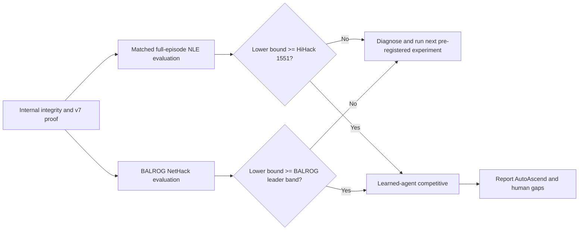
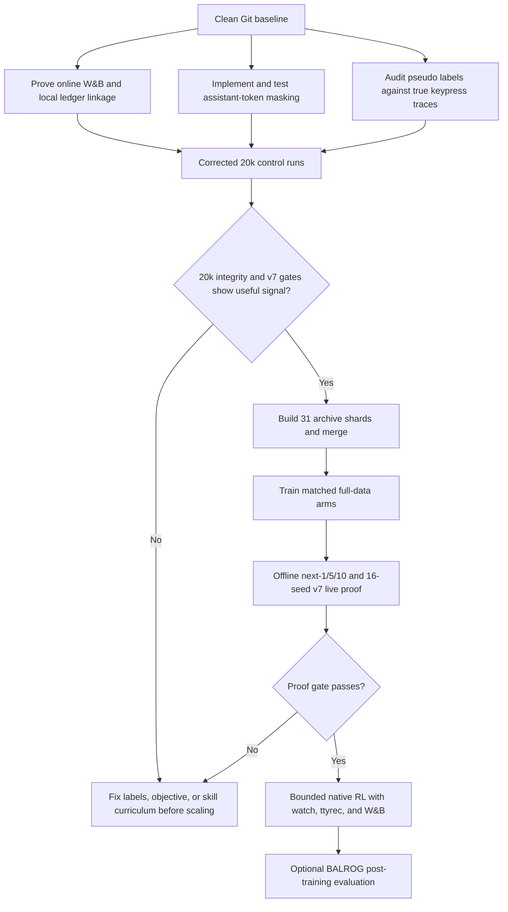
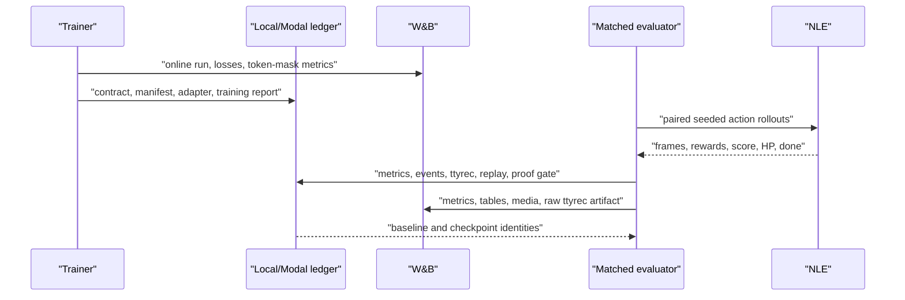
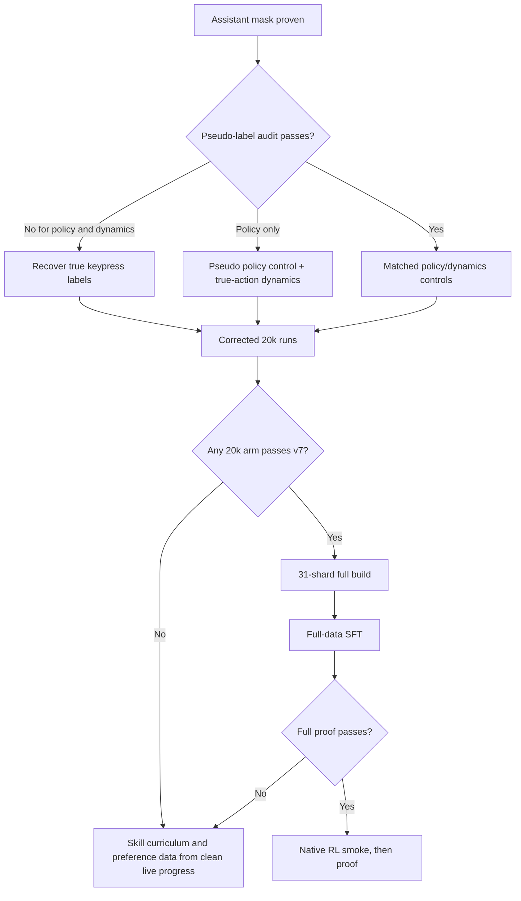

# Full-Data Training Proof: Next Steps

Date: 2026-07-09

Status: proposed execution plan

## Goal

Produce a reproducible Gemma 4 checkpoint that improves live NetHack play
relative to frozen base-Gemma and current-20k baselines.

First prove assistant-only loss, game-disjoint splits, label integrity, and
online W&B plus local-ledger reporting. Then run matched corrected-20k
experiments. Scale the winning recipe to the full corpus only if the
corrected-20k gate passes.

Success requires:

1. Policy JSON and action-space validity remain 1.0; useful-action accuracy
   improves without dominant-action collapse.
2. Autoregressive next-1/5/10 changed-state metrics improve against
   copy-current and matched deterministic baselines. Raw character accuracy is
   diagnostic only.
3. At least 16 paired-seed NLE rollouts under `live_rollout_utility_v7`
   demonstrate score, reward, or depth progress without regressions in HP
   damage, deaths, walls, menus, non-advancing actions, repetition, hunger, or
   role robustness.
4. Every run has online W&B, local reports, terminal events, ttyrecs, replay
   media, and watchable demonstrations.
5. The promoted checkpoint is compared under matched versions of the external
   benchmark protocols in `benchmarks/nethack_benchmarks.json`; experimentation
   continues until the learned-agent competitive gate passes.

Dynamics improvement alone does not complete the goal. Promote to RL only
after the live SFT gate passes. If a corrected-20k experiment fails, record the
falsified label, objective, representation, or curriculum hypothesis and run a
new pre-registered experiment rather than scaling the failed recipe.

## Current Evidence

| Surface | Current state | Consequence |
| --- | --- | --- |
| Git | Root baseline committed as `bb276f4`; worktree clean before this plan | Future experiments now have a reproducible code anchor |
| Full build | Stalled at 591,828 transitions; 282,500 policy rows, 282,500 next-frame rows, 309,328 rejected rows | Do not train from this directory; completion markers are absent |
| Build process | No active `learn-nethack-gemma` Modal task | The monolithic build is dead, not merely slow |
| Build markers | `train.jsonl` exists; `manifest.json`, `rejection_report.json`, and `sft_build_report.json` are absent | `train_ready=false` is correct |
| Baseline eval | Complete for Gemma 4 E4b on 512 policy rows and 64 generated windows per horizon | This is the matched baseline for the next checkpoint |
| Baseline policy | Parse validity 1.0, action-space validity 1.0, exact pseudo-label match 0.08984 | Valid JSON is solved at baseline; useful play is not |
| Baseline dynamics | Next-1/5/10 character accuracy 0.5934/0.6948/0.7954; exact frame and map-line rates are all 0 | Character accuracy is dominated by unchanged text and is not a sufficient metric |
| Prior 20k adapter | Policy exact match rose to 0.6191; next-1 and next-10 character accuracy improved; next-5 and teacher-forced NLL regressed | The model learned parts of the offline task, but not consistently |
| Prior live proof | Failed on wall rate, action repetition, zero score/reward/depth progress, only 3 seeds, and an obsolete v2/v3 fitness contract | There is no current evidence of gameplay improvement |
| Trainer | Existing-JSONL path formats rows into `text` and sets `assistant_only_loss=False` | Prompt-token loss is a pre-training correctness blocker |
| Labels | Full archive uses `pseudo_visible_player_delta`; 52.3% of observed transitions were rejected | These are movement-effect labels, not verified player keypresses |
| W&B | Modal has `wandb-secret`; the local shell has no API key and 8 offline runs | Cloud auth likely exists, but end-to-end online logging must be reproven |

## External Benchmark Ladder

The versioned source of truth is `benchmarks/nethack_benchmarks.json`. Refresh
it immediately before an external evaluation campaign; never silently move a
target during a run.

| Tier | Frozen target | Completion role |
| --- | --- | --- |
| Internal | base Gemma, current 20k adapter, copy-current dynamics, deterministic structured-delta dynamics | Required training proof |
| Learned NLE | HiHack mean NLE score 1551 under a matched full-episode challenge protocol | Required competitive gate |
| LLM agent | BALROG NetHack leader band, currently Claude Opus 4.5 at 2.0 +/- 0.5 progress in the 2026-02-24 snapshot | Required competitive gate |
| Neural milestone | Sample Factory APPO mean 700-800, median 400 | Reported milestone |
| Symbolic | AutoAscend / NetHack Challenge winner | Mandatory gap report, not mixed into learned-agent statistics |
| Human | full-game score, depth, and ascension references | Mandatory long-horizon ceiling report |

"Competitive" means the checkpoint passes the internal training proof and its
lower confidence bound reaches every required external target under that
target's exact protocol. An 80-step development rollout cannot be compared to a
full-episode NLE score, and native NLE reward cannot be substituted for BALROG
progress.



## Decision

Do not restart the monolithic build and do not launch full-data GPU training
yet.

The next meaningful increment is a training-integrity gate:

1. prove assistant-token masking;
2. measure pseudo-label agreement against true keypress traces;
3. re-score baseline and the existing 20k adapter under v7; and
4. run a corrected 20k control before scaling.

Only then build the full archive through 31 preemption-safe shards.



## Phase 0: Observability Must Be Real

### Work

- Run a credentialed Modal readiness job with no `WANDB_MODE=offline` override.
- Require every local run report to contain W&B mode, run ID, run URL, project,
  and artifact names.
- Fail a real build/train/eval/RL command before compute starts if it cannot
  create an online W&B run.
- Keep explicit offline mode only for unit tests and named smoke runs.
- Authenticate the local shell and sync the 8 existing offline runs. This is
  reporting cleanup; Modal's secret remains the cloud credential boundary.
- Verify the Hugging Face token and `/cache/huggingface` volume in the same
  readiness run so model weights are not downloaded for every job.

### Exit gate

- Readiness report says `execution.backend=modal_cloud` and `wandb.mode=online`.
- The W&B run is visible by its recorded URL.
- A small test artifact can be found both in W&B and in the local/Modal report
  ledger.

## Phase 1: Fix the Training Contract

### Assistant-only loss

Replace the text-only JSONL trainer path with explicit token labels:

- tokenize the complete chat row;
- identify the assistant response span deterministically;
- set all system/user/padding labels to `-100`;
- leave only assistant response tokens supervised;
- fail if the chat template does not produce a verifiable assistant span.

Add report and W&B fields for:

- `prompt_token_count`
- `supervised_assistant_token_count`
- `masked_prompt_token_count`
- `supervised_token_fraction`
- per-task token counts for `policy_action` and `next_frame`

Tests must prove masking for both exact `{"action_id": N}` responses and raw
next-frame responses. An 8-row overfit smoke must drive assistant-token loss
down without supervising prompt text.

### Pseudo-label audit

Add a deterministic audit over transitions where true keypress labels and
visible-player-delta labels can both be computed. Report:

- pseudo-label coverage;
- exact action-ID agreement;
- movement-direction equivalence agreement;
- confusion matrix by action ID;
- accepted/rejected counts by reason;
- role/race/alignment breakdown;
- action distribution and dominant-class rate;
- examples of every disagreement class.

Promotion rules:

- `movement_direction_equivalence_rate >= 0.99`;
- no non-movement action may be emitted as a movement pseudo label;
- pseudo-conditioned dynamics rows may be used only if their conditioning
  action agrees with the true action or a documented equivalent action class;
- if exact action-ID agreement is below 0.95, pseudo policy rows are explicitly
  treated as movement-effect targets, not player-imitation targets.

If the dynamics conditioning gate fails, keep pseudo rows for the policy-only
control and build dynamics rows only from true-keypress traces.

### Dynamics metric repair

Keep character accuracy for continuity, but add metrics that cannot be won by
copying mostly unchanged terminal text:

- player-coordinate exact rate;
- changed-map-cell precision/recall/F1;
- unchanged-cell copy rate as a diagnostic, not a success metric;
- BLSTATS field exact rate and numeric MAE;
- game-turn delta exact rate;
- normalized message exact/edit score;
- autoregressive next-1/5/10 versions of the same metrics.

### Exit gate

- Unit tests prove assistant-only masking.
- Label audit report passes or routes dynamics to true-keypress-only data.
- The corrected metrics are present in local reports and W&B.

## Phase 2: Corrected 20k Controls

Run matched 20k-row experiments before full scaling:

| Arm | Context | Objective | Purpose |
| --- | --- | --- | --- |
| A | `single_frame` | `policy_only` | Simplest valid-action control |
| B | `growing_context` | `policy_only` | Directly test whether history improves action choice |
| C | winning context from A/B | `dynamics_only` | Isolate next-frame learning and compounding error |
| D | winning context from A/B | `policy_dynamics_phased` | Test whether dynamics helps policy without interference |

Use identical game-ID splits, seeds, policy row counts, effective batch size,
and optimizer-token budgets. Do not compare runs with different data leakage or
different generated-window samples.

Before training, re-run base Gemma and the existing 20k adapter under
`live_rollout_utility_v7` with the same 16 seeds. The old v2/v3 reports remain
historical diagnostics and are not valid comparators.

### 20k promotion gate

- W&B is online and linked from every local report.
- Parse and action-space validity remain 1.0.
- Policy exact match improves over base without dominant-action collapse.
- Dynamics improves next-1 and does not regress next-5 or next-10 on the new
  changed-state metrics.
- Teacher-forced dynamics NLL does not regress.
- The 16-seed v7 live gate shows absolute score, reward, or depth progress.
- Wall, prompt/menu, non-advancing, dirty-progress, HP-damage, and action-repeat
  gates pass.
- Every live episode has terminal events, a ttyrec, and replay media in local
  artifacts and W&B.

If no corrected 20k arm passes, stop. More of the same data is not the next
experiment. Move to true-keypress policy data and an explicit low-level skill
curriculum: leave room, avoid walls, resolve prompts, pick up food, eat when
hungry, fight adjacent weak monsters, and use stairs.

## Phase 3: Preemption-Safe Full Build

The old monolithic run remains immutable and is never merged into the new
dataset.

Implement a small shard coordinator outside `modal_train.py` that:

- reads the 31-row archive manifest;
- creates deterministic shard run IDs for indices 0 through 30;
- launches at most four CPU shard jobs concurrently by default;
- records app/function IDs and W&B run links;
- treats a shard as complete only when its manifest, rejection report, build
  report, and split JSONL files exist;
- retries missing/preempted shards without restarting completed shards;
- writes a local aggregate status report after every poll;
- merges only when all shard gates pass.

Suggested run family:

```text
full-archive-<mode>-shard-000..030-20260709-01
full-archive-<mode>-merged-20260709-01
```

Merge validation must prove:

- merged row counts equal the sum of shard row counts;
- train/validation/test game IDs are mutually disjoint;
- task-specific files agree with combined task counts;
- all rows parse and satisfy their task schema;
- source shard IDs and checksums are recorded;
- rejection reasons and role/action distributions are aggregated;
- online W&B artifacts and local reports both exist.

Build both `single_frame` and `growing_context` full datasets only after the
20k comparison passes. If the 20k confidence intervals clearly separate the
contexts, build the winner first and treat the second full build as a confirmatory
ablation rather than blocking the first proof run.

## Phase 4: Full-Data SFT Proof

Train the surviving 20k recipe on the merged full dataset. Keep the policy-only
and dynamics-only controls; run joint phased training only when the dynamics
label audit passed.

Use `max_steps=0` only after the generated contract records the exact row count,
effective batch size, resolved full-pass step count, estimated token count, GPU,
and expected maximum run duration. Do not launch an unbounded or ambiguous
full pass.

The matched evaluation suite is:

1. policy parse/action-space/exact-match metrics;
2. teacher-forced dynamics likelihood;
3. generated next-1/5/10 structured-state metrics;
4. 16-seed paired `NetHack-v0` development proof at 80 steps;
5. a role-stratified confirmation suite after the development proof passes;
6. watch pages, ttyrecs, replay media, local reports, and W&B artifacts.



### Full-data promotion gate

Promote only when `training_proof_gate.json` reports `passed=true` under
`live_rollout_utility_v7`, with at least 16 paired seeds and no missing required
artifact. A `mixed` offline verdict or a positive aggregate fitness delta is
not sufficient.

## Phase 5: RL and External Evaluation

After SFT passes:

- run the native constrained candidate-action RL loop;
- use v7 utility with KL to the promoted SFT reference and an auxiliary
  supervised anchor;
- begin with the two-episode plumbing smoke, then run a matched 16-seed proof;
- keep every rollout watchable and upload ttyrecs plus replay media to W&B;
- do not use generated next-frame text to choose actions;
- run BALROG only as a post-training external evaluator through the explicit
  action-map adapter.

## Decision Tree



## Immediate Implementation Slice

The next coding task should be limited to the integrity gate:

1. add explicit assistant-token masking and tests;
2. add pseudo-vs-true label audit and report schema;
3. add changed-state dynamics metrics;
4. add W&B run identity to every local training/eval report;
5. run unit gates and an online Modal readiness smoke;
6. produce the corrected 20k run contracts, but do not launch GPU training
   until the contracts and expected spend are reviewed.

Expected verification:

```bash
uv run pytest -q
uv run ruff check src tests
uv run ruff format --check src tests
git diff --check
modal run src/learn_nethack/modal_train.py::readiness \
  --run-id training-integrity-readiness-20260709-01
```

## Explicit Non-Goals For The Next Slice

- No training from the incomplete monolithic directory.
- No claim that pseudo-label exact match is human imitation quality.
- No proof based on frame character accuracy alone.
- No RL before SFT passes live v7.
- No BALROG ownership of the gradient loop.
- No W&B-offline real training run.
