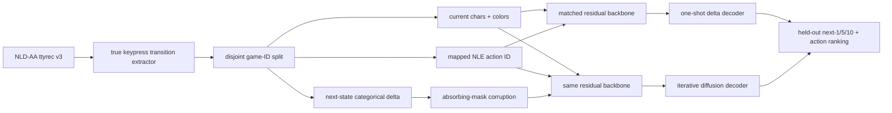
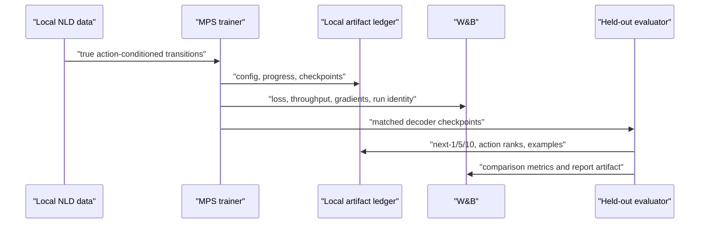

# Local Diffusion World-Model Proof

Date: 2026-07-09

Status: completed; hypothesis not supported

## Goal

Prove or falsify, on local Apple Silicon, whether an action-conditioned
categorical diffusion decoder models true NetHack terminal transitions better
than a capacity-matched deterministic structured-delta decoder.

This is a decoder-architecture proof, not a claim that a complete Gemma policy
or full NetHack world model has been solved.

## Source Of Truth

- Data: `/Users/ericfode/data/nld/nld-aa-taster/ttyrecs.db`
- Labels: true ttyrec v3 keypresses mapped through
  `artifacts/action_manifest.json`
- State: complete 24 by 80 terminal character and color planes
- Split: deterministic, disjoint game IDs for train, validation, and test
- Ledger: local JSON reports first; W&B online when authenticated and explicit
  offline mode otherwise

Rendered SFT samples and pseudo visible-movement labels are excluded from this
proof.

## Matched Arms

Both arms use the same embeddings, action conditioning, residual convolutional
backbone, output heads, optimizer, batches, update count, and game-ID split.

1. `deterministic`: predict the complete structured terminal delta in one pass.
2. `diffusion`: denoise the same categorical delta from an absorbing mask over
   several reverse steps.

## Metrics

Primary metrics cannot be won by copying unchanged spaces:

- changed-cell precision, recall, and F1;
- changed-cell character accuracy;
- autoregressive next-1, next-5, and next-10 changed-cell F1;
- status-line and map-region character accuracy;
- true-action top-1 accuracy and mean reciprocal rank when candidate actions
  are scored by transition likelihood;
- exact-frame rate and full-frame character/color accuracy as diagnostics;
- decoder parameter count and inference forward-pass multiplier.

## Pre-Registered Decision Rule

Call the local decoder hypothesis `supported` only when all of these hold on
the untouched test game IDs:

1. diffusion next-10 changed-cell F1 is greater than deterministic next-10
   changed-cell F1;
2. a paired bootstrap 95% confidence interval for that difference excludes
   zero;
3. diffusion action-ranking MRR is greater than deterministic action-ranking
   MRR;
4. diffusion action-ranking MRR exceeds the random eight-candidate expectation;
5. diffusion one-step full-frame character accuracy is no more than 0.002
   below deterministic;
6. neither model collapses to predicting no changed cells.

Otherwise report `not_supported`. Do not weaken the gate after seeing results.

Final result: `not_supported` in all three matched training seeds. Diffusion
lost action-ranking MRR in every seed and showed a 0.300 range in next-10
changed-cell F1. See
`docs/superpowers/reports/2026-07-09-local-diffusion-world-model-proof.md`.

## Execution

1. Build a compact transition array from selected games in each split.
2. Run a tiny overfit and MPS smoke to reject implementation defects.
3. Train both matched arms for the same number of updates.
4. Evaluate one-step, autoregressive next-1/5/10, and candidate-action ranking.
   Include an untrained copy-current-frame baseline so unchanged text cannot
   make either learned decoder look useful.
5. Write checkpoints, per-example metrics, comparison report, W&B run identity,
   and a watchable terminal replay under ignored `artifacts/`.
6. Record the verdict and the narrowest justified next action.

## Boundaries

- No cloud training.
- No raw ttyrecs or generated checkpoints enter git.
- No conclusion from character accuracy alone.
- No claim about policy score improvement from an offline transition test.
- A positive result justifies integrating the decoder behind the existing
  action-conditioned world-model interface; a negative result kills that route
  before expensive Gemma or RL work.
