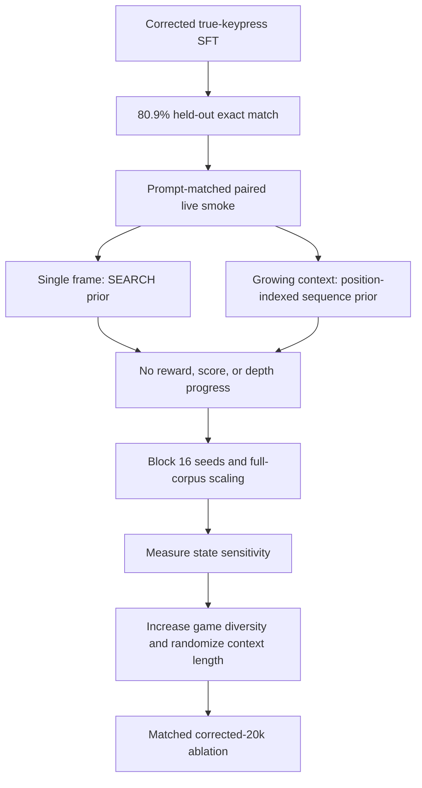
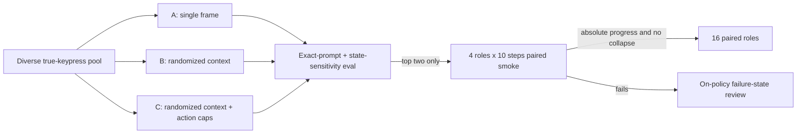

# State-Conditioned Policy Correction Implementation Plan

> **For agentic workers:** REQUIRED SUB-SKILL: Use superpowers:subagent-driven-development (recommended) or superpowers:executing-plans to implement this plan task-by-task. Steps use checkbox (`- [ ]`) syntax for tracking.

**Goal:** Replace trace-prior imitation with a corrected-20k Gemma policy that selects actions from NetHack state, passes a four-role paired live smoke, and only then advances to the 16-seed proof.

**Architecture:** Preserve the exact JSON action and NLE action-space contracts. Add a counterfactual state-sensitivity evaluator, build game-diverse true-keypress datasets with deterministic per-game/action controls, and train matched single-frame, randomized-context, and balanced-context arms. Every arm uses exact prompt parity, online W&B, local reports, paired NLE seeds, ttyrecs, and watch media.

**Tech Stack:** Python 3.11, NLE/NLD, Gemma 4, Transformers/PEFT, Unsloth, Modal, W&B, pytest, Ruff.

---

## Evidence That Changes The Plan

- The corrected growing-context checkpoint reaches `0.80859375` exact match on 512 held-out true-keypress rows when evaluated with its exact stored prompts; frozen base reaches `0.0078125`.
- The original growing-context offline result (`0.505859375`) was invalid because evaluation discarded history.
- Prompt-matched single-frame live play still collapses mostly to SEARCH: repeat rate `0.85`, zero-progress rate `1.0`, reward/score/depth deltas all `0`.
- Prompt-matched growing-context live play avoids the dominant-action threshold (`0.425` repeat rate) but emits nearly the same position-indexed action sequence across four roles and seeds. It also has zero reward/score/depth progress.
- The corrected taster training split contains 20,000 policy rows from only 43 games. More epochs on this split are more likely to strengthen trace priors than state control.



## File Map

- Create `src/learn_nethack/policy_sensitivity.py`: exact-prompt counterfactual evaluation and cross-episode sequence-prior metrics.
- Create `src/learn_nethack/sft_resample.py`: deterministic, game-disjoint, game-capped and action-controlled selection from true-keypress SFT candidates.
- Modify `src/learn_nethack/sft_build.py`: allow deterministic per-transition context-mode schedules without changing labels.
- Modify `src/learn_nethack/sft_rows.py`: record context length and schedule provenance in row metadata.
- Modify `src/learn_nethack/sft_eval.py`: log state-sensitivity metrics with ordinary policy metrics.
- Modify `src/learn_nethack/compare_watch.py`: report cross-seed action-sequence identity and prompt-contract fingerprints.
- Modify `src/learn_nethack/modal_train.py`: add Modal contracts for resampling and sensitivity evaluation; preserve online W&B and local ledgers.
- Modify `src/learn_nethack/cli.py`: add `data resample-sft` and `sft sensitivity` commands.
- Test `tests/test_policy_sensitivity.py`, `tests/test_sft_resample.py`, `tests/test_nld_sft_data_loop.py`, `tests/test_compare_watch.py`, and `tests/test_modal_readiness.py`.

### Task 1: Prove Whether The Policy Uses Current State

- [ ] **Step 1: Write failing tests for exact counterfactual prompt construction**

Create `tests/test_policy_sensitivity.py` with fixtures containing the same history length but different current frames and target actions. Assert that current-frame shuffling preserves the complete prompt except for the final `Current observation:` section and never changes labels or valid action IDs.

```python
def test_shuffle_current_frames_preserves_history_and_labels() -> None:
    cases = build_current_frame_shuffle_cases(_rows(), seed=7)
    assert cases[0].natural_target_action_id == cases[0].shuffled_target_action_id
    assert cases[0].natural_history == cases[0].shuffled_history
    assert cases[0].natural_current_frame != cases[0].shuffled_current_frame
```

- [ ] **Step 2: Implement deterministic sensitivity cases and metrics**

Create `src/learn_nethack/policy_sensitivity.py` with immutable records and these report fields:

```python
@dataclass(frozen=True)
class PolicySensitivityMetrics:
    row_count: int
    natural_exact_match_rate: float
    shuffled_current_exact_match_rate: float
    current_state_dependence_gap: float
    prediction_change_rate_after_current_shuffle: float
    cross_episode_action_sequence_identity_rate: float | None
```

Use only exact SFT user messages. Pair rows within `(mode, context_length, role, depth_bucket)` and derange current frames deterministically with `random.Random(seed)`. Never shuffle assistant labels.

- [ ] **Step 3: Add live sequence-prior detection**

In `compare_watch.py`, compare every pair of seed action sequences. Report exact identity and normalized Hamming similarity. Four identical ten-step sequences must produce identity `1.0`; four distinct sequences must produce `0.0`.

- [ ] **Step 4: Add the fail-closed diagnostic gate**

The corrected-20k arm is ineligible for live promotion unless all are true:

```text
natural_exact_match_rate >= matched base
current_state_dependence_gap >= 0.15
prediction_change_rate_after_current_shuffle >= 0.20
cross_episode_action_sequence_identity_rate <= 0.25
```

These are diagnostic gates, not claims that shuffling creates valid NetHack states.

- [ ] **Step 5: Run and commit the focused gate**

```bash
uv run pytest tests/test_policy_sensitivity.py tests/test_compare_watch.py -q
uv run ruff check src tests
git add src/learn_nethack/policy_sensitivity.py src/learn_nethack/compare_watch.py tests/test_policy_sensitivity.py tests/test_compare_watch.py
git commit -m "Measure policy state sensitivity"
```

Expected: all focused tests pass and reports are deterministic for a fixed seed.

### Task 2: Build A Game-Diverse Corrected-20k Candidate Pool

- [ ] **Step 1: Write selection-contract tests**

Create `tests/test_sft_resample.py`. Use 1,000 synthetic games and assert:

```python
assert report["train"]["row_count"] == 20_000
assert report["train"]["game_count"] >= 625
assert report["train"]["max_rows_per_game_observed"] <= 32
assert report["split_leakage_count"] == 0
assert report["label_sources"] == {"true_nld_keypress_and_successor_frame": 24_000}
```

- [ ] **Step 2: Implement deterministic priority sampling**

Create `src/learn_nethack/sft_resample.py`. Assign each candidate a stable priority:

```python
priority = hashlib.sha256(
    f"{seed}:{episode_id}:{step}:{task}".encode("utf-8")
).hexdigest()
```

Select train/validation/test by episode hash, then apply `max_rows_per_game=32` for train and `16` for validation/test. Fill quotas across `(role, depth_bucket, action_id)` round-robin. Reject pseudo labels and rows missing an integrity fingerprint.

- [ ] **Step 3: Add dominant-action controls without flattening the task**

For training only, cap SEARCH, SPACE, and Escape at `0.12` each. Fill remaining rows at natural frequency. Record every skipped row under `per_game_cap`, `dominant_action_cap`, `split_excluded`, or `invalid_provenance`.

- [ ] **Step 4: Add the CLI and local report**

```bash
uv run nethack-gemma data resample-sft \
  --source-manifest artifacts/full-true-keypress-candidates.json \
  --out artifacts/corrected-diverse-20k-20260710-01 \
  --train-rows 20000 --validation-rows 2000 --test-rows 2000 \
  --max-train-rows-per-game 32 --max-eval-rows-per-game 16 \
  --seed 20260710
```

Write `resample_manifest.json`, `resample_report.json`, file SHA-256 values, action histograms, role/depth coverage, and source paths.

- [ ] **Step 5: Audit and commit**

```bash
uv run nethack-gemma data audit-sft \
  --dataset-dir artifacts/corrected-diverse-20k-20260710-01 \
  --action-manifest artifacts/action_manifest.json
uv run pytest tests/test_sft_resample.py tests/test_sft_integrity.py -q
git add src/learn_nethack/sft_resample.py src/learn_nethack/cli.py tests/test_sft_resample.py
git commit -m "Build game-diverse corrected SFT splits"
```

Expected: 24,000 policy rows, at least 625 train games, zero split leakage, zero label-integrity failures.

### Task 3: Randomize Context Length Without Future Leakage

- [ ] **Step 1: Add a deterministic mode schedule test**

For each transition, choose from this pre-registered mix:

```python
MODE_MIX = {
    "single_frame": 0.30,
    "context_1": 0.25,
    "context_2": 0.20,
    "context_4": 0.15,
    "growing_context": 0.10,
}
```

The same `(seed, gameid, step)` must always choose the same mode. History may only contain earlier transitions from that game.

- [ ] **Step 2: Implement scheduled row rendering**

Modify `write_sft_dataset` to accept either one `mode` or a `mode_mix`. Resolve the mode before `HistoryBuffer.history_for`, and record `context_mode`, `context_item_count`, `context_token_budget`, and `mode_schedule_version` in metadata.

- [ ] **Step 3: Build matched natural-context and mixed-context datasets**

Use exactly the same selected transitions and splits for both arms:

```text
A: diverse single_frame, natural action frequency
B: diverse randomized context, natural action frequency
C: diverse randomized context, dominant-action caps
```

Prove matching with a report containing the ordered `(episode_id, step, target_action_id)` SHA-256 for each arm.

- [ ] **Step 4: Run focused tests and commit**

```bash
uv run pytest tests/test_nld_sft_data_loop.py tests/test_sft_resample.py -q
git add src/learn_nethack/sft_build.py src/learn_nethack/sft_rows.py tests/test_nld_sft_data_loop.py tests/test_sft_resample.py
git commit -m "Randomize policy context without leakage"
```

### Task 4: Run The Matched Corrected-20k Ablation

- [ ] **Step 1: Preflight every arm**

Require assistant-only loss, no truncated assistant tokens, online W&B, mounted HF cache, and local reports before a 1,000-step run. A preflight failure stops that arm.

- [ ] **Step 2: Train A, B, and C with identical optimizer settings**

Use the same Gemma base, LoRA configuration, seed, batch size, sequence limit, and `max_steps=1000`. Only the registered dataset treatment may differ.

- [ ] **Step 3: Run exact-prompt offline and sensitivity evals**

For each arm, evaluate 512 natural validation rows plus the deterministic current-frame shuffle. Log validity, exact match, macro action accuracy, non-modal accuracy, action histogram, role breakdown, and state-sensitivity metrics to W&B and local JSON.

- [ ] **Step 4: Apply the offline promotion rule**

Promote at most two arms. Validity must equal `1.0`; no dominant-action collapse; natural exact and macro accuracy must beat frozen base; state-dependence gap must be at least `0.15`.



### Task 5: Require State-Contingent Live Progress

- [ ] **Step 1: Run paired four-role smokes**

Use seeds `20260615..20260618`, roles Arc/Bar/Mon/Wiz, `NetHackPairedChallenge-v0`, ten steps, and the arm's exact context mode. W&B must sync four replay media items and all ttyrecs.

- [ ] **Step 2: Reject sequence priors explicitly**

An arm fails if cross-episode action-sequence identity exceeds `0.25`, even when action-repeat rate is below `0.6`.

- [ ] **Step 3: Require absolute progress**

At least one current-policy episode must have positive reward, score delta, depth delta, or a clean live-progress event. Mean zero-progress rate must be below `1.0`, fitness must be positive, and HP/death/menu/wall/hunger guardrails must not regress.

- [ ] **Step 4: Advance only a passing arm to 16 seeds**

The 16-seed run must cover all 13 roles, use deterministic paired initial states, and produce local reports, terminal events, ttyrecs, replay HTML/media, and online W&B.

### Task 6: Use Human-Labeled On-Policy Recovery States Only If Needed

- [ ] **Step 1: Export failure-state review packets**

If all A/B/C arms fail, select 256 unique live states stratified by role, prompt/menu state, repeated action, and message. Each packet includes the exact user prompt, terminal frame, allowed action IDs, chosen action, outcome, and replay link.

- [ ] **Step 2: Build a local review command**

Add `nethack-gemma data review-actions` that accepts one human-selected action ID and an optional reason. It must reject IDs outside the NLE action manifest and append immutable JSONL with `label_source=human_live_recovery_v1`.

- [ ] **Step 3: Never infer expert labels from NLE validity**

NLE acceptance proves an action is in the action space, not that it is useful. Do not convert arbitrary valid actions, model actions, or handcrafted movement guesses into expert labels.

- [ ] **Step 4: Train a bounded DAgger-style mixture**

Mix at most 20% reviewed recovery rows with 80% diverse true-keypress rows. Repeat the state-sensitivity and four-role gates before any 16-seed run.

## Stop Rules

- Do not run a 16-seed proof when the four-role smoke has zero absolute progress.
- Do not scale row count or model size while state-dependence gap is below `0.15`.
- Do not treat lower wall/menu failure alone as gameplay improvement.
- Do not add dynamics loss to rescue a policy that is not state-conditioned; run the corrected dynamics arm separately against copy-current and deterministic next-1/5/10 baselines.
- Do not claim BALROG competitiveness until a native 16-seed run passes. BALROG remains a post-training external evaluation.

## Final Verification

```bash
uv run ruff check src tests
uv run pytest -q
uv run pytest tests/integration/test_paired_nle.py -q
git diff --check
```

Regenerate `artifacts/status-dashboard`, open the paired replay viewers, verify W&B run URLs and media counts, and record the promotion or rejection decision in the local proof-gate report.
