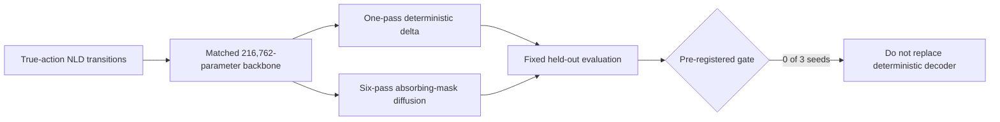
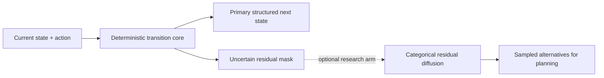

# Local Diffusion World-Model Proof

Date: 2026-07-09

Verdict: **not supported as the primary decoder**

## Question

Does an action-conditioned absorbing-mask categorical diffusion decoder model
NetHack terminal transitions better than a capacity-matched deterministic
structured-delta decoder?

The pre-registered gate required diffusion to win next-10 changed-cell F1 with
a positive paired confidence interval, beat deterministic and random action
ranking, preserve one-step character accuracy, and avoid no-change collapse.

No training seed passed every requirement.

## Experimental Contract

| Property | Value |
| --- | --- |
| Source | NLD-AA ttyrec v3 true keypress traces |
| Dataset | 12,000 train / 2,000 validation / 2,000 test transitions |
| Included games | 34 train / 9 validation / 9 test; disjoint by game ID |
| Observed actions | 46 mapped NLE action IDs |
| Dataset checksum | `d150db402587efc2487ad175670cbe1ee198c292f1f6b6f326b5becefdbe3100` |
| State | Full 24 by 80 terminal character and 32-value color planes |
| Target | Unchanged-or-replacement categorical terminal delta |
| Parameters | 216,762 in each arm |
| Training | 1,200 updates, batch 16, AdamW at 3e-4 per arm |
| Seeds | 20260709, 20260710, 20260711 |
| Evaluation | Fixed seed 20260709; 512 one-step/action-rank examples; 256 next-1/5/10 starts |
| Diffusion inference | Six reverse denoising passes per transition |

Both learned arms used the same embeddings, action conditioning, residual
convolutional backbone, optimizer, update count, and source transitions. The
deterministic arm decoded once from a fully masked delta. The diffusion arm was
trained at random absorbing-mask levels and decoded by iterative
confidence-ordered unmasking.

## Aggregate Results

Mean +/- sample standard deviation over three training seeds:

| Metric | Deterministic | Diffusion | Diffusion delta |
| --- | ---: | ---: | ---: |
| One-step changed-cell F1 | 0.650 +/- 0.037 | 0.530 +/- 0.153 | -0.120 |
| Next-1 changed-cell F1 | 0.629 +/- 0.046 | 0.516 +/- 0.134 | -0.112 |
| Next-5 changed-cell F1 | 0.354 +/- 0.061 | 0.405 +/- 0.158 | +0.051 |
| Next-10 changed-cell F1 | 0.289 +/- 0.059 | 0.353 +/- 0.152 | +0.063 |
| One-step full-frame char accuracy | 0.973 +/- 0.001 | 0.950 +/- 0.031 | -0.023 |
| Action-ranking MRR | 0.798 +/- 0.005 | 0.754 +/- 0.015 | -0.043 |
| Action-ranking top-1 | 0.697 +/- 0.004 | 0.640 +/- 0.014 | -0.057 |

The copy-current baseline reached 0.957 one-step and 0.950 next-10 character
accuracy while scoring zero changed-cell F1. This confirms why raw character
accuracy cannot be the promotion metric.

### Seed Stability

| Seed | Next-10 F1 delta | Paired macro-F1 delta | Action MRR delta | One-step char delta | Verdict |
| --- | ---: | ---: | ---: | ---: | --- |
| 20260709 | -0.094 | -0.149 | -0.054 | -0.059 | not supported |
| 20260710 | +0.252 | +0.125 | -0.022 | +0.003 | not supported |
| 20260711 | +0.033 | -0.043 | -0.055 | -0.013 | not supported |

The diffusion next-10 F1 range was 0.300 across seeds. Deterministic action MRR
stayed within 0.011; diffusion lost action MRR in all three runs.

## Findings

1. **The deterministic world model works as a useful local baseline.** It
   learned action-sensitive dynamics: 0.798 action MRR and 0.697 top-1 versus
   random expectations of 0.340 and 0.125.
2. **The tested diffusion decoder is not reliable enough to replace it.** It
   improved long-horizon F1 in two seeds but regressed badly in one and lost
   one-step quality on average.
3. **Denoising loss was misleading.** Diffusion validation loss was lower in
   every run, yet action ranking was worse in every run and generated rollouts
   were unstable. Training loss is not a fitness function for this decision.
4. **Iterative full-frame decoding amplifies mistakes.** The weak seed predicted
   too many changed cells, then conditioned later reverse steps on those errors.
5. **The compute trade is currently poor.** Diffusion uses six forward passes
   per environment transition and still loses the stable one-pass model on the
   low-level action contract.

## Decision

Use the deterministic structured-delta decoder as the v1 world-model baseline.
Do not place the tested diffusion decoder on the primary policy or RL path.

Diffusion remains plausible only as a bounded uncertainty model around a
deterministic transition, not as an unrestricted full-terminal replacement.
The next defensible diffusion experiment would:

- keep the deterministic next-state prediction as the mean transition;
- diffuse only uncertain changed cells or a compact event/latent residual;
- use a mathematically matched categorical reverse process with
  self-conditioning;
- evaluate stochastic coverage, calibration, and best-of-K separately from the
  primary top-1 transition;
- retain the deterministic action-scoring head unless diffusion beats it across
  seeds.

## Boundaries

- This proves transition learning on held-out traces, not better NetHack score.
- Action ranking measures whether the observed transition identifies its true
  action among eight candidates. It is not a policy rollout reward.
- The terminal observation is partially observable and does not expose native
  BLSTATS, inventory, RNG, or hidden monster state.
- The three W&B runs were created successfully in explicit offline mode because
  the local shell has no `WANDB_API_KEY`. Run IDs: `pjgow9sk`, `u6mpdya2`, and
  `985aq4hu`. They remain syncable local mirrors, not visible online runs.
- The broader project goal remains active: no live NLE score/damage improvement
  has been proven here.

## Artifacts

- Aggregate: `artifacts/local-diffusion-world-model-proof-20260709-aggregate.json`
- Dataset: `artifacts/local-world-model-data-20260709-02/`
- Seed reports: `artifacts/local-diffusion-world-model-proof-20260709-{01,seed2,seed3}/report.json`
- Replay viewers: each seed directory contains `watch/index.html` and
  `watch/events.jsonl`
- Dashboard: `artifacts/status-dashboard/index.html`
